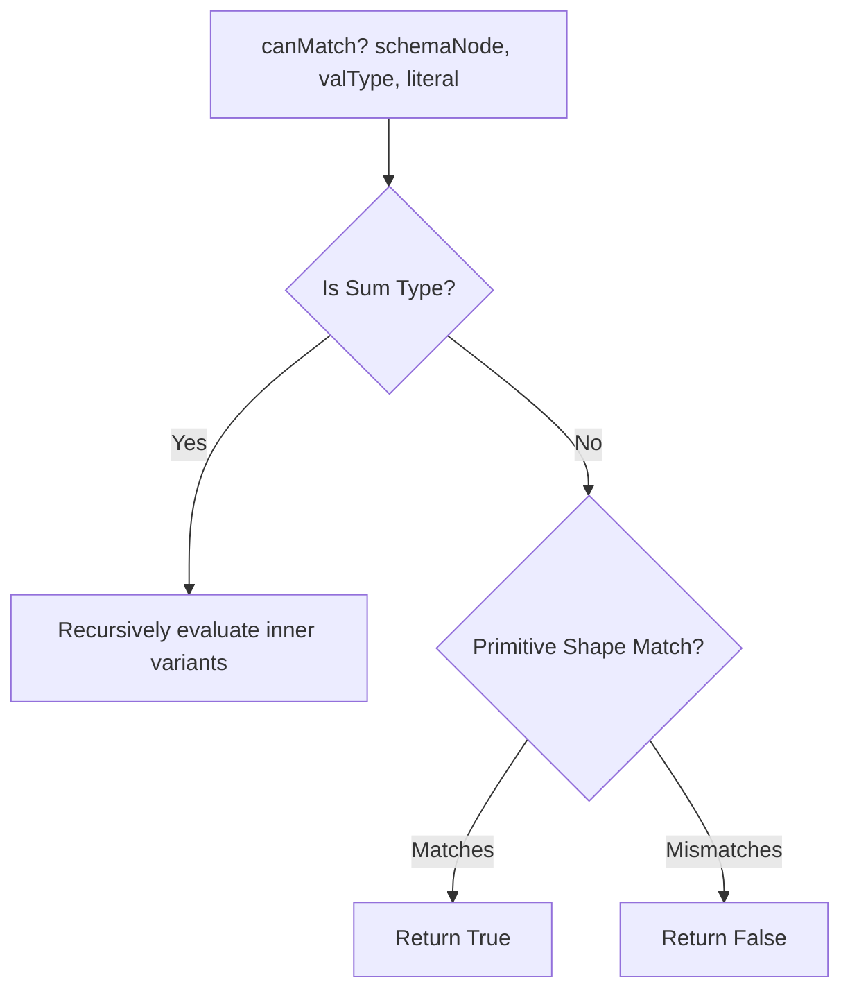
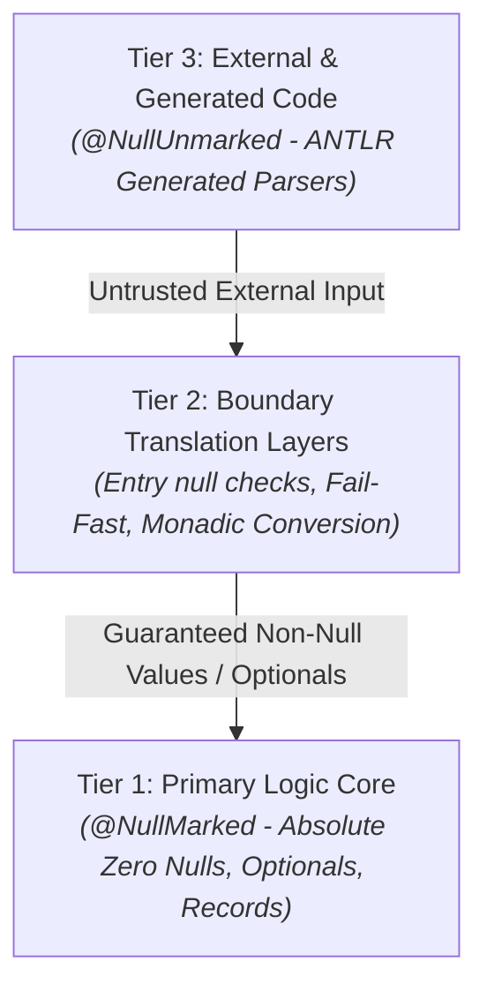

# STVN Technology Primer: Foundations of Value-Oriented Notation

## For Engineers Transitioning from JSON, EDN, Protocol Buffers, and YAML to STVN

This document serves as an in-depth technical onboarding guide for software engineers, language implementers, and system architects transitioning to Strongly Typed Value Notation (STVN). It details the theoretical foundations, type system design, lexical grammar, runtime mechanics, and Value-Oriented Programming (VOP) models implemented in `stvnadore-core`.

---

# Table of Contents <!-- omit in toc -->

<!-- TOC -->
* [STVN Technology Primer: Foundations of Value-Oriented Notation](#stvn-technology-primer-foundations-of-value-oriented-notation)
  * [For Engineers Transitioning from JSON, EDN, Protocol Buffers, and YAML to STVN](#for-engineers-transitioning-from-json-edn-protocol-buffers-and-yaml-to-stvn)
* [Table of Contents <!-- omit in toc -->](#table-of-contents----omit-in-toc---)
  * [1. The Dual-Track Lexical Architecture](#1-the-dual-track-lexical-architecture)
    * [1.1 Type Track (`:`) vs. Value Track (`#`)](#11-type-track--vs-value-track-)
    * [1.2 Typed Compile-Time Constants in `:defs`](#12-typed-compile-time-constants-in-defs)
    * [1.3 Hierarchical Path-Delimited Identifiers](#13-hierarchical-path-delimited-identifiers)
    * [1.4 Single-Pass Lexing and Zero-Lookahead Disambiguation](#14-single-pass-lexing-and-zero-lookahead-disambiguation)
  * [2. Algebraic Data Types & The 10 Inference Rules (Rules A–J)](#2-algebraic-data-types--the-10-inference-rules-rules-aj)
    * [2.1 Product Types (`:Tuple`) vs. Bare Value Variant Syntax](#21-product-types-tuple-vs-bare-value-variant-syntax)
    * [2.2 Sum Types (`:Option`, `:Either`, `:Union`, `:Enum`)](#22-sum-types-option-either-union-enum)
    * [2.3 The Type-Directed Unification Engine (`canMatch`)](#23-the-type-directed-unification-engine-canmatch)
    * [2.4 Union Structural Distinctness Rule](#24-union-structural-distinctness-rule)
    * [2.5 Exhaustive Specification of Inference Rules A through J](#25-exhaustive-specification-of-inference-rules-a-through-j)
  * [3. The Tripartite Temporal Model](#3-the-tripartite-temporal-model)
    * [3.1 Eliminating Temporal Conflation](#31-eliminating-temporal-conflation)
    * [3.2 Physical Instant: `:DateTimeOffset`](#32-physical-instant-datetimeoffset)
    * [3.3 Civil Wall-Clock Schedule: `:DateTimeZoned`](#33-civil-wall-clock-schedule-datetimezoned)
    * [3.4 Compliance & Audit Record: `:DateTimeAudited`](#34-compliance--audit-record-datetimeaudited)
    * [3.5 Physical Epoch Counters](#35-physical-epoch-counters)
    * [3.6 Tripartite Invariant Matrix](#36-tripartite-invariant-matrix)
  * [4. Arbitrary Bit-Width Numeric Systems](#4-arbitrary-bit-width-numeric-systems)
    * [4.1 Non-Power-of-Two Integer Semantics (`:Int`$n$, `:Uint`$n$)](#41-non-power-of-two-integer-semantics-intn-uintn)
    * [4.2 Mathematical Bounds and High-Bit Mask Validation](#42-mathematical-bounds-and-high-bit-mask-validation)
    * [4.3 Exact Financial Decimals (`:FloatExact`) vs. IEEE 754 (`:Float32`, `:Float64`)](#43-exact-financial-decimals-floatexact-vs-ieee-754-float32-float64)
  * [5. Immutability, Collections & Invertible Maps](#5-immutability-collections--invertible-maps)
    * [5.1 Sequenced Collection Semantics (`SequencedSet`, `SequencedMap`)](#51-sequenced-collection-semantics-sequencedset-sequencedmap)
    * [5.2 The 8 Collection Types](#52-the-8-collection-types)
    * [5.3 Dual-Set Invariant in Invertible Maps (`:MapInv`)](#53-dual-set-invariant-in-invertible-maps-mapinv)
    * [5.4 Trait Capability Calculus & Capability Bubbling](#54-trait-capability-calculus--capability-bubbling)
  * [6. Multi-Line Strings & Nested STVN Containment](#6-multi-line-strings--nested-stvn-containment)
    * [6.1 String Presentation Styles](#61-string-presentation-styles)
    * [6.2 Fenced Multi-Line Strings for STVN Containing STVN](#62-fenced-multi-line-strings-for-stvn-containing-stvn)
    * [6.3 Indentation Control with `#preserveIndent`](#63-indentation-control-with-preserveindent)
  * [7. Soundness Boundaries, Monadic Diagnostics & The Null Loophole](#7-soundness-boundaries-monadic-diagnostics--the-null-loophole)
    * [7.1 The 3-Tier Codebase Soundness Model](#71-the-3-tier-codebase-soundness-model)
    * [7.2 Intercepting the Optional Null Loophole](#72-intercepting-the-optional-null-loophole)
    * [7.3 DiagnosticBag Accumulation, Coordinate Spans & Partial AST Recovery](#73-diagnosticbag-accumulation-coordinate-spans--partial-ast-recovery)
  * [8. Standard Library Prelude Reference](#8-standard-library-prelude-reference)
    * [8.1 Built-in Prelude Nominal Types](#81-built-in-prelude-nominal-types)
    * [8.2 Security Considerations: `:Sha256` Adoption and `:Sha1` Excision](#82-security-considerations-sha256-adoption-and-sha1-excision)
<!-- TOC -->

---

## 1. The Dual-Track Lexical Architecture

In traditional formats (JSON, YAML, EDN), type information is either absent, embedded as unstructured string tags, or defined in external schema files disconnected from runtime payloads. STVN solves this by introducing a physical lexical partition between the **Type Track** and the **Value (Variable) Track**.

### 1.1 Type Track (`:`) vs. Value Track (`#`)

```stvn
{
  :defs {
    #MAX_RETRIES :Uint8 3
    :StatusCode  :Uint16
    :Response    :Tuple( :StatusCode :Option(:String) )
  }
  :type :Response
  :body ( 200 #Some "Success" )
}
```

* **The Colon Sigil (`:`) — Type Track:** Reserved exclusively for structural type constructors, built-in primitives, user-defined nominal type definitions, and top-level block keywords (`:defs`, `:type`, `:body`, `:include`). Colons must **always** attach as a leading prefix to an identifier. A bare colon token `:` or an infix JSON-style key-value separator (`key: "value"`) is a fatal lexical error.
* **The Hash Sigil (`#`) — Value Track:** Reserved exclusively for value-level symbols, boolean literals (`#TRUE`, `#FALSE`, `#T`, `#F`), sum type variant constructors (`#Some`, `#None`, `#Left`, `#Right`, `#S`, `#N`, `#L`, `#R`), union branch selectors (`#1`, `#2`), enum domain constants (`#HTTP`, `#HTTPS`), metadata constraint flags (`#minIncl`, `#regex`), and compile-time constants in `:defs`.

### 1.2 Typed Compile-Time Constants in `:defs`

Constants in STVN are declared in `:defs` using the value sigil (`#`), an optional metadata constraint block, a target schema type, and a literal value payload:

```stvn
:defs {
  #MAX_RETRY  :Uint8 3
  #API_HOST   { #regex "^[a-z.]+$" } :String "api.internal.net"
  #EMPTY_MASK :Seq( :Uint8 ) [ 0 0 0 0 ]
}
```

* **Payload Substitution:** Referencing `#MAX_RETRY` in `:body` or within another constant expression in `:defs` instructs the compiler to execute deterministic compile-time value substitution.
* **Lexical Soundness:** Nominal type identifiers (`:`) cannot appear in constant declaration position. Value keywords (`#`) cannot appear as nominal type names.
* **Zero-Shadowing:** Redefining a constant name within the same document context throws an `IllegalStateException` for violating Zero-Shadowing constraints.

### 1.3 Hierarchical Path-Delimited Identifiers

STVN natively supports forward-slash (`/`) path-delimited identifiers across definition and value spaces without requiring complex package import hierarchies:

* **Type Path Syntax:** `:net/http/Status`, `:org/stvnadore/telemetry/Header`
* **Value Path Syntax:** `#net/http/OK`, `#net/http/NotFound`, `#status/v1/ACTIVE`

The leading sigil attaches only to the first segment (e.g., `:net/http/Status`). Infix colons (e.g., `:net:http:Status`) are strictly prohibited. The compiler treats `:net/http/Status` and `:Status` as distinct, non-interchangeable nominal types.

### 1.4 Single-Pass Lexing and Zero-Lookahead Disambiguation

Because type constructors and value literals are cleanly segregated by their leading prefix sigils (`:` vs `#`), the lexer and parser operate in a single pass without lookahead or backtracking.

---

## 2. Algebraic Data Types & The 10 Inference Rules (Rules A–J)

STVN's type system is built on Algebraic Data Types (ADTs), dividing composite data into **Product Types** and **Sum Types**.

### 2.1 Product Types (`:Tuple`) vs. Bare Value Variant Syntax

* **Product Type (`:Tuple`):** Represents heterogeneous fixed-size ordered structural sequences. Enclosed strictly in parentheses: `( "localhost" 8080 #TRUE )`.
* **Bare Value Variant Syntax:** Sum variant constructors (`#Some`, `#None`, `#Left`, `#Right`, `#1`, `#2`) apply directly to trailing payload values **without parentheses**:
  ```stvn
  #Some "text"      // VALID: Bare scalar payload
  #Right 42         // VALID: Bare scalar payload
  #1 1024           // VALID: Bare scalar payload
  ```
* **Strict Product Demarcation:** In STVN, parentheses `( ... )` strictly construct `:Tuple` instances. They are never function-call delimiters:
  ```stvn
  // Given schema: :Option( :Uint32 )
  #Some ( 42 )      // FATAL: Type mismatch (Expected :Uint32, got Tuple)
  #Some 42          // VALID: Scalar integer matches :Uint32

  // Given schema: :Option( :Tuple( :Uint32 ) )
  #Some ( 42 )      // VALID: 1-element tuple matches :Tuple( :Uint32 )
  ```

### 2.2 Sum Types (`:Option`, `:Either`, `:Union`, `:Enum`)

* **`:Option( T )`**: Optional wrapper representing presence (`#Some v` / `#S v`) or absence (`#None` / `#N`).
* **`:Either( L R )`**: Disjoint union with right-side bias (`#Left v` / `#L v` vs. `#Right v` / `#R v`).
* **`:Union( T1 T2 ... Tn )`**: N-way disjoint variant plane using 1-based index selectors (`#1`, `#2`, ... `#n`).
* **`:Enum[ #A #B #C ]`**: Bounded set of nominal keyword constants.

### 2.3 The Type-Directed Unification Engine (`canMatch`)

The type resolver unifies incoming tokens with schemas using recursive structural matching:



### 2.4 Union Structural Distinctness Rule

Every variant within a `:Union` must resolve to a distinct structural profile category (e.g., `STRING`, `INTEGER`, `FLOAT`, `BOOLEAN`, `TUPLE`, `SEQUENCE`, `MAP`, `ENUM`). If two variants share the same underlying category, the schema is rejected at compile time with `MalformedSchemaException` to prevent runtime tag ambiguity.

### 2.5 Exhaustive Specification of Inference Rules A through J

STVN decoders support implicit tagging for sum types when payload values are unambiguous.

```stvn
// -----------------------------------------------------------------------------
// RULE A: Implied Option #Some
// Schema: :Option( :Uint32 )
42                     // Inferred as: #Some 42

// -----------------------------------------------------------------------------
// RULE B: Implied Either #Right
// Schema: :Either( :String :Int32 )
100                    // Inferred as: #Right 100

// -----------------------------------------------------------------------------
// RULE C: Implied Union Branch
// Schema: :Union( :Int32 :String :Boolean )
"text"                 // Inferred as: #2 "text"

// -----------------------------------------------------------------------------
// RULE D: Ambiguity Resolution
// If an untagged literal matches both an explicit tag token and an inner scalar,
// explicit tagging is mandatory.
// Schema: :Option( :String )
"#None"                // FATAL: Ambiguous payload. Must write #Some "#None" or #None.

// -----------------------------------------------------------------------------
// RULE E: Asymmetric Non-Inferability (#Left and #None NEVER inferred)
// Schema: :Either( :String :Int32 )
"error"                // FATAL: String matches :Left, but #Left is never inferred.
#Left "error"          // VALID: Explicit tag provided.

// -----------------------------------------------------------------------------
// RULE F: Compositional Inference Traversal
// Schema: :Seq( :Option( :Either( :String :Float64 ) ) )
[ 42.5 ]               // Inferred as: [ #Some #Right 42.5 ]

// -----------------------------------------------------------------------------
// RULE G: Union 1-Based Indexing
// Schema: :Union( :Int32 :String )
#1 42                  // VALID: Selects branch 1 (:Int32)
#0 42                  // FATAL: #0 is illegal
#3 42                  // FATAL: Index exceeds branch count

// -----------------------------------------------------------------------------
// RULE H: Two-Branch Union vs. Either
// :Union( :String :Int32 ) allows implicit bidirectional matching (Rule C).
// :Either( :String :Int32 ) is right-biased and requires explicit #Left for string.

// -----------------------------------------------------------------------------
// RULE I: Intersection Cluster Disabling
// If an untagged value matches multiple variants, implicit resolution is disabled.
// Explicit tagging (#1 or #2) is mandatory.

// -----------------------------------------------------------------------------
// RULE J: Semantic Guard Tracking
// If a tag is valid but violates a localized constraint (e.g. #regex), the node
// lowers into an error diagnostic frame (StvnDiagnostic) without crashing the AST.
```

---

## 3. The Tripartite Temporal Model

### 3.1 Eliminating Temporal Conflation

Traditional serialization formats conflate physical timeline instants with civil wall-clock schedule times, causing catastrophic timezone conversion bugs and Daylight Saving Time (DST) data corruption. STVN partitions temporal representations into three mathematically orthogonal domains.

### 3.2 Physical Instant: `:DateTimeOffset`

* **Domain:** Absolute point on the physical timeline associated with a fixed UTC presentation offset.
* **Syntax:** ISO-8601 string with mandatory UTC offset (`Z` or `±HH:mm`): `"2026-03-15T08:00:00-05:00"`.
* **Invariant:** **Zone brackets `[...]` are prohibited.** Supplying an IANA zone (e.g., `"2026-03-15T08:00:00-05:00[America/Chicago]"`) is a fatal syntax rejection.
* **Binary Footprint:** 12 bytes `(epoch_utc_nanos: i64, offset_seconds: i32)`.

### 3.3 Civil Wall-Clock Schedule: `:DateTimeZoned`

* **Domain:** Future-scheduled human wall-clock time within a political IANA timezone jurisdiction.
* **Syntax:** Local ISO-8601 timestamp with bracketed IANA zone: `"2026-03-15T08:00:00[America/Chicago]"`.
* **Invariant 1 (No Static Offsets):** Numerical offsets or `Z` are prohibited. The physical offset is computed dynamically via IANA `ZoneRules`.
* **Invariant 2 (DST Spring-Forward Rejection):** Timestamps falling into non-existent DST transition gaps (e.g., `"2026-03-08T02:30:00[America/Chicago]"`) are strictly rejected by the compiler.
* **Binary Footprint:** 10 bytes `(local_nanos: i64, zone_dict_id: u16)`.

### 3.4 Compliance & Audit Record: `:DateTimeAudited`

* **Domain:** Immutable legal/financial audit record proving both the observed UTC instant and the legal jurisdiction of execution.
* **Syntax:** Dual-token string with both UTC offset and bracketed IANA zone: `"2026-03-15T08:00:00-05:00[America/Chicago]"`.
* **Invariant (Compile-Time Consistency Check):** The compiler evaluates $\text{offset} \in \text{ZoneRules}(\text{zoneId}).\text{getValidOffsets}(\text{localTime})$. Contradictory offsets (e.g., specifying `-07:00` for Chicago in CDT) fail compilation immediately.
* **Binary Footprint:** 14 bytes `(local_nanos: i64, offset_seconds: i32, zone_dict_id: u16)`.

### 3.5 Physical Epoch Counters

* `:TimeEpochS`: Signed 64-bit seconds since Unix epoch (`1970-01-01T00:00:00Z`).
* `:TimeEpochMs`: Signed 64-bit milliseconds since Unix epoch.
* `:TimeEpochNs`: Arbitrary-precision nanoseconds since Unix epoch.

### 3.6 Tripartite Invariant Matrix

| Attribute | `:DateTimeOffset` | `:DateTimeZoned` | `:DateTimeAudited` |
|:---|:---|:---|:---|
| **Domain** | Physical Instant | Civil Wall-Clock | Regulatory Audit |
| **Literal Grammar** | `"YYYY-MM-DDTHH:mm:ss±HH:mm"` | `"YYYY-MM-DDTHH:mm:ss[Zone]"` | `"YYYY-MM-DDTHH:mm:ss±HH:mm[Zone]"` |
| **UTC Offset** | **Mandatory** | **Prohibited** | **Mandatory** |
| **Zone Bracket (`[...]`)** | **Prohibited** | **Mandatory** | **Mandatory** |
| **Offset Verification** | N/A | Derived dynamically | **Validated at Compile Time** |
| **DST Gap Rejection** | N/A | **Strictly Rejected** | **Strictly Rejected** |
| **Wire Footprint** | 12 Bytes | 10 Bytes | 14 Bytes |

---

## 4. Arbitrary Bit-Width Numeric Systems

### 4.1 Non-Power-of-Two Integer Semantics (`:Int`$n$, `:Uint`$n$)

STVN supports arbitrary positive bit-widths ($n \ge 1$), eliminating hardware-constrained integer waste:

* **Signed Integers (`:Int`$n$):** Range $[-2^{n-1}, 2^{n-1}-1]$ (e.g., `:Int1`, `:Int7`, `:Int24`, `:Int64`, `:Int128`). Default un-suffixed `:Int` resolves to `:Int32`.
* **Unsigned Integers (`:Uint`$n$):** Range $[0, 2^n-1]$ (e.g., `:Uint1`, `:Uint3`, `:Uint49`, `:Uint64`, `:Uint128`). Default un-suffixed `:Uint` resolves to `:Uint32`.
* **Overflow Validation:** Literal values exceeding bounds fail compilation with `StvnIntegerOverflowException`. Negative literals assigned to `:Uint`$n$ fail immediately.

### 4.2 Mathematical Bounds and High-Bit Mask Validation

In binary encoding (`.stvn_bin`), $n$-bit integers occupy $B = \lceil n/8 \rceil$ bytes:

$$\text{Containment Bytes } B = \lfloor (n + 7) / 8 \rfloor$$

To prevent malicious payload tampering and undefined state attacks, binary decoders execute high-bit mask verification:

$$\text{Valid Mask} = (1 \ll (n \bmod 8)) - 1 \quad (\text{for } n \bmod 8 \ne 0)$$

If any unused upper bit in the most significant byte is non-zero, decoders reject the payload with `StvnCorruptedBitPatternException`.

### 4.3 Exact Financial Decimals (`:FloatExact`) vs. IEEE 754 (`:Float32`, `:Float64`)

* `:Float32` / `:Float64`: Standard IEEE 754 floating-point numbers. By default, floating-point types do not carry the `#equatable` trait due to NaN and rounding hazards.
* `:FloatExact`: Arbitrary-precision decimal arithmetic (mapped to Java `BigDecimal`), guaranteeing exact representations for currency and ledger systems.

---

## 5. Immutability, Collections & Invertible Maps

### 5.1 Sequenced Collection Semantics (`SequencedSet`, `SequencedMap`)

In JSON and traditional serialization formats, map entry and set ordering is undefined. In STVN:
1. **Positional Determinism:** Encounter order is preserved across lexing, AST construction, binary serialization, and JVM heap mapping.
2. **Absolute Immutability:** Collection values in the AST ([StvnSet](file:///c:/Projects/Java/stvnadore/ij_stvnadore_core2/src/main/java/org/stvnadore/core/ir/StvnValue.java#L589) and [StvnMap](file:///c:/Projects/Java/stvnadore/ij_stvnadore_core2/src/main/java/org/stvnadore/core/ir/StvnValue.java#L647)) require `SequencedSet` and `SequencedMap` and wrap them in unmodifiable decorators.

### 5.2 The 8 Collection Types

| Collection Type | Enclosure Syntax | Constraints & Invariants |
|:---|:---|:---|
| **`:Seq( T )`** | `[ v1 v2 ... ]` | Ordered sequence of elements of type `T`. |
| **`:SeqNonEmpty( T )`** | `[ v1 v2 ... ]` | Ordered sequence requiring size $\ge 1$. |
| **`:Set( T )`** | `[ v1 v2 ... ]` | Insertion-ordered set. Elements must be unique and `#equatable`. |
| **`:SetNonEmpty( T )`** | `[ v1 v2 ... ]` | Unique ordered set requiring size $\ge 1$. |
| **`:Map( K V )`** | `{ [ k1 v1 ] [ k2 v2 ] }` | Associative map. Keys must be unique and `#equatable`. |
| **`:MapNonEmpty( K V )`** | `{ [ k1 v1 ] [ k2 v2 ] }` | Associative map requiring size $\ge 1$. |
| **`:MapInv( K V )`** | `{ [ k1 v1 ] [ k2 v2 ] }` | Invertible map. **Dual-Set Invariant:** Keys AND Values must be unique. |
| **`:MapInvNonEmpty( K V )`** | `{ [ k1 v1 ] [ k2 v2 ] }` | Invertible map requiring size $\ge 1$. |

### 5.3 Dual-Set Invariant in Invertible Maps (`:MapInv`)

`:MapInv` establishes a 1-to-1 bidirectional bijection. The compiler enforces that every key is unique and every value is unique. Inserting duplicate values (e.g., `{ [ "a" 10 ] [ "b" 10 ] }`) triggers `DUPLICATE_INVERTED_MAP_VALUE`.

### 5.4 Trait Capability Calculus & Capability Bubbling

Traits govern capability states:
* `#equatable`: Type supports deterministic equality and hashing.
* `#comparable`: Type supports total ordinal comparison.

**Capability Bubbling:** Container types (`:Tuple`, `:Seq`, `:Set`, `:Map`, `:Option`, `:Either`, `:Union`) possess `#equatable` or `#comparable` **if and only if all enclosed member types possess that capability**. If any inner element is `#equatable #FALSE`, the entire container loses `#equatable`.

---

## 6. Multi-Line Strings & Nested STVN Containment

### 6.1 String Presentation Styles

STVN supports three string presentation formats:
1. **Simple String:** `"Single-line quoted text with escapes \n"`
2. **Block String:** Multi-line triple-quoted string `""" Line 1 \n Line 2 """`
3. **Fenced String:** Tagged multi-line string `"""->[TAG] ... [TAG]"""`

### 6.2 Fenced Multi-Line Strings for STVN Containing STVN

When storing an STVN document or schema inside another STVN document (such as in a Content-Addressable Storage `.stvn_cas` repository), standard escape characters cause severe syntax corruption. Fenced strings solve this with matching boundary tags:

```stvn
{
  :defs {
    :SchemaName :String
    :Payload    { #preserveIndent #TRUE } :String
  }
  :type :Tuple( :SchemaName :Payload )
  :body (
    "network_config.stvn_inclf"
    """->[STVN_DOC]
{
  :defs {
    :Port :Uint16
    :Host :String
  }
}[STVN_DOC]"""
  )
}
```

### 6.3 Indentation Control with `#preserveIndent`

* `#preserveIndent #FALSE` (Default): Automatically strips common leading indentation from multi-line block strings.
* `#preserveIndent #TRUE`: Preserves all whitespace, indentation, and newlines exactly as authored.

---

## 7. Soundness Boundaries, Monadic Diagnostics & The Null Loophole

### 7.1 The 3-Tier Codebase Soundness Model

To guarantee null-soundness without performance degradation, `stvnadore-core` organizes its codebase into three strict architectural tiers:



* **Tier 1 (Core):** All core logic packages (`org.stvnadore.core.ir`, `mapper`, `validation`). Enforces `@NullMarked`, records, total immutability, and zero `null` usage.
* **Tier 2 (Boundary):** Translates untrusted external inputs into verified domain models or monadic diagnostic frames.
* **Tier 3 (Generated):** Isolated ANTLR-generated code tagged with `@NullUnmarked`.

### 7.2 Intercepting the Optional Null Loophole

Java records allow developers to construct illegal instances where an `Optional` field holds a literal `null` reference (`new UserProfile("dev", 30, null)`). In VOP, `null` references do not exist—an optional value is either `#Some value` or `#None`.

[StvnMapper](file:///c:/Projects/Java/stvnadore/ij_stvnadore_core2/src/main/java/org/stvnadore/core/mapper/StvnMapper.java) intercepts this at the serialization boundary, throwing a `MalformedPayloadException` if any record component of type `Optional` holds a `null` reference.

### 7.3 DiagnosticBag Accumulation, Coordinate Spans & Partial AST Recovery

In compiler tooling and IDEs, stopping at the first syntax error degrades developer ergonomics. `stvnadore-core` provides an error-tolerant diagnostic pipeline:

```java
// Bounded diagnostic accumulation
var config = new StvnParserConfig(false, 100); // non-strict, max 100 diagnostics
StvnCompilationResult<StvnValue> result = StvnCompiler.compileToResult(source, "file.stvn", config);

if (result.hasErrors()) {
    List<StvnDiagnostic> diags = result.diagnostics();
    for (StvnDiagnostic diag : diags) {
        System.err.printf("Error at [%d:%d] (span %d..%d): %s (Code: %s)%n",
            diag.line(), diag.column(), diag.startOffset(), diag.endOffset(),
            diag.message(), diag.errorCode().orElse("GENERAL_ERROR"));
    }
}

// Access recovered partial AST
if (result.isRecoveredPartialAst()) {
    StvnValue partialAst = result.document().orElseThrow();
    // Partial tree contains StvnError leaves for invalid elements
}
```

* **Memory Bounding:** `DiagnosticBag` caps accumulated diagnostics at `maxDiagnostics` (default 100). Once reached, it appends a single `STVN_DIAG_LIMIT_EXCEEDED` warning and suppresses further allocation to prevent heap exhaustion.
* **Error Leaves (`StvnError`):** Invalid elements within sequences, sets, tuples, or maps are wrapped into `StvnError` nodes containing raw text and exact character spans, allowing valid sibling nodes to compile cleanly.

---

## 8. Standard Library Prelude Reference

### 8.1 Built-in Prelude Nominal Types

The standard library prelude ([StvnPrelude.java](file:///c:/Projects/Java/stvnadore/ij_stvnadore_core2/src/main/java/org/stvnadore/core/stdlib/StvnPrelude.java)) is pre-registered and implicitly available in all STVN contexts:

| Nominal Type | Underlying Type | Applied Constraints / Validation Specification |
|:---|:---|:---|
| **`:Uuid`** | `:StringFixed36` | `{ #regex "^[0-9a-fA-F]{8}-[0-9a-fA-F]{4}-[0-9a-fA-F]{4}-[0-9a-fA-F]{4}-[0-9a-fA-F]{12}$" }` |
| **`:Ulid`** | `:StringFixed26` | `{ #regex "^[0-7][0-9A-HJKMNP-TV-Z]{25}$" }` (Crockford's Base32) |
| **`:Sha256`** | `:StringFixed64` | `{ #regex "^[0-9a-fA-F]{64}$" }` (Hexadecimal SHA-256 Digest) |
| **`:SemVer`** | `:String` | Standard Semantic Versioning syntax (`MAJOR.MINOR.PATCH[-PRERELEASE][+BUILD]`) |
| **`:Email`** | `:String` | RFC 5322 email address validation |
| **`:IPv4`** | `:String` | Dotted-decimal IPv4 address (`0.0.0.0` to `255.255.255.255`) |
| **`:Port`** | `:Uint16` | `{ #minIncl 1 #maxIncl 65535 }` |
| **`:Percentage`** | `:Float64` | `{ #minIncl 0.0 #maxIncl 100.0 }` |
| **`:Probability`** | `:Float64` | `{ #minIncl 0.0 #maxIncl 1.0 }` |
| **`:Currency`** | `:FloatExact` | Monetary value with exact arbitrary decimal precision |
| **`:Latitude`** | `:Float64` | `{ #minIncl -90.0 #maxIncl 90.0 }` |
| **`:Longitude`** | `:Float64` | `{ #minIncl -180.0 #maxIncl 180.0 }` |

### 8.2 Security Considerations: `:Sha256` Adoption and `:Sha1` Excision

In accordance with modern cryptographic standards, STVN has completely deprecated and excised `:Sha1` (`:StringFixed40`) from all compiler registries, schema flatteners, and binary codecs. All cryptographic hashes and digests in STVN standard tooling mandate 256-bit `:Sha256` (`:StringFixed64`).
