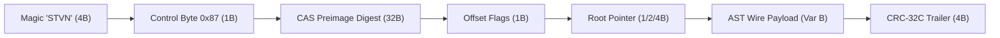
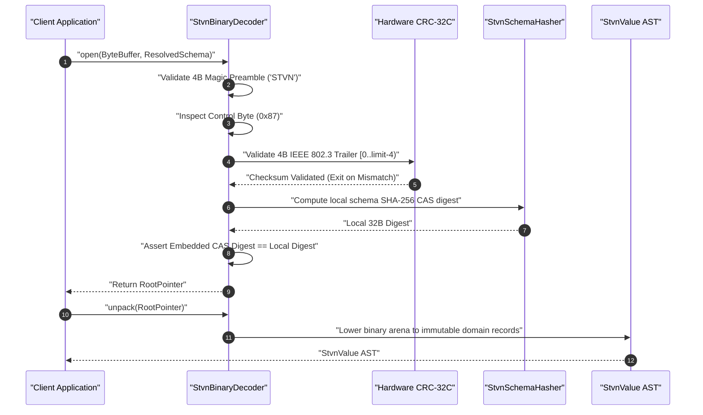

 STVN Architectural Specification 03: Binary Encoding & Zero-Trust Verification

**Document ID**: `STVN-SPEC-03`
**Status**: Canonical Specification
**Version**: 2.0.0
**Compliance**: Mandatory across all STVN binary encoders, decoders, zero-copy readers, and wire protocol bindings.

---

**Table of Contents**

<!-- TOC -->
  * [1. Binary Wire Framing (`.stvn_b`)](#1-binary-wire-framing-stvn_b)
    * [Wire Framing Architecture & Formula](#wire-framing-architecture--formula)
    * [Wire Layout Architecture Diagram](#wire-layout-architecture-diagram)
    * [Byte-by-Byte Wire Framing Breakdown Table](#byte-by-byte-wire-framing-breakdown-table)
    * [Byte 4 Control Byte (1:3:4 Bitwise Partition)](#byte-4-control-byte-134-bitwise-partition)
  * [2. Hardware-Accelerated CRC-32C Trailer Integrity](#2-hardware-accelerated-crc-32c-trailer-integrity)
  * [3. Zero-Trust Security Enforcement (Strategy `0x07`)](#3-zero-trust-security-enforcement-strategy-0x07)
    * [Zero-Trust Verification Pipeline](#zero-trust-verification-pipeline)
  * [4. Tripartite Temporal Wire Memory Layouts](#4-tripartite-temporal-wire-memory-layouts)
    * [Header IANA Zone Dictionary Pool](#header-iana-zone-dictionary-pool)
  * [5. Arbitrary Bit-Width Masking, Zero-Copy Readers & Allocation Defenses](#5-arbitrary-bit-width-masking-zero-copy-readers--allocation-defenses)
    * [5.1 High-Bit Zero Invariant](#51-high-bit-zero-invariant)
    * [5.2 Flyweight Zero-Copy Readers](#52-flyweight-zero-copy-readers)
    * [5.3 Memory Allocation Bomb Defenses (`validateAllocationBounds`)](#53-memory-allocation-bomb-defenses-validateallocationbounds)
  * [6. Enum Subset Binary Wire Encoding & Zero-Copy Subtyping](#6-enum-subset-binary-wire-encoding--zero-copy-subtyping)
    * [6.1 Root-Relative Ordinal Indexing](#61-root-relative-ordinal-indexing)
    * [6.2 Parent-Slot Zero-Copy Assignability](#62-parent-slot-zero-copy-assignability)
    * [6.3 Decoder Boundary Validation (`MalformedPayloadException`)](#63-decoder-boundary-validation-malformedpayloadexception)
  * [7. Cryptographic Schema Hashing for Enum Subsets](#7-cryptographic-schema-hashing-for-enum-subsets)
    * [7.1 Digest Ingestion Sequence](#71-digest-ingestion-sequence)
<!-- TOC -->

---

## 1. Binary Wire Framing (`.stvn_b`)

The STVN binary stream is encoded in Little-Endian byte order with a deterministic, cryptographically verified header and trailer structure.

### Wire Framing Architecture & Formula

The canonical wire layout satisfies the mathematical framing composition:

$$\underbrace{\text{'S','T','V','N'}}_{\text{4B Magic Preamble}} \;\parallel\; \underbrace{\text{0x87}}_{\text{Control Byte}} \;\parallel\; \underbrace{\text{CAS Address}}_{\text{32B SHA-256 Digest}} \;\parallel\; \underbrace{\text{Wire Payload}}_{\text{Offset Size + Root Pointer + AST}} \;\parallel\; \underbrace{\text{CRC-32C}}_{\text{4B IEEE 802.3 Trailer}}$$

```
+-------------------+---------------+-----------------------+---------------+--------------------+--------------------+
| Bytes 0-3 (4B)    | Byte 4 (1B)   | Bytes 5..N (0..Var B) | Byte N+1 (1B) | Bytes N+2.. (1..8B)| Trailing (0 or 4B) |
| "STVN" Magic      | Control Byte  | Schema Identity Data  | Flags (Offset)| Root Node Pointer  | [CRC-32C Trailer]  |
+-------------------+---------------+-----------------------+---------------+--------------------+--------------------+
```

### Wire Layout Architecture Diagram



### Byte-by-Byte Wire Framing Breakdown Table

| Byte Offset | Field Name | Width | Invariant & Boundary Constraint | Exception Contract |
| :--- | :--- | :--- | :--- | :--- |
| `0..3` | Magic Preamble | 4 Bytes | Must equal ASCII `'S','T','V','N'` (`0x5354564E`). | `IllegalArgumentException` |
| `4` | Control Byte | 1 Byte | Bit 7 must be `1` (`0x80`) when Strategy `0x7` (`ExplicitSha256`) is selected (`0x87`). | `MalformedPayloadException` |
| `5..36` | Schema Identity Data | 32 Bytes | Contains 32-byte cryptographic SHA-256 CAS preimage digest. Must match `computeSha256(schema)`. | `PoisonedRegistryPayloadException` |
| `37` | Offset Flags | 1 Byte | Encodes pointer offset size: `1 << (flags & 0x03)` (1, 2, or 4 bytes). | `MalformedPayloadException` |
| `38..38+S` | Root Node Pointer | $S \in \{1, 2, 4\}$ | Points to root element; must satisfy $targetOffset \ge payloadStart \land targetOffset < limit$. | `MalformedPayloadException` |
| `38+S..(limit-4)`| Wire Payload Arena | Variable | Post-order serialized AST records, collections, and scalars. Validated via `validateAllocationBounds()`. | `MalformedPayloadException` |
| `(limit-4)..limit`| CRC-32C Trailer | 4 Bytes | Castagnoli CRC-32C checksum over range `[0, limit - 4)`. | `MalformedPayloadException` |

### Byte 4 Control Byte (1:3:4 Bitwise Partition)
Byte 4 is partitioned into three distinct bitfields:

* **Trailer Flag (Bit 7, Mask `0x80`)**: `HAS_TRAILER_CRC32C`
  * `0`: No trailer appended. Payload limit coincides with binary arena boundary.
  * `1`: 4-byte Little-Endian CRC-32C trailer appended at `limit - 4`. Computes checksum over `0..(limit - 4)`.

* **Wire Strategy (Bits 6..4, Mask `0x70`)**: `BinaryEncodingStrategy`
  * `0x0`: `ZERO_COPY_POST_ORDER` (Standard zero-copy post-order layout).
  * `0x1`–`0x6`: Reserved for future compression and layout models.
  * `0x7`: Extension sentinel reserved for multi-byte header extension.

* **Lower Nibble (Bits 3..0, Mask `0x0F`)**: `SchemaIdentityStrategy`
  * `0x0`: `UniversalDefault` (0 bytes payload). Resolves payload against universal default schema context.
  * `0x1`: `UuidV8Hash` (0 bytes payload). Out-of-band resolution referencing stable cached UUIDv8 hash.
  * `0x2`: `Sha256Hash` (0 bytes payload). Out-of-band resolution referencing stable cached SHA-256 fingerprint.
  * `0x3`: `AsciiStringKey` (2B length prefix + ASCII bytes). Matches schema by looking up ASCII repository key.
  * `0x4`: `UnicodeStringKey` (2B length prefix + UTF-8 bytes). Matches schema by looking up UTF-8 repository key.
  * `0x5`: `UniversalVersion` (4B version integer). Matches schema using sequential 64-bit version integer.
  * `0x6`: `ExplicitUuid` (16B UUID). Zero-trust verification: Decoded UUID must match `StvnSchemaHasher.hashSchema(schema)`.
  * `0x7`: `ExplicitSha256` (32B SHA-256 hash). Zero-trust verification: Decoded hash must match `StvnSchemaHasher.computeSha256(schema)`.
  * `0x8`: `SelfDescribingSchema` (4B length prefix + UTF-8 source string). Ephemeral sandbox: Compiles inline schema in-memory.

---

## 2. Hardware-Accelerated CRC-32C Trailer Integrity

When Byte 4 Bit 7 (`0x80`) is set:
1. The buffer must contain at least 9 bytes (5-byte minimum header + 4-byte trailer).
2. The decoder reads trailing 4 bytes at `limit - 4` as a 32-bit Little-Endian integer.
3. The decoder computes the streaming CRC-32C (`java.util.zip.CRC32C`) across bytes `0..(limit - 4)`.
4. If computed CRC $\ne$ expected CRC, the decoder throws `MalformedPayloadException("CRC-32C trailer mismatch: payload corrupted or truncated")`.
5. Downstream decoders slice the buffer to `0..(limit - 4)`, ensuring zero-copy readers remain oblivious to trailer presence.

---

## 3. Zero-Trust Security Enforcement (Strategy `0x07`)

When decoding an STVN binary payload marked with Strategy `0x07` (`ExplicitSha256`):
1. `StvnBinaryDecoder.open()` reads the 37-byte header and extracts the embedded 32-byte SHA-256 digest at Header Bytes 5..36.
2. The decoder computes the cryptographic SHA-256 digest of the local resolved schema using `StvnSchemaHasher.computeSha256(schema)`.
3. If the computed digest does not match the embedded header digest byte-for-byte, the decoder immediately aborts and throws `PoisonedRegistryPayloadException`. Payload bytes are never read or deserialized.

### Zero-Trust Verification Pipeline

The following sequence diagram details the full decoding and verification pipeline from client invocation to immutable record instantiation:



---

## 4. Tripartite Temporal Wire Memory Layouts

STVN eliminates string parsing overhead for temporal types by embedding fixed-width binary representations:

```
1. { #offset } :DateTime (12 Bytes Total)
   +---------------------------------------+---------------------------------------+
   |   epoch_utc_nanos: i64 (8 Bytes)      |     offset_seconds: i32 (4 Bytes)     |
   +---------------------------------------+---------------------------------------+

2. { #zoned } :DateTime (10 Bytes Total)
   +---------------------------------------+---------------------------------------+
   |     local_nanos: i64 (8 Bytes)        |     zone_dict_id: u16 (2 Bytes)       |
   +---------------------------------------+---------------------------------------+

3. { #audited } :DateTime (14 Bytes Total)
   +-----------------------------------+-------------------+-------------------+
   |    local_nanos: i64 (8 Bytes)     | offset_s: i32 (4B)| zone_dict_id: u16 |
   +-----------------------------------+-------------------+-------------------+
```

### Header IANA Zone Dictionary Pool
To avoid repeating long time zone identifier strings (e.g. `"America/Argentina/Buenos_Aires"`), `.stvn_b` binary headers contain an indexed zone dictionary table mapping unique `ZoneId` strings to 16-bit unsigned integers (`zone_dict_id: u16`), enabling zero-allocation JSR-310 lookups.

---

## 5. Arbitrary Bit-Width Masking, Zero-Copy Readers & Allocation Defenses

### 5.1 High-Bit Zero Invariant

For any arbitrary integer type `{ #size n } :Int` or `{ #unsigned #size n } :Int` ($n \ge 1$), the wire allocates $B = \lceil n/8 \rceil$ containment bytes in Little-Endian order.

* **High-Bit Zero Invariant**: Unused upper bits in the most significant byte (bits $n \pmod 8$ through 7 when $n \not\equiv 0 \pmod 8$) must be 0.
* **Corrupted Pattern Trap**: If any unused high bit is set to 1, decoders reject the buffer immediately with `StvnCorruptedBitPatternException`.

### 5.2 Flyweight Zero-Copy Readers

Zero-copy readers traverse nested buffers directly using memory offset pointers without intermediate heap allocations:

* **`StvnTupleReader`**: Directly traverses heterogeneous product layouts by following memory offset pointers in the header pointer table without allocating intermediate element lists.
* **`StvnSeqReader`**: Traverses homogeneous sequences through indexed element pointer lookups, enabling constant-time random access without deserializing preceding siblings.
* **`StvnMapReader`**: Implements direct key-value traversal and binary key lookup across key-value pairs without constructing map entry objects.

### 5.3 Memory Allocation Bomb Defenses (`validateAllocationBounds`)

To defend against remote Denial-of-Service heap exhaustion attacks (allocation bombs), `StvnBinaryDecoder` enforces strict boundary verification via `validateAllocationBounds(long requestedLength, ByteBuffer buffer, int currentOffset)`:

1. **Negative Length Rejection**: Throws `MalformedPayloadException` if `requestedLength < 0`.
2. **Integer Range Validation**: Throws `MalformedPayloadException` if `requestedLength > Integer.MAX_VALUE`.
3. **Offset Boundary Verification**: Throws `MalformedPayloadException` if `currentOffset < 0 || currentOffset > buffer.limit()`.
4. **Remaining Capacity Verification**: Computes `remainingBytes = buffer.limit() - currentOffset`. If `requestedLength > remainingBytes`, throws `MalformedPayloadException`:
   ```
   Payload length bomb detected: claimed %d bytes, but only %d bytes remain in buffer
   ```

All variable-length payload decoders (`readStringOutlined`, `readOutlinedNode`, `readDerivedLengthPrefix`) invoke this defense before allocating byte arrays or advancing buffer positions.

---

## 6. Enum Subset Binary Wire Encoding & Zero-Copy Subtyping

STVN enum subsets achieve zero-copy polymorphism through root-relative ordinal preservation.

### 6.1 Root-Relative Ordinal Indexing
When serializing a payload value typed as an `EnumSubset`, the binary encoder emits the variant's sequential index relative to the **root `:Enum` declaration**, not a dense local ordinal.

* **Wire Byte Width:** The containment byte width matches the capacity required by the root enum ($N$ root variants):
  * $1 \le N \le 256$: 1 byte (`u8`).
  * $257 \le N \le 65536$: 2 bytes (`u16` Little-Endian).
  * $N > 65536$: 4 bytes (`u32` Little-Endian).
* **Ordinal Preservation:** An enum subset with 2 allowed variants derived from a root enum of 4 variants uses the root variant indices:

```
Root Enum: :Status :Enum [ #Pending #Active #Suspended #Deleted ]
Root Ordinals:               0        1         2          3

Subset: :ActiveStatus { #filterIncl [ #Active #Suspended ] } :Status
Payload: #Active
Wire Encoding: Byte value 0x01 (Root index 1, NOT local index 0)
```

### 6.2 Parent-Slot Zero-Copy Assignability
Because payloads serialize using root-relative ordinals and identical byte widths:
* Payloads typed with `:ActiveStatus` are byte-identical on the wire to payloads typed with `:Status`.
* Systems read and assign child subset payloads directly into storage slots typed as the parent enum without memory reallocation, trans-coding, or ordinal transformation.
* Transitive chains of arbitrary depth preserve this zero-overhead invariant.

### 6.3 Decoder Boundary Validation (`MalformedPayloadException`)
During payload deserialization, `StvnBinaryDecoder` enforces strict zero-trust boundary verification:

1. The decoder reads the root-relative ordinal index `seqIndex` from the input stream.
2. The decoder retrieves the variant keyword string from the root enum schema definition.
3. If the active target schema contains an `enumSubset`, the decoder evaluates:
   $$\text{seqIndex} \ge 0 \quad \land \quad \text{seqIndex} < N_{\text{root}} \quad \land \quad \text{subset.containsVariant}(\text{kw})$$
4. If the decoded ordinal references a variant that exists in the root enum but is excluded from the active subset, the decoder immediately aborts and throws `MalformedPayloadException`.
5. Undefined bytes and invalid ordinals are rejected before memory allocation or object instantiation occurs.

---

## 7. Cryptographic Schema Hashing for Enum Subsets

`StvnSchemaHasher` generates deterministic 32-byte SHA-256 fingerprints to identify schemas in Content-Addressable Storage (CAS) and Strategy `0x07` (`ExplicitSha256`) zero-trust binary headers.

### 7.1 Digest Ingestion Sequence
To prevent CAS hash collisions between distinct subsets or between a subset and its root enum, `StvnSchemaHasher.digestSchema()` digests subset metadata in strict sequential order:

1. **Base Primitive Type:** Emits UTF-8 string bytes for `:Enum`.
2. **Root Enum Variants:** For each variant keyword in the root enum definition, emits:
   ```
   "enumVariant:" + keyword
   ```
3. **Subset Identity & Derivation Metadata (if `enumSubset` is present):**
   * `"subsetName:" + subset.name()` (e.g., `subsetName::ActiveStatus`)
   * `"subsetParent:" + subset.parentType()` (e.g., `subsetParent::Status`)
   * `"subsetRoot:" + subset.rootEnum()` (e.g., `subsetRoot::Status`)
   * `"subsetFilterType:" + (subset.isInclusive() ? "incl" : "excl")`
4. **Allowed Variant Tokens:** For each variant in `subset.allowedVariants()`, in sorted declaration order, emits:
   ```
   "subsetVariant:" + variant
   ```
5. **Constraints & Traits:** Digests numeric limits, indent flags, and capability trait overrides in deterministic order.

Any modification to the allowed variant list, filter mode, parent link, or root enum changes the schema digest deterministically.
