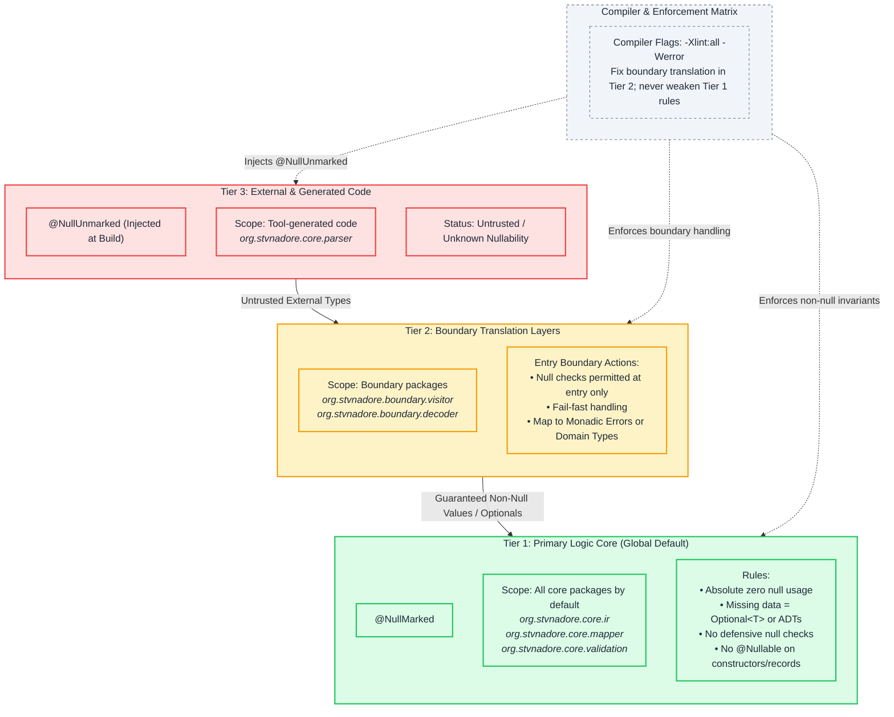

# Architectural Specification: Null Isolation and Codebase Soundness

This document defines the rules for null safety and optional data in the codebase. Every package in this project belongs to one of three tiers.

---

# Table of Contents <!-- omit in toc -->

<!-- TOC -->
* [Architectural Specification: Null Isolation and Codebase Soundness](#architectural-specification-null-isolation-and-codebase-soundness)
* [Table of Contents <!-- omit in toc -->](#table-of-contents----omit-in-toc---)
  * [Global Default Rule](#global-default-rule)
  * [Tier Matrix](#tier-matrix)
    * [Tier 1: Primary Logic Core](#tier-1-primary-logic-core)
    * [Tier 2: Boundary Translation Layers](#tier-2-boundary-translation-layers)
    * [Tier 3: External and Generated Code](#tier-3-external-and-generated-code)
    * [Diagram](#diagram)
  * [Enforcement and Compliance](#enforcement-and-compliance)
<!-- TOC -->

---

## Global Default Rule
Any package not explicitly listed under Tier 2 or Tier 3 belongs to Tier 1 (Null-Prohibited Zone). All packages in the codebase belong to a defined tier.

---

## Tier Matrix

### Tier 1: Primary Logic Core
* **Scope**: All packages by default (for example: `org.stvnadore.core.ir`, `org.stvnadore.core.mapper`, `org.stvnadore.core.validation`).
* **Null Safety Rules**:
    - Do not use `null`. Set the global compilation environment to `@NullMarked`.
    - All record components, class fields, method arguments, and method return values must be non-null.
    - Represent missing data with `java.util.Optional<T>` or domain algebraic data types.
    - Do not assign `null` to local variables.
    - Do not convert `Optional` objects to raw references with `.orElse(null)`. Do not assign `Optional` values to variables that accept `null`.
    - Process `Optional` chains with functional methods (`.map()`, `.flatMap()`) or end them with explicit exception handling (`.orElseThrow()`).
    - Do not write defensive null checks (such as `if (param != null)` or `Objects.requireNonNull(param)`) for Tier 1 parameters. Compile-time guarantees eliminate null references in Tier 1.
* **Rules for AI Tools and Developers**: Human developers and AI coding tools must not add `@Nullable` to Tier 1 constructors or record components to resolve compilation or analysis warnings.

### Tier 2: Boundary Translation Layers
* **Scope**: Specific boundary packages that interface with external or generated structures (for example: `org.stvnadore.boundary.visitor`, `org.stvnadore.boundary.decoder`).
* **Null Safety Rules**:
    - You can use `null` checks only at the entry boundary where external types enter the engine.
    - Handle all `null` or uninitialized states at the boundary method immediately. Convert missing values to monadic error types (returned result values) or domain types. Fail fast.
    - Data that moves from Tier 2 into Tier 1 must not contain `null` references.

### Tier 3: External and Generated Code
* **Scope**: Package directories with tool-generated code (for example: `org.stvnadore.core.parser`).
* **Null Safety Rules**:
    - Isolate generated code by injecting `@NullUnmarked` during the build lifecycle.
    - Treat Tier 3 code as untrusted code with unknown nullability.

---

### Diagram

---

## Enforcement and Compliance
1. Compile all packages with the `-Xlint:all` and `-Werror` flags.
2. Resolve static analysis and IDE warnings by changing structural boundaries in Tier 2. Do not weaken Tier 1 type rules to resolve warnings.