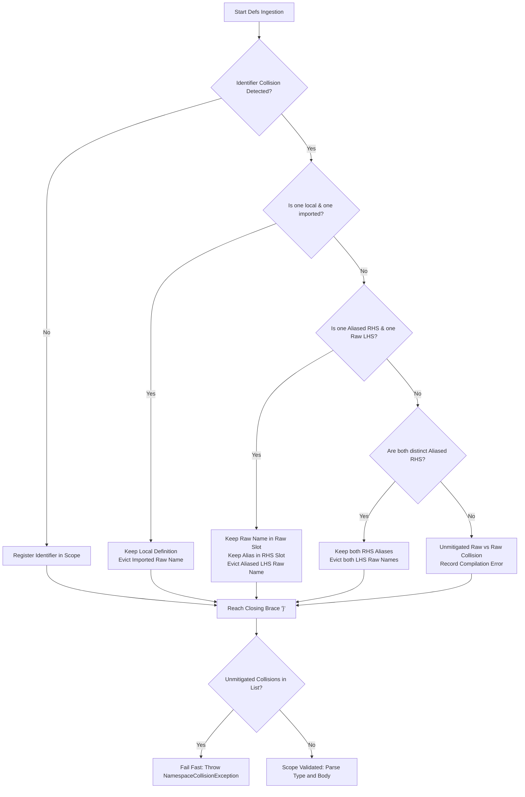

# STVN Language Specification

**Version:** 1.0.0

**Status:** Formal Technical Specification

**Target Audience:** Lexer, Parser, AST Analyzer, and Codec Implementers (Java, Kotlin, Scala, Rust, TypeScript, C++)

---

# Table of Contents <!-- omit in toc -->

<!-- TOC -->
* [STVN Language Specification](#stvn-language-specification)
* [Table of Contents <!-- omit in toc -->](#table-of-contents----omit-in-toc---)
  * [1. Document Boundaries and File Types](#1-document-boundaries-and-file-types)
    * [1.1 Root Enclosure Rule](#11-root-enclosure-rule)
    * [1.2 File Extension Matrix](#12-file-extension-matrix)
  * [2. Concrete Syntax Examples](#2-concrete-syntax-examples)
    * [2.1 Flat Include Module (`.stvn_inclf`)](#21-flat-include-module-stvn_inclf)
    * [2.2 Transitive Include Module (`.stvn_incl`)](#22-transitive-include-module-stvn_incl)
    * [2.3 Standard Payload Document (`.stvn`)](#23-standard-payload-document-stvn)
  * [3. Lexical and Syntactic Enclosure Rules](#3-lexical-and-syntactic-enclosure-rules)
    * [3.1 Hash Symbol (`#`) Semantic Taxonomy](#31-hash-symbol--semantic-taxonomy)
    * [3.2 Colon Symbol (`:`) Semantic Taxonomy](#32-colon-symbol--semantic-taxonomy)
    * [3.3 Comment Tokens](#33-comment-tokens)
    * [3.4 Metadata Annotation Placement Rules](#34-metadata-annotation-placement-rules)
    * [3.5 Module Include Directive Syntax](#35-module-include-directive-syntax)
    * [3.6 Namespaced and Path-Delimited Identifiers](#36-namespaced-and-path-delimited-identifiers)
      * [3.6.1 Lexical and Syntactic Grammar Rules](#361-lexical-and-syntactic-grammar-rules)
      * [3.6.2 Semantics & Scoping Invariants](#362-semantics--scoping-invariants)
    * [3.7 Typed Constant Definitions](#37-typed-constant-definitions)
      * [3.7.1 Syntax Grammar](#371-syntax-grammar)
      * [3.7.2 Semantics & Substitution Rules](#372-semantics--substitution-rules)
  * [4. Module Ingestion and Namespace Isolation](#4-module-ingestion-and-namespace-isolation)
    * [4.1 Single-Import Constraint](#41-single-import-constraint)
    * [4.2 Namespace Eviction Cascade](#42-namespace-eviction-cascade)
  * [5. Complete Type Taxonomy](#5-complete-type-taxonomy)
    * [5.1 Scalar Primitives & Arbitrary Bit-Widths](#51-scalar-primitives--arbitrary-bit-widths)
    * [5.2 Algebraic Sum Types](#52-algebraic-sum-types)
      * [5.2.1 Variant Syntax & Strict Product Demarcation](#521-variant-syntax--strict-product-demarcation)
    * [5.3 Algebraic Product Types](#53-algebraic-product-types)
    * [5.4 Collection Types](#54-collection-types)
    * [5.5 Temporal Domain Types (Tripartite Architecture)](#55-temporal-domain-types-tripartite-architecture)
      * [5.5.1 Physical Epoch Timestamps](#551-physical-epoch-timestamps)
      * [5.5.2 Physical Instant: `:DateTimeOffset`](#552-physical-instant-datetimeoffset)
      * [5.5.3 Civil Schedule: `:DateTimeZoned`](#553-civil-schedule-datetimezoned)
      * [5.5.4 Compliance & Audit Record: `:DateTimeAudited`](#554-compliance--audit-record-datetimeaudited)
      * [5.5.5 Tripartite Invariant Comparison Matrix](#555-tripartite-invariant-comparison-matrix)
  * [6. Trait Capability Calculus & Metadata Constraints](#6-trait-capability-calculus--metadata-constraints)
    * [6.1 Metadata Target Constraints](#61-metadata-target-constraints)
    * [6.2 Trait Capability Matrix](#62-trait-capability-matrix)
    * [6.3 Trait Derivation and Override Rules](#63-trait-derivation-and-override-rules)
  * [7. Value-Oriented Protocol (VOP) Invariants](#7-value-oriented-protocol-vop-invariants)
  * [8. Payload Inference & AST Lowering Rules](#8-payload-inference--ast-lowering-rules)
    * [8.1 Inference Rules](#81-inference-rules)
  * [9. Standard Library Prelude](#9-standard-library-prelude)
  * [10. Binary Format (`.stvn_bin`) Wire Framing & Schema Governance](#10-binary-format-stvn_bin-wire-framing--schema-governance)
    * [10.1 Control Byte Bitwise Architecture (Byte 4)](#101-control-byte-bitwise-architecture-byte-4)
    * [10.2 Upper Nibble: `BinaryEncodingStrategy` Taxonomy (Bits 7..4)](#102-upper-nibble-binaryencodingstrategy-taxonomy-bits-74)
    * [10.3 Lower Nibble: `SchemaIdentityStrategy` Taxonomy (Bits 3..0)](#103-lower-nibble-schemaidentitystrategy-taxonomy-bits-30)
    * [10.4 Header Decoding & Strategy Dispatch Pipeline](#104-header-decoding--strategy-dispatch-pipeline)
    * [10.5 Tripartite Temporal Wire Encoding & Memory Layouts](#105-tripartite-temporal-wire-encoding--memory-layouts)
  * [11. Code Generation & Implementation Directives](#11-code-generation--implementation-directives)
  * [Appendix A: Arbitrary Bit-Width Integer Semantics and Codec Layout](#appendix-a-arbitrary-bit-width-integer-semantics-and-codec-layout)
    * [A.1 Lexer and Grammar Rules](#a1-lexer-and-grammar-rules)
    * [A.2 Mathematical Range & Value Invariants](#a2-mathematical-range--value-invariants)
    * [A.3 Codec Containment and Memory Layout](#a3-codec-containment-and-memory-layout)
    * [A.4 High-Bit Masking and Verification](#a4-high-bit-masking-and-verification)
    * [A.5 Negative Test Cases](#a5-negative-test-cases)
  * [Appendix B: Exhaustive Grammar & AST Feature Catalogue](#appendix-b-exhaustive-grammar--ast-feature-catalogue)
    * [B.1 Canonical (Long-Form) Primitive & Scalar Types](#b1-canonical-long-form-primitive--scalar-types)
    * [B.2 Compressed (Short-Form) Primitive & Literal Showcase](#b2-compressed-short-form-primitive--literal-showcase)
    * [B.3 Algebraic Sum and Product Types (Long vs. Short & Happy Path)](#b3-algebraic-sum-and-product-types-long-vs-short--happy-path)
    * [B.4 Collection Types (Sequences, Sets, Maps, Invertible Maps)](#b4-collection-types-sequences-sets-maps-invertible-maps)
    * [B.5 Temporal Domain and Standard Library Prelude](#b5-temporal-domain-and-standard-library-prelude)
    * [B.6 Metadata Constraints and Trait Overrides](#b6-metadata-constraints-and-trait-overrides)
    * [B.7 STVN containing STVN Using `FENCED_STRING`](#b7-stvn-containing-stvn-using-fenced_string)
  * [Appendix C: Negative Syntax Catalogue (Anti-Hallucination Traps)](#appendix-c-negative-syntax-catalogue-anti-hallucination-traps)
  * [Appendix D: Reference Java-Target ANTLR4 Grammars](#appendix-d-reference-java-target-antlr4-grammars)
    * [D.1 Implementation & Portability Notice](#d1-implementation--portability-notice)
    * [D.2 Lexer Grammar (`StvnLexer.g4`)](#d2-lexer-grammar-stvnlexerg4)
    * [D.3 Parser Grammar (`StvnParser.g4`)](#d3-parser-grammar-stvnparserg4)
  * [Appendix E: Tripartite Temporal VOP Design Rationale & Mathematical Semantics](#appendix-e-tripartite-temporal-vop-design-rationale--mathematical-semantics)
    * [E.1 The Fatal Flaw of Temporal Conflation](#e1-the-fatal-flaw-of-temporal-conflation)
    * [E.2 Making Invalid States Unrepresentable](#e2-making-invalid-states-unrepresentable)
    * [E.3 100% Isomorphic Round-Trip Fidelity Proof](#e3-100-isomorphic-round-trip-fidelity-proof)
    * [E.4 Audit & Legal Compliance in Regulated Domains](#e4-audit--legal-compliance-in-regulated-domains)
    * [E.5 DST Spring-Forward Gap & Ambiguity Calculus](#e5-dst-spring-forward-gap--ambiguity-calculus)
  * [Appendix F: Module Ingestion, Import Aliasing, and Collision Resolution Catalogue](#appendix-f-module-ingestion-import-aliasing-and-collision-resolution-catalogue)
    * [F.1 Scenario 1: Local Priority Eviction](#f1-scenario-1-local-priority-eviction)
    * [F.2 Scenario 2: Asymmetric Ingestion (Alias vs. Raw)](#f2-scenario-2-asymmetric-ingestion-alias-vs-raw)
    * [F.3 Scenario 3: Dual Ingestion (Alias vs. Alias)](#f3-scenario-3-dual-ingestion-alias-vs-alias)
    * [F.4 Scenario 4: Unmitigated Raw vs. Raw Collision (Compiler Rejection)](#f4-scenario-4-unmitigated-raw-vs-raw-collision-compiler-rejection)
    * [F.5 Scenario 5: Single-Import Violation (Compiler Rejection)](#f5-scenario-5-single-import-violation-compiler-rejection)
    * [F.6 Scenario 6: Namespaced and Path-Delimited Identifier Ingestion](#f6-scenario-6-namespaced-and-path-delimited-identifier-ingestion)
<!-- TOC -->

---

## 1. Document Boundaries and File Types

### 1.1 Root Enclosure Rule

Every text-based STVN document **must** enclose its entire content within a single root curly brace pair `{ ... }`. Compilers **must reject** any file missing this outer boundary.

### 1.2 File Extension Matrix

| Extension         | Purpose                  | `:defs` Section | `:type` Section | `:body` Section | Directives Allowed                 |
|:------------------|:-------------------------|:----------------|:----------------|:----------------|:-----------------------------------|
| **`.stvn`**       | Primary Payload Document | Optional        | **Required**    | **Required**    | `:include`                         |
| **`.stvn_incl`**  | Transitive Shared Module | **Required**    | **Prohibited**  | **Prohibited**  | `:include` (Must resolve as a DAG) |
| **`.stvn_inclf`** | Flat Leaf Module         | **Required**    | **Prohibited**  | **Prohibited**  | None (`:include` is prohibited)    |
| **`.stvn_bin`**   | Zero-Copy Compact Binary | Embedded        | Embedded        | Embedded        | N/A (Bytecode)                     |
| **`.stvn_cas`**   | Repository Profile       | **Required**    | **Required**    | **Required**    | N/A (Predefined)                   |

---

## 2. Concrete Syntax Examples

### 2.1 Flat Include Module (`.stvn_inclf`)

```stvn
{
  // network_primitives.stvn_inclf
  :defs {
    :BitFlag        :Uint1
    :UnixPermission :Uint3
    :Port           { #minIncl 1 #maxIncl 65535 } :Uint16
    :HostName       { #regex "^[a-zA-Z0-9.-]+$" } :StringNonEmpty64
    :IpAddress      :Union( :IPv4 :StringFixed15 )
    :Protocol       :Enum [ #HTTP #HTTPS #TCP #UDP ]
  }
}
```

### 2.2 Transitive Include Module (`.stvn_incl`)

```stvn
{
  // telemetry_models.stvn_incl
  :defs {
    :include ["network_primitives.stvn_inclf" { :HostName :RemoteHost }]

    :NodeStatus     :Enum [ #HEALTHY #DEGRADED #UNREACHABLE ]
    :AudioSample24  :Int24
    :PacketCounter  :Uint49

    :Endpoint :Tuple( :RemoteHost :Port :Protocol )

    :LatencyHistory :SeqNonEmpty( :Uint32 )

    :RouteTable :MapInv( :RemoteHost :IpAddress )
  }
}
```

### 2.3 Standard Payload Document (`.stvn`)

```stvn
{
  // telemetry_report.stvn
  :defs {
    :include ["telemetry_models.stvn_incl"]

    :NodeReport :Tuple(
      :Endpoint 
      :NodeStatus 
      :AudioSample24 
      :PacketCounter 
      :LatencyHistory 
      :RouteTable 
      :Option( :Uint32 )    
    )
  }

  :type :NodeReport

  :body ( 
    ("gateway.internal" 8443 #HTTPS)
    #HEALTHY
    -8388600 
    500000000000000 
    [ 12 15 11 14 ]
    { 
       [ "auth.internal" "10.0.0.1" ] 
       [ "db.internal"   "10.0.0.2" ] 
    } 
    1420  // Inferred as #Some 1420 via Rule A
  )
}
```

---

## 3. Lexical and Syntactic Enclosure Rules

```
                      ┌──────────────────────────────────────────────┐
                      │             STVN ENCLOSURE MATRIX            │
┌─────────────────────┼──────────────────────────────┬───────────────┴──────────────┐
│ Delimiter           │ Definition-Space Context     │ Value / Payload Context      │
├─────────────────────┼──────────────────────────────┼──────────────────────────────┤
│ Curly Braces { }    │ • File root { ... }          │ • Metadata blocks            │
│                     │ • Definition block :defs { } │   { #minIncl 1 #equatable #T}│
│                     │ • Include alias maps { :A :B}│ • Map literal values:        │
│                     │                              │   :Map -> { [ "k1" "v1" ] }  │
├─────────────────────┼──────────────────────────────┼──────────────────────────────┤
│ Parentheses ( )     │ • Type constructors:         │ • Product / Tuple values:    │
│                     │   :Tuple( ... ), :Seq( ... ) │   ( "host" 8080 #DEV )       │
│                     │   :Union( ... ), :Option( ...│ • Top-level tuple payload:   │
│                     │                              │   :body ( ... )              │
├─────────────────────┼──────────────────────────────┼──────────────────────────────┤
│ Brackets [ ]        │ • :Enum domain constants:    │ • Collection values:         │
│                     │   :Enum [ #A #B #C ]         │   :Seq -> [ 1 2 3 ]          │
│                     │ • Include directives:        │   :Set -> [ 1 2 3 ]          │
│                     │   :include [ "path" { } ]    │ • Map entries: [ "k" "v" ]   │
└─────────────────────┴──────────────────────────────┴──────────────────────────────┘
```

---

### 3.1 Hash Symbol (`#`) Semantic Taxonomy

The hash character (`#`) is a dedicated structural token in STVN. It is **never** a comment delimiter. The lexer categorizes `#` tokens into five mutually exclusive semantic roles based on context:

| Category                             | Token Pattern                                               | Canonical Form                                                                                           | Compressed Form                       | Context / Purpose                                        |
|:-------------------------------------|:------------------------------------------------------------|:---------------------------------------------------------------------------------------------------------|:--------------------------------------|:---------------------------------------------------------|
| **Boolean Literals**                 | `#TRUE`, `#FALSE`, `#T`, `#F`                               | `#TRUE`, `#FALSE`                                                                                        | `#T`, `#F`                            | Value payload for `:Boolean`                             |
| **Sum Variant Constructors**         | `#Some`, `#None`, `#Left`, `#Right`, `#S`, `#N`, `#L`, `#R` | `#Some v`, `#None`, `#Left v`, `#Right v`                                                                | `#S v`, `#N`, `#L v`, `#R v`          | Tagged sum type values (`:Option`, `:Either`)            |
| **Union Branch Index Selectors**     | `#` `[1-9][0-9]*`                                           | `#1`, `#2`, `#12`                                                                                        | N/A                                   | 1-based index selecting target branch in `:Union( ... )` |
| **Enum Domain Constants**            | `#` `[A-Z0-9_]+`                                            | `#DEV`, `#PROD`, `#HTTP`                                                                                 | N/A                                   | Nominal constant values declared in `:Enum [ ... ]`      |
| **Metadata Constraint Keys & Flags** | `#` `[a-zA-Z0-9_]+`                                         | `#equatable`, `#comparable`, `#minIncl`, `#maxIncl`, `#minExcl`, `#maxExcl`, `#regex`, `#preserveIndent` | N/A                                   | Keys and flags inside metadata blocks `{ ... }`          |

---

### 3.2 Colon Symbol (`:`) Semantic Taxonomy

The colon character (`:`) is a dedicated **type-space and structural keyword prefix sigil**.

* **The Leading Prefix Rule:** The colon **must always** be attached directly as a prefix to an identifier (e.g., `:type`, `:Int32`, `:UserAccount`).
* **The No-Infix Rule:** The colon is **never** used as an infix punctuation mark, key-value separator (JSON/YAML style), or statement terminator. A bare colon token `:` is a fatal lexical error.

| Category                                     | Token Pattern             | Examples                                                                                                                                                | Context / Purpose                                                             |
|:---------------------------------------------|:--------------------------|:--------------------------------------------------------------------------------------------------------------------------------------------------------|:------------------------------------------------------------------------------|
| **Root Block Keywords**                      | `:defs`, `:type`, `:body` | `:defs { ... }`<br>`:type :AppPayload`<br>`:body ( ... )`                                                                                               | Declares mandatory and optional top-level document sections                   |
| **Module Directives**                        | `:include`                | `:include [ "lib.stvn_inclf" ]`                                                                                                                         | Directs the module resolver to import external definitions                    |
| **Scalar & Sized Type Tokens**               | `:` `[A-Z][a-zA-Z0-9]*`   | `:Boolean`, `:Int`, `:Int32`, `:Uint49`, `:Float64`, `:FloatExact`, `:String`, `:StringNonEmpty64`, `:StringFixed16`                                    | Built-in primitive and arbitrary bit-width scalar type identifiers            |
| **Algebraic & Collection Type Constructors** | `:` `[A-Z][a-zA-Z0-9]*`   | `:Option`, `:Either`, `:Union`, `:Tuple`, `:Enum`, `:Seq`, `:SeqNonEmpty`, `:Set`, `:SetNonEmpty`, `:Map`, `:MapNonEmpty`, `:MapInv`, `:MapInvNonEmpty` | Parameterized sum, product, and collection type constructors                  |
| **Temporal & Prelude Identifiers**           | `:` `[A-Z][a-zA-Z0-9]*`   | `:TimeEpochMs`, `:DateTimeOffset`, `:DateTimeZoned`, `:DateTimeAudited`, `:Uuid`, `:Port`, `:Email`, `:Currency`                                        | Pre-registered temporal primitives and standard library domain aliases        |
| **Nominal User-Defined Type Identifiers**    | `:` `[A-Z][a-zA-Z0-9_]*`  | `:HostName`, `:ServerConfig`, `:RouteTable`                                                                                                             | User-defined type names declared inside `:defs` and referenced across schemas |

```stvn
// VALID: Colon as prefix sigil
:defs {
  :PortNumber :Uint16
  :ServerConfig :Tuple( :String :PortNumber )
}
:type :ServerConfig
:body ( "localhost" 8080 )

// INVALID: Colon as JSON-style key-value separator
"host": "localhost"     // FATAL: Lexical/Parse error (bare colon infix separator prohibited)
port: 8080              // FATAL: Lexical/Parse error (bare colon infix separator prohibited)
```

---

### 3.3 Comment Tokens

1. **Single-Line Comments (`//`)**: The scanner discards all characters from the double-slash token (`//`) through the end-of-line boundary before AST construction.
2. **Block Comments Prohibited**: STVN does not support multi-line block comments (`/* ... */`). Documentation spanning multiple lines **must** use contiguous single-line `//` tokens.
3. **Comment Token Isolation**: The hash character (`#`) **must not** be used for documentation or prose. Using `#` for freeform text causes a fatal lexical error.

```stvn
// VALID: Single-line documentation
// Contiguous single-line documentation comment block

#INVALID_COMMENT // FATAL: Parse error (unexpected symbol token '#INVALID_COMMENT')
/* INVALID_BLOCK */ // FATAL: Parse error (unexpected token '/*')
```

---

### 3.4 Metadata Annotation Placement Rules

Metadata constraint blocks `{ ... }` **must immediately precede** the target type identifier they configure:

```stvn
// VALID: Metadata block prefixes the target type
:Port     { #minIncl 1 #maxIncl 65535 } :Uint16
:Username { #regex "^[a-z0-9_]{3,16}$" } :StringNonEmpty16
:Flag     { #equatable #TRUE } :Float64

// INVALID: Suffix or wrapped metadata placement
:BadPort1 :Uint16 { #minIncl 1 }       // FATAL: Syntax error
:BadPort2 (:Uint16 { #minIncl 1 })     // FATAL: Syntax error
```

---

### 3.5 Module Include Directive Syntax

All `:include` directives inside a `:defs` block **must** be enclosed within square brackets `[ ... ]`:

```stvn
:defs {
  // Direct import
  :include [ "network_primitives.stvn_inclf" ]

  // Import with explicit namespace alias mapping block
  :include [ "shared_models.stvn_incl" { :HostName :RemoteHost :Port :RemotePort } ]
}
```

---

### 3.6 Namespaced and Path-Delimited Identifiers

STVN supports hierarchical, slash-delimited path identifiers in definition and value spaces. This capability allows domain modularization, namespace scoping, and structured cataloging without requiring complex package import hierarchies.

#### 3.6.1 Lexical and Syntactic Grammar Rules
A path-delimited identifier consists of a base keyword start token followed by one or more forward-slash (`/`) delimited alphanumeric segments:

* **Type Identifier Syntax:** `typeKeywordStart ( '/' IDENTIFIER )*`
  * Examples: `:net/http/Status`, `:org/stvnadore/telemetry/Header`, `:math/geo/Coordinate3D`
* **Value Identifier Syntax:** `valueKeywordStart ( '/' IDENTIFIER )*`
  * Examples: `#net/http/OK`, `#net/http/NotFound`, `#status/v1/ACTIVE`

#### 3.6.2 Semantics & Scoping Invariants
1. **Atomic Token Identity:** The complete slash-delimited token acts as a single, indivisible nominal identifier. The compiler treats `:net/http/Status` and `:Status` as distinct, non-interchangeable nominal types.
2. **Leading Prefix Rule:** The leading colon (`:`) or hash (`#`) sigil attaches only to the first segment. Subsequent segments are separated solely by forward slashes (`/`). Colons must not appear in infix positions (e.g. `:net:http:Status` is a fatal syntax error).
3. **Module Alias Compatibility:** Namespaced identifiers can be targeted by include alias blocks inside `:defs`:
   ```stvn
   :defs {
     :include [ "networking.stvn_incl" { :net/http/Status :HttpStatus } ]
   }
   ```

---

### 3.7 Typed Constant Definitions

A `:defs` block **MAY** bind immutable compile-time constant values to identifiers. Constant identifiers **MUST** reside in the value namespace and start with a value sigil (`#`). Type identifiers (`:`) in constant definition position are **PROHIBITED**.

#### 3.7.1 Syntax Grammar
```antlr4
defsEntry          : KW_DEFS LBRACE ( includeStmt | typeDefinition | constantDefinition )* RBRACE ;
typeDefinition     : typeKeyword metadataMap? schemaType ;
constantDefinition : valueKeyword metadataMap? schemaType value ;
```

#### 3.7.2 Semantics & Substitution Rules
1. **Declaration:** A constant definition **MUST** declare a value keyword (`#`), an optional metadata constraint block, a target schema type, and a trailing literal payload:
   ```stvn
   :defs {
     #MAX_RETRY  :Uint8 3
     #API_HOST   { #regex "^[a-z.]+$" } :String "api.internal.net"
     #EMPTY_MASK :Seq( :Uint8 ) [ 0 0 0 0 ]
   }
   ```
2. **Payload Substitution:** Referencing the value keyword (e.g., `#MAX_RETRY`) within the document `:body` or within another constant expression in `:defs` instructs the compiler to perform deterministic compile-time value substitution:
   ```stvn
   :type :Tuple( :Uint8 :String )
   :body ( #MAX_RETRY #API_HOST )
   // Lowers to: ( 3 "api.internal.net" )
   ```
3. **Lexical Isolation:** Nominal type identifiers (`:`) **MUST NOT** appear in value positions. Value keywords (`#`) **MUST NOT** appear as nominal type declarations.
4. **Type Soundness:** The assigned `value` payload **MUST** conform to the specified `schemaType` and all associated metadata constraints during `:defs` validation. Mismatches cause immediate compile-time failure.

---

## 4. Module Ingestion and Namespace Isolation

### 4.1 Single-Import Constraint

A file path string literal may appear in an `:include` directive **only once** per `:defs` block. Duplicate declarations of the same file path cause the compiler to immediately throw `DuplicateModuleImportException`. *(See Appendix F.5)*.

### 4.2 Namespace Eviction Cascade

When multiple modules or local declarations supply the same type identifier name, the compiler evaluates conflicts sequentially and resolves them at the closing curly brace `}` of the `:defs` block:

1. **Local Priority:** Local definitions inside the file's `:defs` block evict clashing imported raw names. *(See [Appendix F.1](#f1-scenario-1-local-priority-eviction))*.
2. **Asymmetric Ingestion (Alias vs. Raw):** If Module A renames `:TypeX` to `:LocalAlias`, and Module B imports `:TypeX` raw, the raw slot is assigned to Module B. Module A accesses the type through `:LocalAlias`. *(See [Appendix F.2](#f2-scenario-2-asymmetric-ingestion-alias-vs-raw))*.
3. **Dual Ingestion (Alias vs. Alias):** If Module A and Module B both alias `:TypeX` using distinct local names, both claims on the raw identifier `:TypeX` are evicted. Both local alias names remain valid. *(See [Appendix F.3](#f3-scenario-3-dual-ingestion-alias-vs-alias))*.
4. **Unmitigated Collision (Raw vs. Raw):** If two modules import the identical raw identifier without alias mapping, the conflict cannot be resolved. The compiler flags this as an unmitigated error and throws `NamespaceCollisionException`. *(See [Appendix F.4](#f4-scenario-4-unmitigated-raw-vs-raw-collision-compiler-rejection))*.
5. **Gate Execution:** At the closing brace `}` of `:defs`, if any unmitigated collisions remain, the compiler stops and throws `NamespaceCollisionException`. Downstream `:type` and `:body` sections **must not** be parsed if `:defs` validation fails.

*(See [**Appendix F**](#appendix-f-module-ingestion-import-aliasing-and-collision-resolution-catalogue) for complete, executable code examples demonstrating each resolution scenario.)*



---

## 5. Complete Type Taxonomy

### 5.1 Scalar Primitives & Arbitrary Bit-Widths

STVN supports arbitrary bit-width integers ($n \ge 1$). Integers are not limited to powers of 2. Un-suffixed base tokens resolve to fixed default types.

| Base Token               | Compiled Type            | Bit-Width ($n$)       | Value Bounds                            | Examples                                                                                                                           |
|:-------------------------|:-------------------------|:----------------------|:----------------------------------------|:-----------------------------------------------------------------------------------------------------------------------------------|
| **`:Int`**               | **`:Int32`**             | $n = 32$              | $[-2^{31}, 2^{31}-1]$                   | Default when un-suffixed                                                                                                           |
| **`:Int`$n$**            | **`:Int`$n$**            | Any integer $n \ge 1$ | $[-2^{n-1}, 2^{n-1}-1]$                 | `:Int1`, `:Int7`, `:Int24`, `:Int64` *(See [Appendix A](#appendix-a-arbitrary-bit-width-integer-semantics-and-codec-layout))*      |
| **`:Uint`**              | **`:Uint32`**            | $n = 32$              | $[0, 2^{32}-1]$                         | Default when un-suffixed                                                                                                           |
| **`:Uint`$n$**           | **`:Uint`$n$**           | Any integer $n \ge 1$ | $[0, 2^n-1]$                            | `:Uint1`, `:Uint3`, `:Uint49`, `:Uint128` *(See [Appendix A](#appendix-a-arbitrary-bit-width-integer-semantics-and-codec-layout))* |
| **`:Boolean`**           | `:Boolean`               | 1 bit / 1 byte        | `#TRUE`/`#T`, `#FALSE`/`#F`             | Maps true/false values                                                                                                             |
| **`:Float`**             | **`:Float64`**           | 64 bits               | IEEE 754 double precision               | Default when un-suffixed                                                                                                           |
| **`:Float32`**           | `:Float32`               | 32 bits               | IEEE 754 single precision               | Explicit 32-bit float                                                                                                              |
| **`:Float64`**           | `:Float64`               | 64 bits               | IEEE 754 double precision               | Explicit 64-bit float                                                                                                              |
| **`:FloatExact`**        | `:FloatExact`            | Arbitrary             | Exact decimal representation            | Financial / high-precision values                                                                                                  |
| **`:String`**            | **`:String`**            | Variable              | Max 16,777,216 chars baseline           | Default when un-suffixed                                                                                                           |
| **`:String`$n$**         | **`:String`$n$**         | Variable              | Length $\le n$ characters               | `:String64`, `:String256`                                                                                                          |
| **`:StringNonEmpty`$n$** | **`:StringNonEmpty`$n$** | Variable              | $1 \le \text{Length} \le n$ characters  | `:StringNonEmpty64`                                                                                                                |
| **`:StringFixed`$N$**    | **`:StringFixed`$N$**    | Fixed                 | Length exactly equal to $N$ ($N \ge 1$) | `:StringFixed15`, `:StringFixed36`                                                                                                 |

### 5.2 Algebraic Sum Types

* **`:Option( T )`**: Optional wrapper. Recognizes `#Some v` (or `#S v`) and `#None` (or `#N`).
* **`:Either( L R )`**: Disjoint union with right bias. Recognizes `#Left v` (or `#L v`) and `#Right v` (or `#R v`).
* **`:Union( T1 T2 ... Tn )`**: N-way disjoint variant plane. Variants use 1-based indexing (`#1`, `#2`, ... `#n`).
* **`:Enum[ #VAL1 #VAL2 ... #VALn ]`**: Bounded set of nominal keyword constants. Stored internally as 0-based sequential integers.

#### 5.2.1 Variant Syntax & Strict Product Demarcation
Sum variant tags (`#Some`, `#None`, `#Left`, `#Right`, `#S`, `#N`, `#L`, `#R`, and Union index tags `#1`, `#2`, ... `#n`) operate directly on a trailing `value`:

1. **Bare Value Syntax (Normative):**
   The variant tag directly precedes the payload value without enclosing parentheses:
   - `#Some "text"`
   - `#Right 42`
   - `#1 1024`

2. **Strict Product Demarcation:**
   Parentheses `( ... )` in STVN are strictly and exclusively product constructors (`:Tuple`). They are **never** function-call delimiters.
   - If the target schema is a scalar (e.g., `:Option( :Uint32 )`), supplying a parenthesized expression (`#Some ( 42 )`) is a fatal type mismatch (`MalformedPayloadException`).
   - If the target schema is explicitly a product (e.g., `:Option( :Tuple( :Uint32 ) )`), parentheses are mandatory: `#Some ( 42 )`.
   - Multi-element product variants require parentheses matching the product schema arity: `:Option( :Tuple( :Uint32 :Uint32 ) )` with `#Some ( 1 2 )`.

### 5.3 Algebraic Product Types

* **`:Tuple( T1 T2 ... Tn )`**: Heterogeneous fixed-size ordered structural sequence. Encoded as `( v1 v2 ... vn )`.

### 5.4 Collection Types

All collection types preserve **insertion order**. Value equality is order-dependent: `{ [ "a" 1 ] [ "b" 2 ] }` does not equal `{ [ "b" 2 ] [ "a" 1 ] }`.

* **`:Seq( T )`**: Ordered dynamic array of elements of type `T`. Encoded as `[ v1 v2 ... vn ]`.
* **`:SeqNonEmpty( T )`**: Ordered dynamic array of type `T` requiring size $\ge 1$. Encoded as `[ v1 v2 ... vn ]`.
* **`:Set( T )`**: Insertion-ordered set of unique elements of type `T`. Type `T` **must** resolve to `#equatable`. Encoded as `[ v1 v2 ... vn ]`. Duplicate values trigger `"Duplicate set element detected"`.
* **`:SetNonEmpty( T )`**: Insertion-ordered set of unique elements of type `T` requiring size $\ge 1$. Same constraints as `:Set`.
* **`:Map( K V )`**: Associative key-value map. Keys **must** resolve to `#equatable`. Encoded in text as outer curly braces enclosing ordered bracketed key-value pairs: `{ [ k1 v1 ] [ k2 v2 ] ... [ kn vn ] }`. Encoded in binary format using Structure-of-Arrays (SoA) layout. Duplicate keys are prohibited and trigger `"Duplicate map key detected"`.
* **`:MapNonEmpty( K V )`**: Associative key-value map requiring size $\ge 1$. Same constraints as `:Map`.
* **`:MapInv( K V )`**: Invertible bidirectional map. Enforces a **dual-set invariant**: all keys must be unique **and** all values must be unique. Both `K` and `V` **must** resolve to `#equatable`. Encoded in text as `{ [ k1 v1 ] [ k2 v2 ] ... }`. Duplicate values trigger `"Duplicate inverted map value detected"`.
* **`:MapInvNonEmpty( K V )`**: Invertible bidirectional map requiring size $\ge 1$. Same constraints as `:MapInv`.

### 5.5 Temporal Domain Types (Tripartite Architecture)

STVN partitions temporal values into physical epoch counters and a mathematically orthogonal tripartite date-time system:

#### 5.5.1 Physical Epoch Timestamps
* **`:TimeEpochS`**: 64-bit signed integer representing seconds elapsed since the Unix Epoch (`1970-01-01T00:00:00Z`).
* **`:TimeEpochMs`**: 64-bit signed integer representing milliseconds elapsed since the Unix Epoch.
* **`:TimeEpochNs`**: Arbitrary-precision integer representing nanoseconds elapsed since the Unix Epoch.

#### 5.5.2 Physical Instant: `:DateTimeOffset`
Represents an absolute point on the physical timeline associated with a fixed local presentation offset.
* **Normative Syntax:** Double-quoted ISO-8601 string containing full date, time, and mandatory numerical UTC offset (`Z` or `±HH:mm`):
  `"YYYY-MM-DDTHH:mm:ss[.fff...](Z|±HH:mm)"`
* **Grammar Invariant:** **Prohibits zone brackets `[...]`.** Supplying a time zone identifier (e.g. `"2026-03-15T08:00:00-05:00[America/Chicago]"`) to a `:DateTimeOffset` schema is a fatal compilation error (`MalformedPayloadException`).
* **AST Record:** `StvnValue.StvnDateTimeOffset(ResolvedSchema schema, OffsetDateTime value)`
* **Examples:** `"2026-03-15T08:00:00-05:00"`, `"2026-08-18T18:30:00Z"`, `"2026-12-31T23:59:59.999999999+09:00"`

#### 5.5.3 Civil Schedule: `:DateTimeZoned`
Represents a human civil wall-clock time scheduled within a geopolitical IANA time zone jurisdiction.
* **Normative Syntax:** Double-quoted ISO-8601 string containing local date, local time, and a bracketed canonical IANA time zone identifier:
  `"YYYY-MM-DDTHH:mm:ss[.fff...][Region/City]"`
* **Grammar Invariant 1 (No Static Offset):** **Prohibits static numerical offsets or `Z`.** Supplying `±HH:mm` or `Z` before the bracketed zone (e.g. `"2026-03-15T08:00:00-05:00[America/Chicago]"`) is a fatal compilation error. The physical offset is dynamically evaluated via IANA `ZoneRules`.
* **Grammar Invariant 2 (DST Spring-Forward Gap):** The compiler **strictly rejects** civil times falling into non-existent daylight saving transition gaps (e.g., `"2026-03-08T02:30:00[America/Chicago]"` where clocks leap from `02:00` directly to `03:00`).
* **AST Record:** `StvnValue.StvnDateTimeZoned(ResolvedSchema schema, LocalDateTime localDateTime, ZoneId zoneId)`
* **Examples:** `"2026-03-15T08:00:00[America/Chicago]"`, `"2026-08-18T18:30:00[Europe/London]"`, `"2026-11-01T01:30:00[Asia/Tokyo]"`

#### 5.5.4 Compliance & Audit Record: `:DateTimeAudited`
Represents an immutable regulatory event recording both the observed instant offset and the legal IANA jurisdiction under which the transaction occurred.
* **Normative Syntax:** Double-quoted ISO-8601 string containing local date, local time, explicit UTC offset, and bracketed IANA time zone identifier:
  `"YYYY-MM-DDTHH:mm:ss[.fff...](Z|±HH:mm)[Region/City]"`
* **Grammar Invariant 1 (Mandatory Dual Tokens):** Must contain **both** an explicit UTC offset (`Z` or `±HH:mm`) and a bracketed IANA zone ID. Omitting either token is a fatal compilation error.
* **Grammar Invariant 2 (Compile-Time Consistency Assert):** The compiler computes the valid offset(s) for the local timestamp in the specified zone and asserts:
  $$\text{offset} \in \text{ZoneRules}(\text{zoneId}).\text{getValidOffsets}(\text{localTime})$$
  Contradictory offsets (e.g., `"2026-03-15T08:00:00-07:00[America/Chicago]"`, where Chicago is at `-05:00` CDT) trigger an immediate compile-time diagnostic.
* **Grammar Invariant 3 (DST Gap Check):** Civil timestamps falling into DST spring-forward gaps are rejected.
* **AST Record:** `StvnValue.StvnDateTimeAudited(ResolvedSchema schema, OffsetDateTime offsetDateTime, ZoneId zoneId)`
* **Examples:** `"2026-03-15T08:00:00-05:00[America/Chicago]"`, `"2026-01-15T08:00:00-06:00[America/Chicago]"`, `"2026-07-04T12:00:00+01:00[Europe/London]"`

#### 5.5.5 Tripartite Invariant Comparison Matrix

| Specification Attribute            | `:DateTimeOffset`                       | `:DateTimeZoned`                        | `:DateTimeAudited`                                     |
|:-----------------------------------|:----------------------------------------|:----------------------------------------|:-------------------------------------------------------|
| **Domain Category**                | Physical / Universal Instant            | Civil / Wall-Clock Schedule             | Compliance / Regulatory Audit                          |
| **Literal Grammar**                | `"YYYY-MM-DDTHH:mm:ss±HH:mm"`           | `"YYYY-MM-DDTHH:mm:ss[Zone]"`           | `"YYYY-MM-DDTHH:mm:ss±HH:mm[Zone]"`                    |
| **Explicit Offset (`Z`/`±HH:mm`)** | **Mandatory**                           | **Prohibited**                          | **Mandatory**                                          |
| **Bracketed Zone (`[...]`)**       | **Prohibited**                          | **Mandatory**                           | **Mandatory**                                          |
| **Offset Consistency Evaluation**  | $\text{N/A}$                            | Derived dynamically at runtime          | **Validated at Compile Time**                          |
| **DST Gap Rejection**              | $\text{N/A}$ (Unambiguous instant)      | **Strictly Rejected**                   | **Strictly Rejected**                                  |
| **Target AST IR Node**             | `StvnDateTimeOffset`                    | `StvnDateTimeZoned`                     | `StvnDateTimeAudited`                                  |
| **Binary Memory Layout**           | `(epoch_utc_nanos: i64, offset_s: i32)` | `(local_nanos: i64, zone_dict_id: u16)` | `(local_nanos: i64, offset_s: i32, zone_dict_id: u16)` |
| **Binary Wire Footprint**          | 12 Bytes                                | 10 Bytes                                | 14 Bytes                                               |
| **Canonical Serialization**        | ISO-8601 Offset String                  | ISO-8601 Local String + `[Zone]`        | ISO-8601 Offset String + `[Zone]`                      |

---

## 6. Trait Capability Calculus & Metadata Constraints

### 6.1 Metadata Target Constraints

Metadata annotations appear inside `{ ... }` blocks immediately following a type identifier:

* `#equatable`: Declares that the type supports stable equality and hashing.
* `#comparable`: Declares that the type supports deterministic ordinal comparison.
* `#minIncl` / `#minExcl`: Lower numeric bounds (inclusive or exclusive). Must match the underlying numeric scalar type.
* `#maxIncl` / `#maxExcl`: Upper numeric bounds (inclusive or exclusive). Must match the underlying numeric scalar type.
* `#regex`: Regular expression pattern constraint for string types (evaluated using standard Java regex syntax).
* `#preserveIndent`: String whitespace rule for multi-line block literals. `#TRUE` keeps exact indentation; `#FALSE` (default) strips common indentation.

### 6.2 Trait Capability Matrix

| Type Category             | Specific Types                                                                                         | `#equatable` Default | `#comparable` Default |
|:--------------------------|:-------------------------------------------------------------------------------------------------------|:---------------------|:----------------------|
| **Scalars**               | `:Boolean`, `:Int*`, `:Uint*`, `:FloatExact`, `:String*`, `:Enum`                                      | **Yes**              | **Yes**               |
| **Floating-Point**        | `:Float32`, `:Float64`, `:Float`                                                                       | **--No--**           | **Yes**               |
| **Temporal**              | `:TimeEpochS`, `:TimeEpochMs`, `:TimeEpochNs`, `:DateTimeOffset`, `:DateTimeZoned`, `:DateTimeAudited` | **Yes**              | **Yes**               |
| **Unordered Collections** | `:Set`, `:SetNonEmpty`, `:MapInv`, `:MapInvNonEmpty`                                                   | **Yes**              | **--No--**            |
| **Derived Containers**    | `:Option`, `:Either`, `:Union`, `:Tuple`, `:Seq*`, `:Map*`                                             | **Derived**          | **Derived**           |

### 6.3 Trait Derivation and Override Rules

1. **Capability Bubbling:** For types marked as **Derived**, the container possesses `#equatable` or `#comparable` **if and only if all enclosed member types possess that capability**. If any inner type is `#equatable #FALSE`, the entire container becomes `#equatable #FALSE`.
2. **Explicit Override Authority:** A developer can explicitly declare `{ #equatable #TRUE }` on any type. An explicit user metadata annotation overrides automatic capability bubbling.
3. **Numeric Equivalence Escape Hatch:** If a developer applies `{ #equatable #TRUE }` to `:Float32` or `:Float64`, the compiler accepts the type and generates bitwise IEEE 754 pattern comparisons. The developer accepts all runtime precision hazards.
4. **Recursive Cycle Traversal:** During trait derivation (`deriveAndApplyTraits`), recursive nominal types maintain their derived traits across cycle boundaries. The compiler uses a `passedConstructor` frame to detect cycles and prevent infinite loops.
5. **Printer Minimization:** STVN serialization and printing engines **must not** emit default or derived metadata tokens. Printers emit `{ ... }` annotation blocks **only** when an explicit user override or non-default constraint is present.
6. **Symbol Style Uniformity:** Serializers configured to short-form tokens **must** apply compression uniformly across all types in a document. Mixing styles (e.g., emitting `#T` for booleans but `#Some` for options) is prohibited.

| Style Mode             | `:Boolean`         | `:Option`         | `:Either`          |
|:-----------------------|:-------------------|:------------------|:-------------------|
| **Canonical (Long)**   | `#TRUE` / `#FALSE` | `#Some` / `#None` | `#Left` / `#Right` |
| **Compressed (Short)** | `#T` / `#F`        | `#S` / `#N`       | `#L` / `#R`        |

---

## 7. Value-Oriented Protocol (VOP) Invariants

1. **Absence of Null and Uninitialized States:** High-level `null` references, `nil` pointers, and uninitialized fields are unrepresentable in STVN. Missing or optional data must be declared as `:Option( T )`.
2. **Zero-Shadowing:** A nominal type definition in a `:defs` block must not redefine or shadow another type identifier in the same file context.
3. **Nominal Type Isolation:** Types with identical structural layouts remain incompatible if their names differ. Compatibility requires matching nominal type identifiers.
4. **Nominal Bounding:** Recursive or cyclical type structures must not be defined anonymously at the raw payload tier. Recursive types must be anchored through a named definition in a `:defs` block.
5. **Sum Type Variant Uniqueness:** All candidate branches in `:Either` or `:Union` types must possess unique nominal type names. If two branches share the same underlying structure, the developer must register unique aliases in `:defs`. Duplicate branch types cause a `MalformedSchemaException`.

---

## 8. Payload Inference & AST Lowering Rules

STVN decoders support implicit tagging for sum types when the payload value is unambiguous.

### 8.1 Inference Rules

* **Rule A (Implied Option `#Some`):** For schema `:Option( T )`, an untagged value matching type `T` is automatically parsed as `#Some value`.
* **Rule B (Implied Either `#Right`):** For schema `:Either( L R )`, an untagged value matching type `R` is automatically parsed as `#Right value`.
* **Rule C (Implied Union Branch):** For schema `:Union( T1 T2 ... Tn )`, an untagged value matching the distinct structural domain of exactly one branch `Tk` is automatically parsed as `#k value`.
* **Rule D (Ambiguity Resolution):** If an untagged value is structurally valid as both an explicit variant tag (e.g., enum or constant value token `#None`, `#Right`, etc.) and an inner scalar type `T`, explicit tagging is **mandatory**.
* **Rule E (Asymmetric Non-Inferability):** The tags `#Left` and `#None` **must never be inferred**.
    * Untagged values matching type `L` in an `:Either( L R )` schema trigger a fatal type error (`MalformedPayloadException`).
    * Missing elements never synthesize an implicit `#None`.
* **Rule F (Negative Examples):**
```stvn
// Given schema: :Seq( :Option( :Either( :String :Float ) ) )

// INVALID: Fails Rule E. String matches :Left, but #Left cannot be inferred.
[ "test" ] // Parse Failure

// VALID: Explicit #Left wrapper provided.
[ #Left "test" ]

// VALID: Float matches :Right, inferred via Rule B.
//        :Right 42.5 matches :Some, inferred via Rule A.
[ 42.5 ] // Inferred as #Some #Right 42.5
```
* **Rule G (Union Branch Indexing):** Union variants use 1-based indexing prefixes matching lexer pattern `#` `[1-9][0-9]*` (e.g., `#1 42`, `#2 "text"`). Tag `#0` and negative tags are illegal. Indices exceeding the union branch count throw `StvnMalformedLiteralException`.
* **Rule H (Two-Branch Union vs. Either):** A 2-branch `:Union( A B )` has no structural bias and allows implicit bidirectional matching across distinct token domains via Rule C. In contrast, `:Either( L R )` is right-biased and requires explicit `#Left` tagging.
* **Rule I (Intersection Clusters):** If an untagged value matches multiple candidate branches in a union, implicit resolution is disabled. The payload must provide an explicit branch tag (`#1`), or the parser throws `StvnCollectionCollisionException`.
* **Rule J (Semantic Guard Tracking):** If an explicit branch tag is syntactically valid but the value violates a localized constraint (e.g., a `#regex` mismatch), the AST node is lowered into a monadic diagnostic framework (`StvnAnalysisResult`). The error is tracked in a `StvnDiagnostic` frame with text coordinates for IDE highlighting without crashing the AST pipeline.

---

## 9. Standard Library Prelude

The runtime environment provides the following pre-registered types:

| Type Identifier    | Underlying Representation | Applied Constraints / Validation Specification               |
|:-------------------|:--------------------------|:-------------------------------------------------------------|
| **`:Uuid`**        | `:StringFixed36`          | Standard UUID format: `8-4-4-4-12` hex characters            |
| **`:Ulid`**        | `:StringFixed26`          | Crockford's Base32 ULID character set                        |
| **`:Sha256`**      | `:StringFixed64`          | Hexadecimal SHA-256 hash string (64 hex characters)          |
| **`:SemVer`**      | `:StringNonEmpty64`       | Standard Semantic Versioning syntax (`MAJOR.MINOR.PATCH`)    |
| **`:Email`**       | `:StringNonEmpty256`      | Standard RFC 5322 email address validation                   |
| **`:IPv4`**        | `:StringNonEmpty15`       | Dotted-decimal IPv4 address (`0.0.0.0` to `255.255.255.255`) |
| **`:Port`**        | `:Uint16`                 | `{ #minIncl 1 #maxIncl 65535 }`                              |
| **`:Percentage`**  | `:Float64`                | `{ #minIncl 0.0 #maxIncl 100.0 }`                            |
| **`:Probability`** | `:Float64`                | `{ #minIncl 0.0 #maxIncl 1.0 }`                              |
| **`:Currency`**    | `:FloatExact`             | Monetary decimal value with exact decimal precision          |
| **`:Latitude`**    | `:Float64`                | `{ #minIncl -90.0 #maxIncl 90.0 }`                           |
| **`:Longitude`**   | `:Float64`                | `{ #minIncl -180.0 #maxIncl 180.0 }`                         |

---

## 10. Binary Format (`.stvn_bin`) Wire Framing & Schema Governance

The STVN binary stream (`.stvn_bin`) begins with a mandatory 5-byte header frame:
* **Bytes 0–3 (4 Bytes):** Magic identifier (`MAGIC_BYTES = 0x5354564E`, ASCII `"STVN"`).
* **Byte 4 (1 Byte):** Codec Control Byte partitioned into a 4:4 bitwise layout.

### 10.1 Control Byte Bitwise Architecture (Byte 4)

Byte 4 separates wire layout framing (`BinaryEncodingStrategy`) from schema authentication and discovery (`SchemaIdentityStrategy`):

```
+-------------------------------------------+-------------------------------------------+
|         Upper Nibble (Bits 7..4)          |         Lower Nibble (Bits 3..0)          |
|          BinaryEncodingStrategy           |          SchemaIdentityStrategy           |
+-------------------------------------------+-------------------------------------------+
| 0x0: ZERO_COPY_POST_ORDER (Canonical DAG) | 0x0: UniversalDefault                     |
| 0x1..0xF: Reserved Wire Strategies        | 0x1: UuidV8Hash       0x5: UniversalVers  |
|                                           | 0x2: Sha256Hash       0x6: ExplicitUuid   |
|                                           | 0x3: AsciiStringKey   0x7: ExplicitSha256 |
|                                           | 0x4: UnicodeStringKey 0x8: SelfDescribing |
+-------------------------------------------+-------------------------------------------+
```

#### Bitwise Operations
* **Packing Formula:**

  ```java
  byte controlByte = (byte) (((encodingStrategy.code() & 0x0F) << 4) | (identityStrategy.code() & 0x0F));
  ```

* **Unpacking Formula (Unsigned Logical Shift):**
  ```java
  int encodingCode = (controlByte >>> 4) & 0x0F;
  int identityCode = controlByte & 0x0F;
  ```

### 10.2 Upper Nibble: `BinaryEncodingStrategy` Taxonomy (Bits 7..4)

| Code            | Strategy Constant      | Description & Framing Invariant                                       | Verification & Exception                                           |
|:----------------|:-----------------------|:----------------------------------------------------------------------|:-------------------------------------------------------------------|
| **`0x0`**       | `ZERO_COPY_POST_ORDER` | Canonical indexed post-order DAG binary layout.                       | Supported default.                                                 |
| **`0x1`–`0xF**` | *Reserved*             | Reserved for future framing, dictionary compression, or block codecs. | Decoder immediately throws `UnsupportedEncodingStrategyException`. |

### 10.3 Lower Nibble: `SchemaIdentityStrategy` Taxonomy (Bits 3..0)

| Code            | Strategy Identifier    | Payload Structure          | Governance & Verification Semantics                                                                                 |
|:----------------|:-----------------------|:---------------------------|:--------------------------------------------------------------------------------------------------------------------|
| **`0x0`**       | `UniversalDefault`     | None (0 B)                 | Resolves against the universal default schema context.                                                              |
| **`0x1`**       | `UuidV8Hash`           | None (0 B)                 | Out-of-band schema resolution referencing a local 128-bit UUIDv8.                                                   |
| **`0x2`**       | `Sha256Hash`           | None (0 B)                 | Out-of-band schema resolution referencing a local 256-bit SHA-256.                                                  |
| **`0x3`**       | `AsciiStringKey`       | 2B short len + ASCII bytes | Matches schema by repository ASCII key.                                                                             |
| **`0x4`**       | `UnicodeStringKey`     | 2B short len + UTF-8 bytes | Matches schema by repository UTF-8 key.                                                                             |
| **`0x5`**       | `UniversalVersion`     | 4B int version             | Matches schema via global sequential integer version.                                                               |
| **`0x6`**       | `ExplicitUuid`         | 16B UUID value             | Zero-Trust: Decoded UUID must match `hashSchema(schema)`.                                                           |
| **`0x7`**       | `ExplicitSha256`       | 32B SHA-256 digest         | Zero-Trust: Decoded digest must match `computeSha256(schema)`. Tampering throws `PoisonedRegistryPayloadException`. |
| **`0x8`**       | `SelfDescribingSchema` | 4B int len + UTF-8 string  | Ephemeral Sandbox: Compiles inline `.stvn_inclf` schema in JVM memory.                                              |
| **`0x9`–`0xF**` | *Unmapped*             | Undefined                  | Decoder immediately throws `StvnSerializationException`.                                                            |

### 10.4 Header Decoding & Strategy Dispatch Pipeline


### 10.5 Tripartite Temporal Wire Encoding & Memory Layouts

STVN binary encoding (`.stvn_bin`) utilizes deterministic, fixed-width, zero-copy, little-endian memory layouts for temporal primitives:

```
+===================================================================================================+
|                                    BINARY MEMORY LAYOUT SPEC                                      |
+===================================================================================================+

1. :DateTimeOffset (12 Bytes Total)
   +---------------------------------------+---------------------------------------+
   |   epoch_utc_nanos: i64 (8 Bytes)      |     offset_seconds: i32 (4 Bytes)     |
   +---------------------------------------+---------------------------------------+
   • epoch_utc_nanos: Signed 64-bit int representing nanoseconds since 1970-01-01T00:00:00Z.
   • offset_seconds: Signed 32-bit int representing UTC offset in seconds (e.g., -18000 for -05:00).

2. :DateTimeZoned (10 Bytes Total)
   +---------------------------------------+---------------------------------------+
   |     local_nanos: i64 (8 Bytes)        |     zone_dict_id: u16 (2 Bytes)       |
   +---------------------------------------+---------------------------------------+
   • local_nanos: Signed 64-bit int representing local wall-clock time in nanoseconds since epoch.
   • zone_dict_id: Unsigned 16-bit index referencing the Header IANA Zone Dictionary Pool.

3. :DateTimeAudited (14 Bytes Total)
   +-----------------------------------+-------------------+-------------------+
   |    local_nanos: i64 (8 Bytes)     | offset_s: i32 (4B)| zone_dict_id: u16 |
   +-----------------------------------+-------------------+-------------------+
   • local_nanos: Signed 64-bit int representing local wall-clock time in nanoseconds.
   • offset_seconds: Signed 32-bit int representing recorded historical UTC offset.
   • zone_dict_id: Unsigned 16-bit index referencing the Header IANA Zone Dictionary Pool.
+===================================================================================================+
```

#### Header IANA Zone Dictionary Pool

To prevent redundant string allocation on the wire:

1. All unique IANA zone identifiers (e.g. `"America/Chicago"`, `"Europe/London"`) in a document are deduplicated into a contiguous UTF-8 dictionary table located in the `.stvn_bin` header segment.
2. Inlined temporal payloads store an unsigned 16-bit dictionary index (`zone_dict_id: u16`), supporting up to 65,536 distinct time zones per binary document.
3. Decoders unpack `zone_dict_id` via $O(1)$ table lookup into native JSR-310 `ZoneId` instances without string reallocation.

---

## 11. Code Generation & Implementation Directives

* **Null-Safety Boundaries (Java):** All generated Java interfaces, records, and classes **must** carry `@org.jspecify.annotations.NullMarked` at package or type boundaries.
* **Variable Type Inference:** In test suites and codec initialization routines, use local variable type inference (`var`) with explicit type specifications placed exclusively on the Right-Hand Side (RHS).
* **Immutability Invariant:** Generated AST nodes, records, and runtime value instances **must be deeply immutable**. Any modification operations must return new structural copies.

---

## Appendix A: Arbitrary Bit-Width Integer Semantics and Codec Layout

This appendix specifies the formal lexer, range verification, and memory containment rules for integer types with non-power-of-2 bit-widths (e.g., `:Int1`, `:Int7`, `:Uint3`, `:Uint49`).

### A.1 Lexer and Grammar Rules

Integer type identifiers consist of a base prefix (`:Int` or `:Uint`) followed by an optional bit-width integer $n$.

* **Lexer Pattern:**
  * Signed: `':Int' ([1-9][0-9]*)?`
  * Unsigned: `':Uint' ([1-9][0-9]*)?`

* **Bit-Width Parameter Constraints:**
  * $n$ **must** be a positive decimal integer where $n \ge 1$.
  * Leading zeros in the suffix (e.g., `:Int08` or `:Uint01`) are **prohibited**.
  * Suffix values of zero (`:Int0` or `:Uint0`) are **prohibited**.

* **Default Resolution:**
  * Base token `:Int` compiles to `:Int32`.
  * Base token `:Uint` compiles to `:Uint32`.

### A.2 Mathematical Range & Value Invariants

For any declared bit-width $n \ge 1$:

| Type Token     | Value Range Lower Bound | Value Range Upper Bound |
|:---------------|:------------------------|:------------------------|
| **`:Int`$n$**  | $-2^{n-1}$              | $2^{n-1} - 1$           |
| **`:Uint`$n$** | $0$                     | $2^n - 1$               |

* **Overflow Validation:** Any literal value assigned to an $n$-bit integer type that exceeds the specified range causes an immediate compile-time `StvnIntegerOverflowException`.
* **Negative Values on Unsigned Types:** Supplying a negative literal (e.g., `-1`) to any `:Uint`$n$ type causes a compile-time type error.

### A.3 Codec Containment and Memory Layout

Target runtimes that do not natively support arbitrary hardware bit widths allocate the minimum number of contiguous bytes $B$ required to hold $n$ bits:

$$B = \lceil n / 8 \rceil = \lfloor (n + 7) / 8 \rfloor$$

* `:Int1` and `:Int7` $\rightarrow$ stored in $1$ byte ($8$ bits).
* `:Uint24` $\rightarrow$ stored in $3$ bytes ($24$ bits).
* `:Uint49` $\rightarrow$ stored in $7$ bytes ($56$ bits, using the lowest $49$ bits).

### A.4 High-Bit Masking and Verification

1. **Unsigned Types (`:Uint`$n$):** Unused upper bits in the containing byte boundary **must be zero**. Decoders must perform a high-bit mask check:
$$\text{Mask} = (1 \ll (n \bmod 8)) - 1 \quad (\text{when } n \bmod 8 \ne 0)$$
If any unused high bit is non-zero, the decoder **must reject** the payload with a `StvnCorruptedBitPatternException`.
2. **Signed Types (`:Int`$n$):** Decoders must sign-extend from bit position $n-1$ to the target platform word container.

### A.5 Negative Test Cases

```stvn
// INVALID: :Uint1 accepts only 0 or 1.
:BadBit :Uint1
// Value: 2 -> Fatal: StvnIntegerOverflowException (Value 2 exceeds :Uint1 max of 1)

// INVALID: :Int1 accepts only -1 or 0.
:BadSign :Int1
// Value: 1 -> Fatal: StvnIntegerOverflowException (Value 1 exceeds :Int1 max of 0)

// INVALID: Negative literal on Unsigned type.
:BadUnsigned :Uint49
// Value: -42 -> Fatal: Type mismatch (Negative literal assigned to unsigned :Uint49)

// INVALID: Leading zero in type suffix.
:BadTypeToken :Uint08
// Lexer error: Malformed type identifier ':Uint08' (leading zero prohibited)
```

---

## Appendix B: Exhaustive Grammar & AST Feature Catalogue

This appendix provides fully parseable STVN documents demonstrating every keyword, scalar bit-width, algebraic structure, collection variant, temporal type, prelude alias, and short/long form in the language.

---

### B.1 Canonical (Long-Form) Primitive & Scalar Types

```stvn
{
  // canonical_scalars.stvn
  :defs {
    // Arbitrary bit-width signed integers
    :IntBit1        :Int1
    :IntBit7        :Int7
    :IntBit24       :Int24
    :IntBit64       :Int64
    :IntBit128      :Int128
    :DefaultSigned  :Int            // Compiles to :Int32

    // Arbitrary bit-width unsigned integers
    :UintBit1       :Uint1
    :UintBit3       :Uint3
    :UintBit49      :Uint49
    :UintBit64      :Uint64
    :UintBit128     :Uint128
    :DefaultUnsigned :Uint          // Compiles to :Uint32

    // Floating-point and exact numbers
    :DefaultFloat   :Float          // Compiles to :Float64
    :SingleFloat    :Float32
    :DoubleFloat    :Float64
    :FinancialValue :FloatExact

    // Strings and size bounds
    :UnboundedText  :String
    :BoundedText    :String64
    :MandatoryText  :StringNonEmpty128
    :ExactKeyText   :StringFixed16

    // Booleans and Enumerations
    :FlagState      :Boolean
    :ServerState    :Enum [ #INITIALIZING #ACTIVE #DEGRADED #OFFLINE ]
  }

  :type :Tuple(
    :Int1 :Int7 :Int24 :Int64 :Int128 :Int
    :Uint1 :Uint3 :Uint49 :Uint64 :Uint128 :Uint
    :Float :Float32 :Float64 :FloatExact
    :String :String64 :StringNonEmpty128 :StringFixed16
    :Boolean :Boolean :ServerState
  )

  :body (
    // Signed integers
    0
    -64
    -8388600
    -9223372036854775808
    -170141183460469231731687303715884105728
    -2147483648

    // Unsigned integers
    1
    7
    500000000000000
    18446744073709551615
    340282366920938463463374607431768211455
    4294967295

    // Floating-point and exact numbers
    3.141592653589793
    1.5
    -0.00000001
    12450.75

    // Strings
    "Standard text without manual character limits"
    "Text bounded to maximum 64 characters"
    "Text requiring at least 1 character and at most 128"
    "1234567890abcdef"

    // Booleans (Long-Form) and Enum constants
    #TRUE
    #FALSE
    #ACTIVE
  )
}
```

---

### B.2 Compressed (Short-Form) Primitive & Literal Showcase

```stvn
{
  // compressed_scalars.stvn
  :defs {
    :BoolFlag   :Boolean
    :OptVal     :Option( :String )
    :ChoiceVal  :Either( :Int32 :String )
  }

  :type :Tuple(
    :BoolFlag
    :BoolFlag
    :OptVal
    :OptVal
    :ChoiceVal
    :ChoiceVal
  )

  :body (
    #T                     // Short-form boolean true (#TRUE)
    #F                     // Short-form boolean false (#FALSE)
    #S "Payload"           // Short-form option some (#Some)
    #N                     // Short-form option none (#None)
    #L -100                // Short-form either left (#Left)
    #R "Success"           // Short-form either right (#Right)
  )
}
```

---

### B.3 Algebraic Sum and Product Types (Long vs. Short & Happy Path)

```stvn
{
  // algebraic_full.stvn
  :defs {
    :OptText       :Option( :String )
    :EitherResult  :Either( :Int32 :String )
    :DisjointUnion :Union( :Int32 :Boolean :Float64 :String )
    :ProductData   :Tuple( :Int32 :String :Boolean )
  }

  :type :Tuple(
    // Option demonstration
    :OptText       // 1. Long-form explicit #Some
    :OptText       // 2. Short-form explicit #S
    :OptText       // 3. Long-form explicit #None
    :OptText       // 4. Short-form explicit #N
    :OptText       // 5. Implicit #Some (Rule A Happy-Path)

    // Either demonstration
    :EitherResult  // 6. Long-form explicit #Left
    :EitherResult  // 7. Short-form explicit #L
    :EitherResult  // 8. Long-form explicit #Right
    :EitherResult  // 9. Short-form explicit #R
    :EitherResult  // 10. Implicit #Right (Rule B Happy-Path)

    // Union demonstration
    :DisjointUnion // 11. Explicit branch index 1 (:Int32)
    :DisjointUnion // 12. Explicit branch index 2 (:Boolean)
    :DisjointUnion // 13. Explicit branch index 3 (:Float64)
    :DisjointUnion // 14. Explicit branch index 4 (:String)
    :DisjointUnion // 15. Implicit branch index 1 (:Int32)
    :DisjointUnion // 16. Implicit branch index 2 (:Boolean)
    :DisjointUnion // 17. Implicit branch index 3 (:Float64)
    :DisjointUnion // 18. Implicit branch index 4 (:String)

    // Tuple demonstration
    :ProductData   // 19. Nested product instance
  )

  :body (
    // Option instances
    #Some "Explicit long option"
    #S "Explicit short option"
    #None
    #N
    "Implicitly wrapped option"  // Inferred as `#Some "..."` via Rule A

    // Either instances
    #Left 404                    // #Left mandatory tag (Rule D)
    #L 500                       // #L mandatory tag (Rule D)
    #Right "Explicit long right"
    #R "Explicit short right"
    "Implicitly wrapped right"   // Inferred as `#Right "..."` via Rule B

    // Union instances (1-based index prefixes)
    #1 1024
    #2 #TRUE
    #3 99.95
    #4 "Union payload text"
    1024                         // Inferred as `#1 1024`  via Rule C
    #TRUE                        // Inferred as `#2 #TRUE` via Rule C
    99.95                        // Inferred as `#3 99.95` via Rule C
    "Union payload text"         // Inferred as `#4 "..."` via Rule C

    // Tuple instance (Enclosed in parentheses)
    ( 200 "OK" #TRUE )
  )
}
```

---

### B.4 Collection Types (Sequences, Sets, Maps, Invertible Maps)

```stvn
{
  // collections_full.stvn
  :defs {
    // Sequences
    :IntSequence       :Seq( :Int32 )
    :NonEmptySequence  :SeqNonEmpty( :String )

    // Sets (Requires elements to be #equatable)
    :IntSet            :Set( :Int32 )
    :NonEmptySet       :SetNonEmpty( :String )

    // Maps (Requires keys to be #equatable, flat key-value array)
    :LookupMap         :Map( :String :Int32 )
    :NonEmptyMap       :MapNonEmpty( :String :Int32 )

    // Invertible Bidirectional Maps (Dual-Set: Keys AND Values must be unique & #equatable)
    :BiDirectionalMap  :MapInv( :String :Int32 )
    :NonEmptyBiMap     :MapInvNonEmpty( :String :Int32 )
  }

  :type :Tuple(
    :IntSequence
    :NonEmptySequence
    :IntSet
    :NonEmptySet
    :LookupMap
    :NonEmptyMap
    :BiDirectionalMap
    :NonEmptyBiMap
  )

  :body (
    // Sequences: ordered arrays inside brackets
    [ 10 20 30 40 50 ]
    [ "Alpha" "Beta" "Gamma" ]

    // Sets: unique elements preserving insertion order
    [ 1 2 3 4 5 ]
    [ "UniqueTagA" "UniqueTagB" ]

    // Maps: outer curly braces enclosing bracketed key-value pairs
    {
      [ "port"     8080 ]
      [ "timeout"  30 ]
      [ "retries"  3 ]
    }
    {
      [ "primaryKey" 1 ]
    }

    // Invertible Maps: outer curly braces enclosing unique keys and unique values
    {
      [ "admin" 0 ]
      [ "user"  1000 ]
      [ "guest" 2000 ]
    }
    {
      [ "root" 0 ]
    }
  )
}
```

---

### B.5 Temporal Domain and Standard Library Prelude

```stvn
{
  // prelude_and_temporal.stvn
  :defs {
    // Temporal types
    :EpochSeconds    :TimeEpochS
    :EpochMillis     :TimeEpochMs
    :EpochNanos      :TimeEpochNs
    :OffsetDateTime  :DateTimeOffset
    :ZonedDateTime   :DateTimeZoned
    :AuditedDateTime :DateTimeAudited

    // Standard Library Prelude Types
    :IdUuid         :Uuid
    :IdUlid         :Ulid
    :HashSha256     :Sha256
    :VersionSemVer  :SemVer
    :ContactEmail   :Email
    :NetworkIPv4    :IPv4
    :NetworkPort    :Port
    :RatioPercent   :Percentage
    :RatioProb      :Probability
    :MoneyAmount    :Currency
    :GeoLat         :Latitude
    :GeoLon         :Longitude
  }

  :type :Tuple(
    :EpochSeconds :EpochMillis :EpochNanos :OffsetDateTime :ZonedDateTime :AuditedDateTime
    :IdUuid :IdUlid :HashSha256 :VersionSemVer :ContactEmail
    :NetworkIPv4 :NetworkPort :RatioPercent :RatioProb
    :MoneyAmount :GeoLat :GeoLon
  )

  :body (
    // Temporal values
    1773532800
    1773532800000
    1773532800000000000
    "2026-03-15T08:00:00-05:00"
    "2026-03-15T08:00:00[America/Chicago]"
    "2026-03-15T08:00:00-05:00[America/Chicago]"

    // Standard Prelude values
    "123e4567-e89b-12d3-a456-426614174000"
    "01ARZ3NDEKTSV4RRFFQ69G5FAV"
    "ba7816bf8f01cfea414140de5dae2223b00361a396177a9cb410ff61f20015ad"
    "1.2.3-beta.1"
    "developer@example.com"
    "192.168.1.1"
    8443
    99.95
    0.85
    149.99
    32.7767
    -96.7970
  )
}
```

---

### B.6 Metadata Constraints and Trait Overrides

```stvn
{
  // metadata_and_traits.stvn
  :defs {
    // Range bounds matching underlying numeric types
    :RestrictedPort   { #minIncl 1024 #maxIncl 65535 } :Uint16
    :ScoreRange       { #minExcl 0.0 #maxIncl 10.0 } :Float64
    :NegativeOffset   { #minIncl -100 #maxExcl 0 } :Int32

    // Regular expression string validation
    :RegexIdentifier  { #regex "^[a-z][a-z0-9_-]{2,31}$" } :StringNonEmpty32

    // Indentation preservation for multi-line block literals
    :RawScriptBlock   { #preserveIndent #TRUE } :String

    // Trait overrides
    // Forcing IEEE 754 float equatability (triggers bitwise equality engine)
    :BitwiseFloat     { #equatable #TRUE } :Float64

    // Strip equatable capability from a scalar
    :NonEquatableInt  { #equatable #FALSE } :Int32
  }

  :type :Tuple(
    :RestrictedPort
    :ScoreRange
    :NegativeOffset
    :RegexIdentifier
    :RawScriptBlock
    :BitwiseFloat
    :NonEquatableInt
  )

  :body (
    8080
    9.5
    -50
    "server_node_01"
    """
      Line 1 indented
        Line 2 further indented
    """
    3.141592653589793
    42
  )
}
```

---

### B.7 STVN containing STVN Using `FENCED_STRING`

```stvn
{
  // ba7816bf8f01cfea414140de5dae2223b00361a396177a9cb410ff61f20015ad.stvn_cas
  //   Used by the STVN Schema Repository
  //   cas = Content Addressable Storage
  //   Note how the contained STVN document is intentionally un-indented
  :defs {
    :SchemaName :String
    :StvnInclf {#preserveIndent #T} :String  //the full .stvn_inclf as a STVN containing STVN
  }  
  :type :Tuple(:SchemaName :StvnInclf)
  :body (
    "example-schema.stvn_inclf"
    """->[SHA256-ba7816bf8f01cfea414140de5dae2223b00361a396177a9cb410ff61f20015ad]
{
  //example-schema.stvn_inclf
  :defs {
    :CustomAlias :String
  }
}[SHA256-ba7816bf8f01cfea414140de5dae2223b00361a396177a9cb410ff61f20015ad]"""
  )
}
```

---

## Appendix C: Negative Syntax Catalogue (Anti-Hallucination Traps)

This section documents invalid syntax constructs from other languages that STVN compilers reject.

```stvn
// -------------------------------------------------------------
// TRAP 1: JSON / Lisp-style Record Field Structuring (ILLEGAL)
// -------------------------------------------------------------
// INVALID: STVN does not use named field lists or nested sub-brackets in definitions.
:BadRecord (
  [ [ :host :String ] [ :port :Uint16 ] ] // FATAL: Syntax error
)
// CORRECT: Use :Tuple( ... ) with positional elements:
:GoodRecord :Tuple( :String :Uint16 )

// -------------------------------------------------------------
// TRAP 2: Flat Bracketed Map Syntax (ILLEGAL)
// -------------------------------------------------------------
// INVALID: STVN Map values must NOT use flat brackets or bare lists.
:badMapBody1 [ "key1" 100 "key2" 200 ]       // FATAL: Type mismatch (Expected MapLiteralContext)
:badMapBody2 [ [ "key1" 100 ] [ "key2" 200 ] ] // FATAL: Syntax error
// CORRECT: Outer curly braces enclosing bracketed pairs:
:goodMapBody { [ "key1" 100 ] [ "key2" 200 ] }

// -------------------------------------------------------------
// TRAP 3: Trailing / Enclosed Metadata Blocks (ILLEGAL)
// -------------------------------------------------------------
// INVALID: Metadata placed after the type or enclosed with it.
:BadPort :Uint16 { #minIncl 1 }       // FATAL: Syntax error
:BadPort (:Uint16 { #minIncl 1 })     // FATAL: Syntax error
// CORRECT: Metadata prefixing the type:
:GoodPort { #minIncl 1 } :Uint16

// -------------------------------------------------------------
// TRAP 4: Unbracketed :include Directives (ILLEGAL)
// -------------------------------------------------------------
// INVALID: Missing outer brackets for :include.
:include "file.stvn_inclf"            // FATAL: Syntax error
// CORRECT: Bracketed directive:
:include [ "file.stvn_inclf" ]

// -------------------------------------------------------------
// TRAP 5: Tuple Payloads using Brackets (ILLEGAL)
// -------------------------------------------------------------
// INVALID: Using square brackets for :Tuple payloads.
:badTuplePayload [ "localhost" 8080 ] // FATAL: Type mismatch (Expected Product, found Collection)
// CORRECT: Product instances use parentheses:
:goodTuplePayload ( "localhost" 8080 )

// -------------------------------------------------------------
// TRAP 6: Using Hash (#) as a Comment Character (ILLEGAL)
// -------------------------------------------------------------
// INVALID: Attempting to document lines with #.
# This is a comment                   // FATAL: Lexical error (Unknown symbol token '#')
// CORRECT: Use double-slash:
// This is a comment

// -------------------------------------------------------------
// TRAP 7: Colon (:) as an Infix Key-Value Separator (ILLEGAL)
// -------------------------------------------------------------
// INVALID: Using colon as an infix delimiter between keys and values.
:badPayload { [ "key": "value" ] }    // FATAL: Lexical error (Bare colon ':' used as infix separator)
:badField   [ :port: 8080 ]           // FATAL: Syntax error
// CORRECT: Outer curlies with bracketed pairs or positional tuples:
:goodMapPayload { [ "key" "value" ] }
:goodTuplePayload ( 8080 )

// -------------------------------------------------------------
// TRAP 8: Function-Call Parentheses on Scalar Variants (ILLEGAL)
// -------------------------------------------------------------
// INVALID: Using parentheses around scalar payloads as if calling a constructor.
// In STVN, parentheses ( ... ) strictly construct :Tuple instances.
:defs {
  :ScalarOpt :Option( :Uint32 )
  :TupleOpt  :Option( :Tuple( :Uint32 ) )
}
:type :Tuple( :ScalarOpt :TupleOpt )
:body (
  #Some ( 42 )   // FATAL: Type mismatch (Expected :Uint32, got Tuple)
  #Some 42       // FATAL if placed in :TupleOpt (Expected Tuple, got integer)
)

// CORRECT: Bare values for scalar variants, parentheses ONLY for tuples:
:body (
  #Some 42       // Valid: bare scalar matches :Option( :Uint32 )
  #Some ( 42 )   // Valid: parenthesized tuple matches :Option( :Tuple( :Uint32 ) )
)
```

## Appendix D: Reference Java-Target ANTLR4 Grammars

This appendix contains the formal reference grammar specifications for STVN: the lexical grammar (`StvnLexer.g4`) and the syntactic grammar (`StvnParser.g4`).

### D.1 Implementation & Portability Notice

These grammar files are explicitly designated as the **Reference Java-Target ANTLR4 Grammars**.

Implementers porting STVN to alternative environments should note the following constraints:

* **Embedded Host-Language Actions & Predicates:** `StvnLexer.g4` incorporates native Java target actions (within `@members` and `FENCE_START`) and a semantic predicate (`{ ... }?` on `FENCE_END`) to maintain an isolated lexical state (`currentFenceTag`) for fenced multi-line string blocks.
* **Non-Java ANTLR Targets:** Targets such as Rust, C++, Go, Python, or TypeScript require adapting the embedded action blocks and semantic predicate expressions to their respective target language APIs.
* **Alternative Parsers:** Implementations utilizing alternative parser engines (e.g., Tree-sitter external scanners) or handwritten recursive descent/Pratt parsers must replicate this dynamic boundary tag validation logic within their custom lexer/scanner state machines.

---

### D.2 Lexer Grammar (`StvnLexer.g4`)

```antlr4
lexer grammar StvnLexer;

@members {
    // Isolated Lexer state to track exact fencing boundaries during Mode transitions
    private String currentFenceTag = "";
}

// ============================================================================
// 1. STANDARD LEXER RULES
// ============================================================================

SPACE   : [ \t\r\n]+ -> skip ;
COMMENT : '//' ~[\r\n]* -> skip ;

LBRACK : '[' ;
RBRACK : ']' ;
LPAREN : '(' ;
RPAREN : ')' ;
LBRACE : '{' ;
RBRACE : '}' ;
FSLASH : '/' ;

KW_DEFS    : ':defs' ;
KW_TYPE    : ':type' ;
KW_BODY    : ':body' ;
KW_INCLUDE : ':include' ;

KW_EQUATABLE       : '#equatable' ;
KW_COMPARABLE      : '#comparable' ;
KW_PRESERVE_INDENT : '#preserveIndent' ;
KW_MIN_INCL        : '#minIncl' ;
KW_MIN_EXCL        : '#minExcl' ;
KW_MAX_INCL        : '#maxIncl' ;
KW_MAX_EXCL        : '#maxExcl' ;
KW_REGEX           : '#regex' ;

KW_TUPLE     : ':Tuple' ;
KW_ENUM      : ':Enum' ;
KW_OPTION    : ':Option' ;
KW_EITHER    : ':Either' ;
KW_UNION     : ':Union' ;
KW_MAP_ENTRY : ':MapEntry' ;

KW_TRUE        : '#TRUE' ;
KW_FALSE       : '#FALSE' ;
KW_TRUE_SHORT  : '#T' ;
KW_FALSE_SHORT : '#F' ;

KW_NONE        : '#None' ;
KW_SOME        : '#Some' ;
KW_NONE_SHORT  : '#N' ;
KW_SOME_SHORT  : '#S' ;

KW_LEFT        : '#Left' ;
KW_RIGHT       : '#Right' ;
KW_LEFT_SHORT  : '#L' ;
KW_RIGHT_SHORT : '#R' ;

ATOM_BOOLEAN          : ':Boolean' ;
ATOM_UINT             : ':Uint' [0-9]* ;
ATOM_INT              : ':Int' [0-9]* ;
ATOM_FLOAT_EXACT      : ':FloatExact' ;
ATOM_FLOAT            : ':Float' [0-9]* ;
ATOM_STRING_FIXED     : ':StringFixed' [0-9]* ;
ATOM_STRING           : ':String' [0-9]* ;
ATOM_STRING_NON_EMPTY : ':StringNonEmpty' [0-9]* ;
ATOM_TIME_EPOCH_S     : ':TimeEpochS' ;
ATOM_TIME_EPOCH_MS    : ':TimeEpochMs' ;
ATOM_TIME_EPOCH_NS    : ':TimeEpochNs' ;
ATOM_DATE_TIME_OFFSET : ':DateTimeOffset' ;
ATOM_DATE_TIME_ZONED  : ':DateTimeZoned' ;
ATOM_DATE_TIME_AUDITED: ':DateTimeAudited' ;

COLL_SEQ               : ':Seq' ;
COLL_SEQ_NON_EMPTY    : ':SeqNonEmpty' ;
COLL_SET               : ':Set' ;
COLL_SET_NON_EMPTY    : ':SetNonEmpty' ;
COLL_MAP               : ':Map' ;
COLL_MAP_NON_EMPTY    : ':MapNonEmpty' ;
COLL_MAP_INV           : ':MapInv' ;
COLL_MAP_INV_NON_EMPTY : ':MapInvNonEmpty' ;

UNION_TAG_PREFIX : '#' [1-9] [0-9]* ;

TYPE_KEYWORD_BASE  : ':' [a-zA-Z_][a-zA-Z0-9_]* ;
VALUE_KEYWORD_BASE : '#' [a-zA-Z_][a-zA-Z0-9_]* ;
IDENTIFIER   : [a-zA-Z_][a-zA-Z0-9_]* ;

// Base-10, Hexadecimal (0x), Binary (0b), and Octal (0o) match rules
LITERAL_INTEGER : '-'? ('0' [xX] [0-9a-fA-F]+ | '0' [bB] [01]+ | '0' [oO] [0-7]+ | [1-9][0-9]* | '0') ;
LITERAL_FLOAT : '-'? [0-9]+ '.' [0-9]+ ([eE] [-+]? [0-9]+)? ;
LITERAL_STRING_SIMPLE : '"' (~["\\\r\n] | '\\' .)* '"' ;

BLOCK_STRING_TRIGGER : '"""' -> more, pushMode(STANDARD_BLOCK);

// ============================================================================
// 2. ISOLATED LEXER MODES
// ============================================================================

FENCE_START : '"""->[' [-a-zA-Z0-9_ ]* ']' ~[\n]* '\n' {
    String text = getText();
    int start = text.indexOf('[') + 1;
    int end = text.indexOf(']', start);
    currentFenceTag = text.substring(start, end);
    pushMode(FENCED_STRING);
} ;

mode FENCED_STRING;

// Semantic Predicate ensures that we only pop the lexer mode if the matching tag is mathematically identical!
FENCE_END : '[' [-a-zA-Z0-9_ ]* ']"""' { getText().substring(1, getText().length() - 4).equals(currentFenceTag) }? -> popMode ;

FENCE_CONTENT : . ;

mode STANDARD_BLOCK;

// Pops the mode and emits the accumulated text buffer as a single clean token
LITERAL_STRING_BLOCK : '"""' -> popMode ;

// Greedily collect multi-line characters into the current token buffer
BLOCK_CONTENT : . -> more ;
```

---

### D.3 Parser Grammar (`StvnParser.g4`)

```antlr4
parser grammar StvnParser;

options {
    tokenVocab = StvnLexer;
}

// ============================================================================
// 1. PARSER RULES
// ============================================================================

stvnDocument : LBRACE documentBody RBRACE EOF ;

documentBody : defsEntry? (typeEntry bodyEntry)? ;

// Inclusion definitions integrated alongside type structures
defsEntry : KW_DEFS LBRACE ( includeStmt | typeDefinition | constantDefinition )* RBRACE ;

includeStmt       : KW_INCLUDE LBRACK includeElement+ RBRACK ;

includeElement    : stringLiteral includeAliasBlock? ;

includeAliasBlock : LBRACE includeMapAlias+ RBRACE ;

includeMapAlias   : typeKeyword typeKeyword ;

typeEntry : KW_TYPE schemaType ;
bodyEntry : KW_BODY value ;

typeDefinition     : typeKeyword metadataMap? schemaType ;
constantDefinition : valueKeyword metadataMap? schemaType value ;

metadataMap    : LBRACE metadataEntry* RBRACE ;

// Enforced structural type verification branches
metadataEntry  : metadataBool | metadataNum | metadataString ;
metadataBool   : (KW_EQUATABLE | KW_COMPARABLE | KW_PRESERVE_INDENT) metadataValue ;
metadataNum    : (KW_MIN_INCL | KW_MAX_INCL | KW_MIN_EXCL | KW_MAX_EXCL) metadataValue ;
metadataString : KW_REGEX metadataValue ;

metadataValue  : booleanLiteral
               | integerLiteral
               | floatLiteral
               | stringLiteral
               | valueKeyword
               ;

schemaType : schemaConstructor | typeKeyword ;

schemaConstructor : atomicType | collectionType | productType | sumType ;

atomicType : ATOM_BOOLEAN
           | ATOM_UINT
           | ATOM_INT
           | ATOM_FLOAT
           | ATOM_FLOAT_EXACT
           | ATOM_STRING_FIXED
           | ATOM_STRING
           | ATOM_STRING_NON_EMPTY
           | ATOM_TIME_EPOCH_S
           | ATOM_TIME_EPOCH_MS
           | ATOM_TIME_EPOCH_NS
           | ATOM_DATE_TIME_OFFSET
           | ATOM_DATE_TIME_ZONED
           | ATOM_DATE_TIME_AUDITED
           ;

collectionType
    : (COLL_SEQ | COLL_SEQ_NON_EMPTY) LPAREN schemaType RPAREN
    | (COLL_SET | COLL_SET_NON_EMPTY) LPAREN schemaType RPAREN
    | (COLL_MAP | COLL_MAP_NON_EMPTY | COLL_MAP_INV | COLL_MAP_INV_NON_EMPTY) LPAREN schemaType schemaType RPAREN
    ;

productType
    : KW_TUPLE LPAREN schemaType+ RPAREN               # TupleType
    ;

sumType : KW_OPTION LPAREN schemaType RPAREN
        | KW_ENUM enumDef
        | KW_EITHER LPAREN schemaType schemaType RPAREN
        | KW_UNION LPAREN schemaType+ RPAREN
        ;

enumDef : LBRACK valueKeyword* RBRACK ;

value : explicitOptionValue
      | explicitEitherValue
      | explicitUnionValue
      | booleanLiteral
      | integerLiteral
      | floatLiteral
      | stringLiteral
      | valueKeyword
      | collectionValue
      ;

collectionValue : listLiteral | mapLiteral | tupleLiteral ;
listLiteral     : LBRACK value* RBRACK ;
mapLiteral      : LBRACE mapEntry* RBRACE ;
mapEntry        : LBRACK value value RBRACK ;
tupleLiteral    : LPAREN value+ RPAREN ;

booleanLiteral : KW_TRUE | KW_FALSE | KW_TRUE_SHORT | KW_FALSE_SHORT ;
integerLiteral : LITERAL_INTEGER ;
floatLiteral   : LITERAL_FLOAT ;

explicitOptionValue : KW_NONE | KW_NONE_SHORT | (KW_SOME | KW_SOME_SHORT) value ;
explicitEitherValue : (KW_RIGHT | KW_RIGHT_SHORT) value | (KW_LEFT | KW_LEFT_SHORT) value ;
explicitUnionValue  : UNION_TAG_PREFIX value ;

stringLiteral
    : LITERAL_STRING_SIMPLE  # StringSimple
    | LITERAL_STRING_BLOCK   # StringBlock
    | fencedString           # StringFenced
    ;

fencedString : FENCE_START FENCE_CONTENT* FENCE_END ;

// Support for slash-delimited pathways
typeKeyword : typeKeywordStart ( FSLASH IDENTIFIER )* ;

typeKeywordStart : TYPE_KEYWORD_BASE
                 | KW_DEFS
                 | KW_TYPE
                 | KW_BODY
                 | KW_TUPLE
                 | KW_ENUM
                 | KW_OPTION
                 | KW_EITHER
                 | KW_UNION
                 ;

valueKeyword : valueKeywordStart ( FSLASH IDENTIFIER )* ;

valueKeywordStart : VALUE_KEYWORD_BASE
                  | KW_FALSE | KW_FALSE_SHORT
                  | KW_TRUE  | KW_TRUE_SHORT
                  | KW_NONE  | KW_NONE_SHORT
                  | KW_SOME  | KW_SOME_SHORT
                  | KW_LEFT  | KW_LEFT_SHORT
                  | KW_RIGHT | KW_RIGHT_SHORT
                  | KW_EQUATABLE | KW_COMPARABLE | KW_PRESERVE_INDENT
                  | KW_MIN_INCL | KW_MIN_EXCL
                  | KW_MAX_INCL | KW_MAX_EXCL
                  | KW_REGEX
                  ;
```

---

## Appendix E: Tripartite Temporal VOP Design Rationale & Mathematical Semantics

This appendix provides the formal design rationale, mathematical models, and Value-Oriented Programming (VOP) proofs underpinning STVN's tripartite temporal architecture.

---

### E.1 The Fatal Flaw of Temporal Conflation

In distributed systems, data serialization formats that collapse temporal representations into a single string format or epoch integer invariably cause silent data corruption:

1. **The Physical Instant vs. Civil Schedule Paradox:**
   * A physical instant $\tau \in \mathbb{R}$ represents an absolute event in the spacetime continuum (e.g. "Server CPU tripped at 18:32:01.104Z").
   * A civil schedule $(L, Z)$ represents an agreed human appointment in a legal jurisdiction (e.g. "Weekly board meeting at 09:00 AM America/New_York on November 15").
   * **Conflation Hazard:** If the civil schedule is prematurely converted to UTC epoch time (`14:00 UTC`), any intervening statutory change to daylight saving time rules (or standard time boundaries) permanently desynchronizes the meeting from wall-clock time. Conversely, if a physical log is stored with a time zone name, future changes to that jurisdiction's historical tzdb rules retroactively alter observed physics.

2. **The Ambient Reconciliation Anti-Pattern:**
   * Formats lacking schema constraints permit ambiguous ISO strings (e.g., `"2026-03-15T08:00:00"` without offset, or `"2026-03-15T08:00:00Z"` when local wall-clock was intended).
   * Runtimes compensate with "ambient reconciliation heuristics" (defaulting to machine local timezone, guessing UTC, or silently shifting hours).
   * In multi-region microservice meshes, ambient reconciliation produces non-deterministic state drift and silent corruption.

---

### E.2 Making Invalid States Unrepresentable

STVN eliminates temporal ambiguity at compile time by strictly partitioning temporal degrees of freedom:

$$D_{\text{temporal}} = \mathcal{D}_{\text{offset}} \uplus \mathcal{D}_{\text{zoned}} \uplus \mathcal{D}_{\text{audited}}$$

```
┌──────────────────┬─────────────────────────────┬────────────────────────────┬──────────────────────────────────────────────┐
│ Domain Type      │ Permitted Components        │ Prohibited Components      │ Example Value                                │
├──────────────────┼─────────────────────────────┼────────────────────────────┼──────────────────────────────────────────────┤
│ :DateTimeOffset  │ ISO DateTime + Offset (±/Z) │ Zone Brackets [...]        │ "2026-03-15T08:00:00-05:00"                  │
│ :DateTimeZoned   │ ISO DateTime + Zone [...]   │ Numerical Offset (±/Z)     │ "2026-03-15T08:00:00[America/Chicago]"       │
│ :DateTimeAudited │ ISO DateTime + Offset +Zone │ None (Consistency Checked) │ "2026-03-15T08:00:00-05:00[America/Chicago]" │
└──────────────────┴─────────────────────────────┴────────────────────────────┴──────────────────────────────────────────────┘
```

1. **Eliminating Redundant Degrees of Freedom in `:DateTimeZoned`:**
   By strictly prohibiting static offsets in `:DateTimeZoned`, the developer cannot author a conflicting offset. The physical instant is solely a pure function of $(L, Z, \text{tzdb})$.

2. **Eliminating Jurisdiction Leakage in `:DateTimeOffset`:**
   By prohibiting zone brackets in `:DateTimeOffset`, physical telemetry timestamps remain immutable constants of nature, immune to legal tzdb shifts.

3. **Compiler-Enforced Invariant Assertion in `:DateTimeAudited`:**
   For compliance records where both historical offset and jurisdiction must be preserved, the compiler verifies:
   $$\delta \equiv \text{ZoneRules}(Z).\text{getOffset}(L)$$
   If an auditor receives `"2026-03-15T08:00:00-07:00[America/Chicago]"`, the compiler rejects the payload immediately because Chicago observed `-05:00` CDT on that date. The record is mathematically impossible and thus unrepresentable.

---

### E.3 100% Isomorphic Round-Trip Fidelity Proof

Let $\mathcal{T}$ be the set of valid STVN textual expressions, $\mathcal{A}$ be the set of typed STVN AST nodes, $\mathcal{B}$ be the set of zero-copy binary encodings, and $\mathcal{P}$ be the canonical pretty-printer.

**Theorem (Tripartite Isomorphism):**
For every temporal type $T \in \{ \text{Offset}, \text{Zoned}, \text{Audited} \}$ and every valid source text $t \in \mathcal{T}_T$:
$$\mathcal{P}(\mathcal{D}(\mathcal{E}(\text{Parse}(t)))) \equiv t$$
where $\text{Parse}: \mathcal{T} \to \mathcal{A}$, $\mathcal{E}: \mathcal{A} \to \mathcal{B}$, and $\mathcal{D}: \mathcal{B} \to \mathcal{A}$.

**Proof Sketch:**
1. **Injectivity of $\text{Parse}$:**
   - For `:DateTimeOffset`, $t = (L, \delta) \mapsto \text{StvnDateTimeOffset}(L, \delta)$. Since zone brackets are rejected and offsets are preserved verbatim, no component is lost.
   - For `:DateTimeZoned`, $t = (L, Z) \mapsto \text{StvnDateTimeZoned}(L, Z)$. Since numerical offsets are rejected, $L$ and $Z$ map bijectively to JSR-310 `LocalDateTime` and `ZoneId`.
   - For `:DateTimeAudited`, $t = (L, \delta, Z) \mapsto \text{StvnDateTimeAudited}(L, \delta, Z)$, validated by $\delta == \text{rules}(Z, L)$.
2. **Injectivity of $\mathcal{E}$ and $\mathcal{D}$:**
   - $\mathcal{E}(\text{StvnDateTimeOffset}) = (\tau_{\text{nanos}}: \text{i64}, \delta_{\text{sec}}: \text{i32})$. $\mathcal{D}$ reconstructs $( \text{Instant}(\tau), \text{ZoneOffset}(\delta) ) \equiv \text{OffsetDateTime}$.
   - $\mathcal{E}(\text{StvnDateTimeZoned}) = (L_{\text{nanos}}: \text{i64}, Z_{\text{id}}: \text{u16})$. $\mathcal{D}$ reconstructs $( \text{LocalDateTime}(L), \text{ZoneId}(\text{dict}[Z_{\text{id}}]) )$.
   - $\mathcal{E}(\text{StvnDateTimeAudited}) = (L_{\text{nanos}}: \text{i64}, \delta_{\text{sec}}: \text{i32}, Z_{\text{id}}: \text{u16})$. $\mathcal{D}$ reconstructs exact $(L, \delta, Z)$.
3. **Canonical Printing $\mathcal{P}$:**
   - Formats each AST node according to ISO-8601 extended standards matching the exact lexical grammar without heuristic padding or stripping.
   - Therefore, round-trip fidelity is $100\%$ isomorphic and loss-free. $\blacksquare$

---

### E.4 Audit & Legal Compliance in Regulated Domains

In high-assurance industries (financial trade execution under SEC Rule 613 / MiFID II RTS 25, pharmaceutical clinical trials under FDA 21 CFR Part 11, and cross-border tax compliance):
1. **The Non-Repudiation Requirement:** An organization must prove not only *what UTC time* an order was matched, but *what local wall-clock and statutory jurisdiction* governed the trading desk at that instant.
2. **Historical Immunity:** If an international body alters the timezone definition for a region retroactively 10 years later, an audited financial record stored as `:DateTimeAudited` retains both the observed offset ($-05:00$) and the recorded jurisdiction (`America/Chicago`). Discrepancies between historical rules and new definitions can be audited explicitly without corrupting the historical ledger.

---

### E.5 DST Spring-Forward Gap & Ambiguity Calculus

During daylight saving time transitions:
1. **Spring-Forward Gap (Non-Existent Civil Time):**
   Clocks jump forward (e.g. from `02:00:00` to `03:00:00`). The interval $[02:00:00, 03:00:00)$ does not exist on the local civil timeline.
   * **STVN Rule:** Any `:DateTimeZoned` or `:DateTimeAudited` literal specifying a time within this gap is rejected at compile time:
     $$\text{ZoneRules}(Z).\text{getValidOffsets}(L) = \emptyset \implies \text{Fatal Diagnostic}$$
2. **Fall-Back Overlap (Ambiguous Civil Time):**
   Clocks repeat an hour (e.g. from `02:00:00` back to `01:00:00`).
   * In `:DateTimeZoned`, the local time resolves unambiguously to the earlier offset by default under standard JSR-310 transition rules.
   * In `:DateTimeAudited`, the explicit offset ($\delta = -05:00$ vs $\delta = -06:00$) completely eliminates ambiguity, recording the exact occurrence.

---

## Appendix F: Module Ingestion, Import Aliasing, and Collision Resolution Catalogue

This appendix provides concrete, unambiguous STVN source documents demonstrating each namespace ingestion and collision resolution pathway defined in Section 4.

---

### F.1 Scenario 1: Local Priority Eviction

A local definition in `:defs` takes precedence over an imported raw identifier. The imported raw name is evicted, and downstream types bind to the local definition.

```stvn
{
  // Module A: network_base.stvn_inclf
  :defs {
    :Port { #minIncl 1 #maxIncl 1024 } :Uint16
  }
}
```

```stvn
{
  // Main Document: local_override.stvn
  :defs {
    :include [ "network_base.stvn_inclf" ]

    // LOCAL DEFINITION: Evicts imported :Port from network_base.stvn_inclf
    :Port { #minIncl 1025 #maxIncl 65535 } :Uint16

    :ServerConfig :Tuple( :Port )
  }

  :type :ServerConfig
  :body ( 8080 ) // Binds to local :Port (1025..65535). network_base :Port is evicted.
}
```

---

### F.2 Scenario 2: Asymmetric Ingestion (Alias vs. Raw)

Module A aliases `:HostName` to `:RemoteHost`. Module B imports `:HostName` without an alias. The raw slot `:HostName` is assigned to Module B, while Module A's type is accessed through `:RemoteHost`.

```stvn
{
  // Module A: dns_types.stvn_inclf
  :defs {
    :HostName { #regex "^[a-z.]+$" } :String64
  }
}
```

```stvn
{
  // Module B: system_types.stvn_inclf
  :defs {
    :HostName { #regex "^[A-Z0-9_-]+$" } :StringFixed16
  }
}
```

```stvn
{
  // Main Document: asymmetric_mapping.stvn
  :defs {
    // Aliases dns_types.:HostName -> :RemoteHost
    :include [ "dns_types.stvn_inclf" { :HostName :RemoteHost } ]

    // Imports system_types.:HostName raw into the active scope
    :include [ "system_types.stvn_inclf" ]

    :NetworkRoute :Tuple( :RemoteHost :HostName )
  }

  :type :NetworkRoute
  :body (
    "api.service.internal" // :RemoteHost (dns_types)
    "HOST-NODE-01-SEC"     // :HostName   (system_types)
  )
}
```

---

### F.3 Scenario 3: Dual Ingestion (Alias vs. Alias)

Module A and Module B both export `:Status`. The importing document aliases both modules using distinct local names. The raw identifier `:Status` is completely evicted from the scope.

```stvn
{
  // Module A: network_status.stvn_inclf
  :defs {
    :Status :Enum [ #CONNECTED #DISCONNECTED #CONNECTING ]
  }
}
```

```stvn
{
  // Module B: database_status.stvn_inclf
  :defs {
    :Status :Enum [ #ONLINE #OFFLINE #READ_ONLY #FAILOVER ]
  }
}
```

```stvn
{
  // Main Document: dual_alias.stvn
  :defs {
    // Both modules alias :Status to explicit local identifiers
    :include [ "network_status.stvn_inclf"  { :Status :NetworkStatus } ]
    :include [ "database_status.stvn_inclf" { :Status :DbStatus } ]

    :SystemState :Tuple( :NetworkStatus :DbStatus )
  }

  :type :SystemState
  :body (
    #CONNECTED // Bound to :NetworkStatus
    #ONLINE    // Bound to :DbStatus
  )

  // NOTE: A bare reference to ':Status' anywhere in this file is a fatal
  // compile error because raw ':Status' was evicted by the dual alias mapping.
}
```

---

### F.4 Scenario 4: Unmitigated Raw vs. Raw Collision (Compiler Rejection)

Two modules export the identical raw identifier `:Config` without alias mapping. The conflict cannot be resolved automatically, so the compiler rejects the file at the closing brace of `:defs` with `NamespaceCollisionException`.

```stvn
{
  // Module A: app_config.stvn_inclf
  :defs {
    :Config :Tuple( :String :Uint16 )
  }
}
```

```stvn
{
  // Module B: db_config.stvn_inclf
  :defs {
    :Config :Tuple( :String :String :Uint32 )
  }
}
```

```stvn
{
  // Main Document: unmitigated_collision.stvn (FATAL REJECTION)
  :defs {
    :include [ "app_config.stvn_inclf" ]
    :include [ "db_config.stvn_inclf" ] // FATAL: Raw ':Config' collides with app_config ':Config'

    :App :Tuple( :Config )
  } // <-- Gate Execution fails here: Throws NamespaceCollisionException

  :type :App
  :body ( ( "localhost" 8080 ) )
}
```

---

### F.5 Scenario 5: Single-Import Violation (Compiler Rejection)

A file path string literal may appear in `:include` only once per `:defs` block. Duplicate inclusions of the identical path fail immediately with `DuplicateModuleImportException`.

```stvn
{
  // Main Document: duplicate_import.stvn (FATAL REJECTION)
  :defs {
    :include [ "network_base.stvn_inclf" ]
    // FATAL: "network_base.stvn_inclf" is already imported in this :defs block.
    // Combining imports into a single include directive or alias map is mandatory.
    :include [ "network_base.stvn_inclf" { :Port :AltPort } ]
  } // <-- Gate Execution fails: Throws DuplicateModuleImportException

  :type :Uint16
  :body 8080
}
```

---

### F.6 Scenario 6: Namespaced and Path-Delimited Identifier Ingestion

Hierarchical, slash-delimited type identifiers (e.g., `:net/http/Status`) can be consumed raw or mapped to flat local aliases via `:include` alias blocks.

```stvn
{
  // Module: cloud_services.stvn_inclf
  :defs {
    :aws/s3/BucketName     { #regex "^[a-z0-9.-]{3,63}$" } :StringNonEmpty64
    :azure/blob/Container  { #regex "^[a-z0-9-]{3,63}$" }  :StringNonEmpty64
  }
}
```

```stvn
{
  // Main Document: path_aliasing.stvn
  :defs {
    // Consume AWS path identifier raw, alias Azure path identifier to flat local alias
    :include [ "cloud_services.stvn_inclf" { :azure/blob/Container :AzureContainer } ]

    :StorageTargets :Tuple( :aws/s3/BucketName :AzureContainer )
  }

  :type :StorageTargets
  :body (
    "prod-telemetry-archive-2026" // :aws/s3/BucketName (Raw path token)
    "backup-container-east"       // :AzureContainer (Aliased from :azure/blob/Container)
  )
}
```
