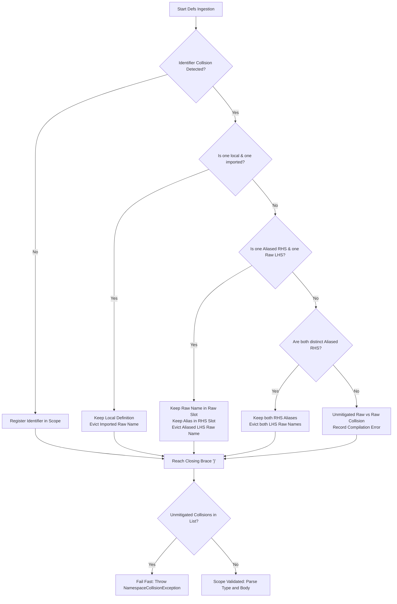
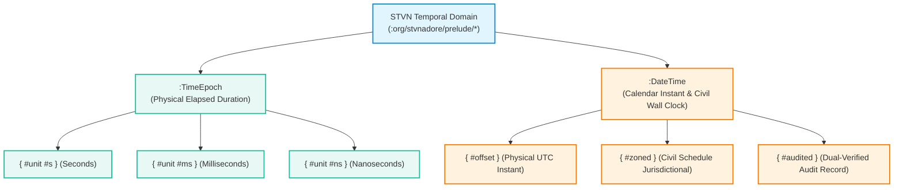
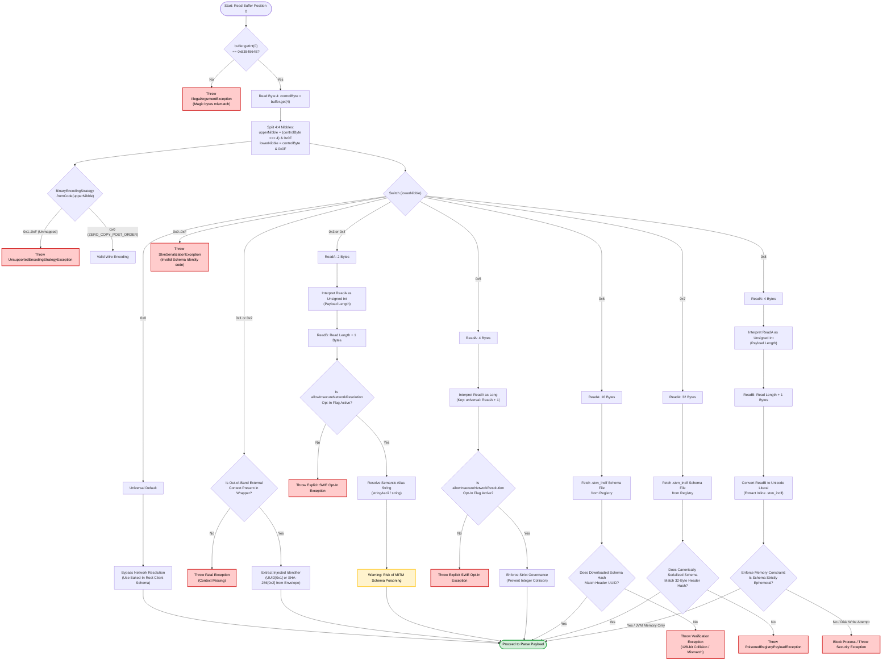

# STVN Language Specification

- **Version:** 2.0.0-PROPOSAL
- **Document ID:** `STVN-SPEC-LANG-02`
- **Status:** Formal Technical Specification (RFC Proposal)
- **Governing Standard:** Simplified Technical English (STE-01 through STE-07)
- **Foundational Baseline:** `STVN-VOP-MANIFESTO.md` (Canonical Foundation v1.0.0)
- **Companion Specifications:**
  - `docs/architecture/STVN_REPOSITORY_SPEC.md` (`STVN-SPEC-REPO-02`)
  - `docs/architecture/STVN_CHESS_SHOWCASE_SPEC.md` (`STVN-SPEC-CHESS-01`)
  - `docs/architecture/STVN_PLUGIN_SPEC.md` (`STVN-SPEC-PLUGIN-01`)
- **Target Audience:** Lexer, Parser, AST Analyzer, IDE Plugin, and Codec Implementers (Java, Kotlin, Scala, Rust, TypeScript, C++, Go)

---

**Table of Contents**

<!-- TOC -->
* [STVN Language Specification](#stvn-language-specification)
  * [1. Document Boundaries and File Types](#1-document-boundaries-and-file-types)
    * [1.1 Root Enclosure Rule](#11-root-enclosure-rule)
    * [1.2 File Extension Matrix](#12-file-extension-matrix)
    * [1.3 Strict Zero-Tab Invariant](#13-strict-zero-tab-invariant)
  * [2. Concrete Syntax Examples](#2-concrete-syntax-examples)
    * [2.1 Flat Include Module (`.stvn_inclf`)](#21-flat-include-module-stvn_inclf)
    * [2.2 Transitive Include Module (`.stvn_incl`)](#22-transitive-include-module-stvn_incl)
    * [2.3 Standard Payload Document (`.stvn`)](#23-standard-payload-document-stvn)
  * [3. Lexical and Syntactic Enclosure Rules](#3-lexical-and-syntactic-enclosure-rules)
    * [3.1 Hash Symbol (`#`) Semantic Taxonomy](#31-hash-symbol--semantic-taxonomy)
    * [3.2 Colon Symbol (`:`) Semantic Taxonomy](#32-colon-symbol--semantic-taxonomy)
    * [3.3 Whitespace Discipline and the Strict Zero-Tab Invariant](#33-whitespace-discipline-and-the-strict-zero-tab-invariant)
    * [3.4 Comment Tokens](#34-comment-tokens)
    * [3.5 Metadata Annotation Placement Rules](#35-metadata-annotation-placement-rules)
      * [3.5.1 Empty Metadata Block Prohibition](#351-empty-metadata-block-prohibition)
    * [3.6 Module Include Directive Syntax](#36-module-include-directive-syntax)
      * [3.6.1 Empty Directive Block Prohibition](#361-empty-directive-block-prohibition)
    * [3.7 Namespaced and Path-Delimited Identifiers](#37-namespaced-and-path-delimited-identifiers)
      * [3.7.1 Lexical and Syntactic Grammar Rules](#371-lexical-and-syntactic-grammar-rules)
      * [3.7.2 Semantics & Scoping Invariants](#372-semantics--scoping-invariants)
    * [3.8 Typed Constant Definitions](#38-typed-constant-definitions)
      * [3.8.1 Syntax Grammar](#381-syntax-grammar)
      * [3.8.2 Semantics & Substitution Rules](#382-semantics--substitution-rules)
    * [3.9 Package Enclosures (`:package`) and Scoped Imports (`:use`)](#39-package-enclosures-package-and-scoped-imports-use)
      * [Scoping Invariants](#scoping-invariants)
  * [4. Module Ingestion and Namespace Isolation](#4-module-ingestion-and-namespace-isolation)
    * [4.1 Single-Import Constraint](#41-single-import-constraint)
    * [4.2 Namespace Eviction Cascade](#42-namespace-eviction-cascade)
    * [4.8 Enum Subset Filtering & Transitive Chaining](#48-enum-subset-filtering--transitive-chaining)
      * [4.8.1 Grammar & Facet Syntax](#481-grammar--facet-syntax)
      * [4.8.2 Target Attachment Constraints](#482-target-attachment-constraints)
      * [4.8.3 Transitive Monotonic Narrowing Invariant](#483-transitive-monotonic-narrowing-invariant)
      * [4.8.4 Root Declaration Ordering Invariant](#484-root-declaration-ordering-invariant)
      * [4.8.5 Non-Empty Subset Invariants](#485-non-empty-subset-invariants)
      * [4.8.6 Payload Validation & AST Lowering](#486-payload-validation--ast-lowering)
  * [5. Complete Type Taxonomy](#5-complete-type-taxonomy)
    * [5.1 Scalar Primitives & Arbitrary Bit-Widths (Orthogonal Scalar Kernel)](#51-scalar-primitives--arbitrary-bit-widths-orthogonal-scalar-kernel)
      * [5.1.1 Integer Storage & Signedness Architecture (`:Int`)](#511-integer-storage--signedness-architecture-int)
      * [5.1.2 Discrete Half-Open Interval Governance](#512-discrete-half-open-interval-governance)
      * [5.1.3 Floating-Point & Precision Architecture (`:Float`)](#513-floating-point--precision-architecture-float)
      * [5.1.4 String Cardinality Governance (MCT § 3.1.3)](#514-string-cardinality-governance-mct--313)
      * [5.1.5 Boolean Domain (`:Boolean`)](#515-boolean-domain-boolean)
    * [5.2 Algebraic Sum Types](#52-algebraic-sum-types)
      * [5.2.1 Variant Syntax & Strict Product Demarcation](#521-variant-syntax--strict-product-demarcation)
    * [5.3 Polyglot Multi-Language Fenced Strings (Rule STR-04)](#53-polyglot-multi-language-fenced-strings-rule-str-04)
      * [Delimiter Invariant](#delimiter-invariant)
      * [Examples](#examples)
    * [5.4 Algebraic Product Types](#54-algebraic-product-types)
    * [5.5 Collection Types (Full Bounding Reduction)](#55-collection-types-full-bounding-reduction)
      * [5.5.1 Base Collection Constructors](#551-base-collection-constructors)
      * [5.5.2 Elimination of Compound Collection Constructors](#552-elimination-of-compound-collection-constructors)
      * [5.5.3 Container Cardinality Bounding (`#minSize`, `#maxSize`)](#553-container-cardinality-bounding-minsize-maxsize)
      * [5.5.4 Bijective Invertible Maps (`#invertible`)](#554-bijective-invertible-maps-invertible)
    * [5.6 Temporal Domain Types (Tripartite Architecture & MCT § 3.3 Simplification)](#56-temporal-domain-types-tripartite-architecture--mct--33-simplification)
      * [5.6.1 Physical Epoch Timestamps: `:org/stvnadore/prelude/TimeEpoch`](#561-physical-epoch-timestamps-orgstvnadorepreludetimeepoch)
      * [5.6.2 Calendar Date-Time: `:org/stvnadore/prelude/DateTime`](#562-calendar-date-time-orgstvnadorepreludedatetime)
      * [5.6.3 Mutually Exclusive Mode Enforcement](#563-mutually-exclusive-mode-enforcement)
      * [5.6.4 Tripartite Invariant Comparison Matrix](#564-tripartite-invariant-comparison-matrix)
  * [6. Trait Capability Calculus & Metadata Constraints](#6-trait-capability-calculus--metadata-constraints)
    * [6.1 Metadata Target Constraints & Facet Governance](#61-metadata-target-constraints--facet-governance)
      * [Facet Target Governance Matrix](#facet-target-governance-matrix)
      * [Empty Block Invariants](#empty-block-invariants)
      * [Diagnostic Reporting Invariant](#diagnostic-reporting-invariant)
    * [6.2 Trait Capability Matrix](#62-trait-capability-matrix)
    * [6.3 Trait Derivation and Override Rules](#63-trait-derivation-and-override-rules)
  * [7. Value-Oriented Protocol (VOP) & Fault Isolation Invariants](#7-value-oriented-protocol-vop--fault-isolation-invariants)
    * [7.1 Core VOP Invariants](#71-core-vop-invariants)
    * [7.2 Container Cardinality Fault Isolation ($M == N$)](#72-container-cardinality-fault-isolation-m--n)
    * [7.3 Diagnostic Coordinate Pinning Discipline](#73-diagnostic-coordinate-pinning-discipline)
    * [7.4 Interactive DX Guards & Caret Resolution Boundaries](#74-interactive-dx-guards--caret-resolution-boundaries)
  * [8. Payload Inference & AST Lowering Rules](#8-payload-inference--ast-lowering-rules)
    * [8.1 Inference Rules (Rule A through Rule J)](#81-inference-rules-rule-a-through-rule-j)
  * [9. Opaque Nominal Type Branding & CAS Bijectivity Invariant](#9-opaque-nominal-type-branding--cas-bijectivity-invariant)
    * [9.1 Opaque Nominal Branding Principle](#91-opaque-nominal-branding-principle)
    * [9.2 The Nominal Bijectivity Invariant ($1:1$ Law)](#92-the-nominal-bijectivity-invariant-11-law)
    * [9.3 CAS Digesting & Schema Hashing Integration](#93-cas-digesting--schema-hashing-integration)
  * [10. Binary Format (`.stvn_bin`) Wire Framing & Schema Governance](#10-binary-format-stvn_bin-wire-framing--schema-governance)
    * [10.1 Control Byte Bitwise Architecture (Byte 4)](#101-control-byte-bitwise-architecture-byte-4)
      * [Bitwise Operations](#bitwise-operations)
    * [10.2 Bits 6..4: `BinaryEncodingStrategy` Taxonomy](#102-bits-64-binaryencodingstrategy-taxonomy)
    * [10.3 Lower Nibble: `SchemaIdentityStrategy` Taxonomy (Bits 3..0)](#103-lower-nibble-schemaidentitystrategy-taxonomy-bits-30)
    * [10.4 Header Decoding & Strategy Dispatch Pipeline](#104-header-decoding--strategy-dispatch-pipeline)
    * [10.5 Tripartite Temporal Wire Encoding & Memory Layouts](#105-tripartite-temporal-wire-encoding--memory-layouts)
      * [Header IANA Zone Dictionary Pool](#header-iana-zone-dictionary-pool)
  * [11. Standard Library Prelude](#11-standard-library-prelude)
    * [11.1 Canonical Prelude Definitions](#111-canonical-prelude-definitions)
    * [11.2 Prelude Ingestion & Alias Discipline](#112-prelude-ingestion--alias-discipline)
  * [12. Code Generation & Implementation Directives](#12-code-generation--implementation-directives)
  * [Appendix A: Arbitrary Bit-Width Integer Semantics and Codec Layout](#appendix-a-arbitrary-bit-width-integer-semantics-and-codec-layout)
    * [A.1 Lexer and Grammar Rules](#a1-lexer-and-grammar-rules)
    * [A.2 Mathematical Range & Value Invariants](#a2-mathematical-range--value-invariants)
    * [A.3 Codec Containment and Memory Layout](#a3-codec-containment-and-memory-layout)
    * [A.4 High-Bit Masking and Verification](#a4-high-bit-masking-and-verification)
    * [A.5 Negative Test Cases](#a5-negative-test-cases)
  * [Appendix B: Exhaustive Grammar & AST Feature Catalogue](#appendix-b-exhaustive-grammar--ast-feature-catalogue)
    * [B.1 Canonical (Long-Form) Primitive & Scalar Types](#b1-canonical-long-form-primitive--scalar-types)
    * [B.2 Compressed (Short-Form) Primitive & Literal Showcase](#b2-compressed-short-form-primitive--literal-showcase)
    * [B.3 Algebraic Sum and Product Types (Long vs. Short & Happy Path)](#b3-algebraic-sum-and-product-types-long-vs-short--happy-path)
    * [B.4 Collection Types (Sequences, Sets, Maps, Invertible Maps)](#b4-collection-types-sequences-sets-maps-invertible-maps)
    * [B.5 Temporal Domain and Standard Library Prelude](#b5-temporal-domain-and-standard-library-prelude)
    * [B.6 Metadata Constraints and Trait Overrides](#b6-metadata-constraints-and-trait-overrides)
    * [B.7 STVN containing STVN Using `FENCED_STRING`](#b7-stvn-containing-stvn-using-fenced_string)
  * [Appendix C: Negative Syntax Catalogue (Anti-Hallucination Traps)](#appendix-c-negative-syntax-catalogue-anti-hallucination-traps)
    * [C.1 Anti-Hallucination Traps 1–14](#c1-anti-hallucination-traps-1-14)
    * [C.2 Standard Compiler Diagnostic Codes](#c2-standard-compiler-diagnostic-codes)
  * [Appendix D: Reference Java-Target ANTLR4 Grammars](#appendix-d-reference-java-target-antlr4-grammars)
    * [D.1 Implementation & Portability Notice](#d1-implementation--portability-notice)
    * [D.2 Lexer Grammar (`StvnLexer.g4`)](#d2-lexer-grammar-stvnlexerg4)
    * [D.3 Parser Grammar (`StvnParser.g4`)](#d3-parser-grammar-stvnparserg4)
  * [Appendix E: Tripartite Temporal VOP Design Rationale & Mathematical Semantics](#appendix-e-tripartite-temporal-vop-design-rationale--mathematical-semantics)
    * [E.1 The Fatal Flaw of Temporal Conflation](#e1-the-fatal-flaw-of-temporal-conflation)
    * [E.2 Making Invalid States Unrepresentable](#e2-making-invalid-states-unrepresentable)
    * [E.3 100% Isomorphic Round-Trip Fidelity Proof](#e3-100-isomorphic-round-trip-fidelity-proof)
    * [E.4 Audit & Legal Compliance in Regulated Domains](#e4-audit--legal-compliance-in-regulated-domains)
    * [E.5 DST Spring-Forward Gap & Ambiguity Calculus](#e5-dst-spring-forward-gap--ambiguity-calculus)
  * [Appendix F: Module Ingestion, Import Aliasing, and Collision Resolution Catalogue](#appendix-f-module-ingestion-import-aliasing-and-collision-resolution-catalogue)
    * [F.1 Scenario 1: Local Priority Eviction](#f1-scenario-1-local-priority-eviction)
    * [F.2 Scenario 2: Asymmetric Ingestion (Alias vs. Raw)](#f2-scenario-2-asymmetric-ingestion-alias-vs-raw)
    * [F.3 Scenario 3: Dual Ingestion (Alias vs. Alias)](#f3-scenario-3-dual-ingestion-alias-vs-alias)
    * [F.4 Scenario 4: Unmitigated Raw vs. Raw Collision (Compiler Rejection)](#f4-scenario-4-unmitigated-raw-vs-raw-collision-compiler-rejection)
    * [F.5 Scenario 5: Single-Import Violation (Compiler Rejection)](#f5-scenario-5-single-import-violation-compiler-rejection)
    * [F.6 Scenario 6: Namespaced and Path-Delimited Identifier Ingestion](#f6-scenario-6-namespaced-and-path-delimited-identifier-ingestion)
  * [Appendix G: Canonical Transitive Reachability & Hermetic Self-Containment](#appendix-g-canonical-transitive-reachability--hermetic-self-containment)
    * [G.1 Transitive Reachability Invariant](#g1-transitive-reachability-invariant)
    * [G.2 Universal Alias Desugaring](#g2-universal-alias-desugaring)
    * [G.3 Dead-Code Pruning & Topological Order](#g3-dead-code-pruning--topological-order)
<!-- TOC -->

---

## 1. Document Boundaries and File Types

### 1.1 Root Enclosure Rule

Every text-based STVN document **must** enclose its entire content within a single root curly brace pair `{ ... }`. Compilers **must reject** any file missing this outer boundary. Zero tokens, directives, or trivia—except whitespace and single-line comments—may appear outside this outer enclosure.

### 1.2 File Extension Matrix

| Extension         | Purpose                  | `:defs` Section | `:type` Section | `:body` Section | Directives Allowed                 |
|:------------------|:-------------------------|:----------------|:----------------|:----------------|:-----------------------------------|
| **`.stvn`**       | Primary Modular Document | Optional        | **Required**    | **Required**    | `:include`, `:package`, `:use`     |
| **`.stvn_f`**     | Flat Hermetic Document   | Optional        | **Required**    | **Required**    | None (`:include` is prohibited)    |
| **`.stvn_incl`**  | Transitive Shared Module | **Required**    | **Prohibited**  | **Prohibited**  | `:include`, `:package`, `:use` (DAG resolution) |
| **`.stvn_inclf`** | Flat Leaf Module         | **Required**    | **Prohibited**  | **Prohibited**  | `:package`, `:use` (`:include` is prohibited) |
| **`.stvn_bin`**   | Zero-Copy Compact Binary | Embedded        | Embedded        | Embedded        | N/A (Bytecode)                     |
| **`.stvn_cas`**   | Repository Profile       | **Required**    | **Required**    | **Required**    | N/A (Predefined Repository Envelope) |

### 1.3 Strict Zero-Tab Invariant

STVN strictly prohibits horizontal tab characters (`0x09`, `\t`) everywhere in text documents, including string literals, comments, and whitespace indentation.

```
Invariant: Every horizontal indentation character must be a standard ASCII space (0x20).
```

When a lexer encounters a tab character, the lexer produces a `TAB_CHARACTER` token. The compiler immediately halts compilation and emits `ERR_TAB_CHARACTER_FORBIDDEN` with exact source line and column offsets.

---

## 2. Concrete Syntax Examples

### 2.1 Flat Include Module (`.stvn_inclf`)

```stvn
{
  // network_primitives.stvn_inclf
  :defs {
    :BitFlag        { #unsigned #size 1 } :Int
    :UnixPermission { #unsigned #size 3 } :Int
    :Port           { #unsigned #size 16 #minIncl 1 #maxExcl 65536 } :Int
    :HostName       { #regex "^[a-zA-Z0-9.-]+$" #minSize 1 #maxSize 64 } :String
    :IpAddress      :Union( :IPv4 { #minSize 15 #maxSize 15 } :String )
    :Protocol       :Enum [ #HTTP #HTTPS #TCP #UDP ]
  }
}
```

### 2.2 Transitive Include Module (`.stvn_incl`)

```stvn
{
  // telemetry_models.stvn_incl
  :defs {
    :include ["network_primitives.stvn_inclf" { :HostName :RemoteHost }]

    :NodeStatus     :Enum [ #HEALTHY #DEGRADED #UNREACHABLE ]
    :AudioSample24  { #size 24 } :Int
    :PacketCounter  { #unsigned #size 49 } :Int

    :Endpoint :Tuple( :RemoteHost :Port :Protocol )

    :LatencyHistory { #minSize 1 } :Seq( { #unsigned #size 32 } :Int )

    :RouteTable { #invertible } :Map( :RemoteHost :IpAddress )
  }
}
```

### 2.3 Standard Payload Document (`.stvn`)

```stvn
{
  // telemetry_report.stvn
  :defs {
    :include ["telemetry_models.stvn_incl"]

    :NodeReport :Tuple(
      :Endpoint 
      :NodeStatus 
      :AudioSample24 
      :PacketCounter 
      :LatencyHistory 
      :RouteTable 
      :Option( { #unsigned #size 32 } :Int )    
    )
  }

  :type :NodeReport

  :body ( 
    ("gateway.internal" 8443 #HTTPS)
    #HEALTHY
    -8388600 
    500000000000000 
    [ 12 15 11 14 ]
    { 
       [ "auth.internal" "10.0.0.1" ] 
       [ "db.internal"   "10.0.0.2" ] 
    } 
    1420  // Inferred as #Some 1420 via Rule A
  )
}
```


---

## 3. Lexical and Syntactic Enclosure Rules

```
                      ┌──────────────────────────────────────────────┐
                      │             STVN ENCLOSURE MATRIX            │
┌─────────────────────┼──────────────────────────────┬───────────────┴──────────────┐
│ Delimiter           │ Definition-Space Context     │ Value / Payload Context      │
├─────────────────────┼──────────────────────────────┼──────────────────────────────┤
│ Curly Braces { }    │ • File root { ... }          │ • Metadata blocks            │
│                     │ • Definition block :defs { } │   { #minIncl 1 #unsigned }   │
│                     │ • Include alias maps { :A :B}│ • Map literal values:        │
│                     │                              │   :Map -> { [ "k1" "v1" ] }  │
├─────────────────────┼──────────────────────────────┼──────────────────────────────┤
│ Parentheses ( )     │ • Type constructors:         │ • Product / Tuple values:    │
│                     │   :Tuple( ... ), :Seq( ... ) │   ( "host" 8080 #DEV )       │
│                     │   :Union( ... ), :Option( ...│ • Top-level tuple payload:   │
│                     │                              │   :body ( ... )              │
├─────────────────────┼──────────────────────────────┼──────────────────────────────┤
│ Brackets [ ]        │ • :Enum domain constants:    │ • Collection values:         │
│                     │   :Enum [ #A #B #C ]         │   :Seq -> [ 1 2 3 ]          │
│                     │ • Include directives:        │   :Set -> [ 1 2 3 ]          │
│                     │   :include [ "path" { } ]    │ • Map entries: [ "k" "v" ]   │
└─────────────────────┴──────────────────────────────┴──────────────────────────────┘
```

---

### 3.1 Hash Symbol (`#`) Semantic Taxonomy

The hash character (`#`) is a dedicated structural token in STVN. It is **never** a comment delimiter. The lexer categorizes `#` tokens into five mutually exclusive semantic roles based on context:

| Category | Token Pattern | Canonical Form | Compressed Form | Context / Purpose |
|:---|:---|:---|:---|:---|
| **Boolean Literals** | `#TRUE`, `#FALSE`, `#T`, `#F` | `#TRUE`, `#FALSE` | `#T`, `#F` | Value payload for `:Boolean` |
| **Sum Variant Constructors** | `#Some`, `#None`, `#Left`, `#Right`, `#S`, `#N`, `#L`, `#R` | `#Some v`, `#None`, `#Left v`, `#Right v` | `#S v`, `#N`, `#L v`, `#R v` | Tagged sum type values (`:Option`, `:Either`) |
| **Union Branch Index Selectors** | `#` `[1-9][0-9]*` | `#1`, `#2`, `#12` | N/A | 1-based index selecting target branch in `:Union( ... )` |
| **Enum Domain Constants** | `#` `[A-Z0-9_]+` | `#DEV`, `#PROD`, `#HTTP` | N/A | Nominal constant values declared in `:Enum [ ... ]` |
| **Metadata Constraint Keys & Flags** | `#` `[a-zA-Z0-9_]+` | `#size`, `#unsigned`, `#exact`, `#minSize`, `#maxSize`, `#minIncl`, `#maxExcl`, `#regex`, `#invertible`, `#unit`, `#offset`, `#zoned`, `#audited`, `#preserveIndent`, `#strip`, `#equatable`, `#comparable`, `#filterIncl`, `#filterExcl` | N/A | Keys and flags inside metadata blocks `{ ... }` and directives |

---

### 3.2 Colon Symbol (`:`) Semantic Taxonomy

The colon character (`:`) is a dedicated **type-space and structural keyword prefix sigil**.

* **The Leading Prefix Rule:** The colon **must always** be attached directly as a prefix to an identifier (e.g., `:type`, `:Int`, `:UserAccount`).
* **The No-Infix Rule:** The colon is **never** used as an infix punctuation mark, key-value separator (JSON/YAML style), or statement terminator. A bare colon token `:` is a fatal lexical error.

| Category | Token Pattern | Examples | Context / Purpose |
|:---|:---|:---|:---|
| **Root Block Keywords** | `:defs`, `:type`, `:body` | `:defs { ... }`<br>`:type :AppPayload`<br>`:body ( ... )` | Declares mandatory and optional top-level document sections |
| **Module Directives** | `:include`, `:package`, `:use` | `:include [ "lib.stvn_inclf" ]`<br>`:package :org/example { ... }`<br>`:use [ :org/example ]` | Directs the module resolver to import external definitions, establish packages, or import symbols |
| **Orthogonal Base Type Tokens** | `:Boolean`, `:Int`, `:Float`, `:String` | `:Boolean`, `:Int`, `:Float`, `:String` | Pure atomic base scalar type identifiers |
| **Algebraic & Collection Type Constructors** | `:Tuple`, `:Enum`, `:Option`, `:Either`, `:Union`, `:Seq`, `:Set`, `:Map` | `:Tuple( ... )`, `:Enum [ ... ]`, `:Option( ... )`, `:Either( ... )`, `:Union( ... )`, `:Seq( ... )`, `:Set( ... )`, `:Map( ... )` | Parameterized sum, product, and collection type constructors |
| **Standard Library Prelude Types** | `:org/stvnadore/prelude/` `[A-Za-z0-9_]+` | `:org/stvnadore/prelude/TimeEpoch`, `:org/stvnadore/prelude/DateTime`, `:org/stvnadore/prelude/Uuid`, `:org/stvnadore/prelude/Port` | Standard library domain types located under `:org/stvnadore/prelude/*` |
| **Nominal User-Defined Type Identifiers** | `:` `[A-Z][a-zA-Z0-9_]*` | `:HostName`, `:ServerConfig`, `:RouteTable` | User-defined type names declared inside `:defs` and referenced across schemas |

```stvn
// VALID: Colon as prefix sigil
:defs {
  :PortNumber { #unsigned #size 16 } :Int
  :ServerConfig :Tuple( :String :PortNumber )
}
:type :ServerConfig
:body ( "localhost" 8080 )

// INVALID: Colon as JSON-style key-value separator
"host": "localhost"     // FATAL: Lexical/Parse error (bare colon infix separator prohibited)
port: 8080              // FATAL: Lexical/Parse error (bare colon infix separator prohibited)
```

---

### 3.3 Whitespace Discipline and the Strict Zero-Tab Invariant

STVN enforces strict lexical whitespace discipline to eliminate formatting ambiguity and layout drift across platforms and editors:

1. **Permissible Whitespace:** The only valid structural and indentation whitespace characters are standard ASCII spaces (`U+0020`), carriage returns (`\r`, `U+000D`), and line feeds (`\n`, `U+000A`).
2. **Strict Zero-Tab Invariant:** Tab characters (`\t`, `U+0009`) are **completely prohibited** as structural or indentation whitespace throughout STVN documents. The presence of a raw tab character in document structure is a fatal syntax violation (`ERR_TAB_CHARACTER_FORBIDDEN`). Tab characters inside single-line strings must be escaped (`\t`).
3. **Canonical Indentation Standard:** Canonical STVN formatting dictates a strict 2-space indentation standard (`indentWidth = 2`). All nested blocks (inside `{ ... }`, `( ... )`, `[ ... ]`) indent by 2 spaces per hierarchy level.
4. **Canonical AST Printers & Serialization Rules:**
   - **`CanonicalStvnWriter`:** Emits deterministic canonical form with minimal structural whitespace for cryptographic hashing and Content-Addressable Storage (CAS).
   - **`AstPrettyPrinter`:** Emits long-form keywords (`#TRUE`, `#FALSE`, `#Some`, `#None`) with a configurable 2-space indented hierarchy.
   - **`AstCompactPrinter`:** Emits short-form keywords (`#T`, `#F`, `#S`, `#N`) with minimal structural whitespace collapsed to single lines.
   - **Transitive Reachability Invariant:** Serializers compute the reachability closure of nominal type and constant definitions reachable from the root `:type` and `:body`. All reachable definitions are emitted in `:defs`.
   - **Universal Alias Desugaring:** Scoped aliases declared via `:use` desugar directly into Fully Qualified Nominal Identifiers (FQNIs). Canonical output contains zero `:package` or `:use` wrappers.
   - **Dead-Code Elimination:** Definitions unreferenced by the root `:type` or `:body` payload are strictly pruned.
   - **Topological Ordering:** Retained definitions in `:defs` emit in topological dependency order (dependencies precede dependents).
5. **String Capacity Governance (MCT § 3.1.3):**
   - **Default Unbounded Allocation Limit:** Unadorned `:String` instances default to a maximum allocation limit of 16,777,216 characters (16 MiB).
   - **Default Inspection Threshold:** 4,096 characters.
   - **Logical Character Cardinality:** Bounded strings declare `{ #maxSize N } :String` or `{ #minSize 1 #maxSize N } :String` up to the signed 32-bit integer boundary ($1 \le N \le 2,147,483,647$). Machine bit-width facet `#size` is prohibited on `:String`.

---

### 3.4 Comment Tokens

1. **Single-Line Comments (`//`)**: The scanner discards all characters from the double-slash token (`//`) through the end-of-line boundary before AST construction.
2. **Block Comments Prohibited**: STVN does not support multi-line block comments (`/* ... */`). Documentation spanning multiple lines **must** use contiguous single-line `//` tokens.
3. **Comment Token Isolation**: The hash character (`#`) **must not** be used for documentation or prose. Using `#` for freeform text causes a fatal lexical error.

```stvn
// VALID: Single-line documentation
// Contiguous single-line documentation comment block

#INVALID_COMMENT // FATAL: Parse error (unexpected symbol token '#INVALID_COMMENT')
/* INVALID_BLOCK */ // FATAL: Parse error (unexpected token '/*')
```

---

### 3.5 Metadata Annotation Placement Rules

Metadata constraint blocks `{ ... }` **must immediately precede** the target type identifier they configure:

```stvn
// VALID: Metadata block prefixes the target type
:Port     { #unsigned #size 16 #minIncl 1 #maxExcl 65536 } :Int
:Username { #regex "^[a-z0-9_]{3,16}$" #minSize 3 #maxSize 16 } :String
:Flag     { #equatable #TRUE } :Float

// INVALID: Suffix or wrapped metadata placement
:BadPort1 :Int { #minIncl 1 }         // FATAL: Syntax error
:BadPort2 (:Int { #minIncl 1 })       // FATAL: Syntax error

// INVALID: Ungrounded empty metadata block (Section 3.5.1)
:BadPort3 {} :Int                     // FATAL: ERR_EMPTY_METADATA_BLOCK
#BAD_CONST {} :Int 80                 // FATAL: ERR_EMPTY_METADATA_BLOCK
```

#### 3.5.1 Empty Metadata Block Prohibition
Empty metadata blocks (`{}`) are prohibited on type definitions and constant definitions. An author must omit the `{}` tokens or specify valid metadata facets. Violations emit diagnostic `ERR_EMPTY_METADATA_BLOCK`.

---

### 3.6 Module Include Directive Syntax

All `:include` directives inside a `:defs` block **must** be enclosed within square brackets `[ ... ]`:

```stvn
:defs {
  // Direct import
  :include [ "network_primitives.stvn_inclf" ]

  // Import with atomic unary prefix strip (terminal segment slicing)
  :include [ "types/network.stvn_incl" { #strip } ]

  // Import with explicit namespace alias mapping block
  :include [ "shared_models.stvn_incl" { :HostName :RemoteHost :Port :RemotePort } ]
}
```

The `#strip` facet is an atomic unary flag without string arguments. Supplying string arguments fails at the parser gate. Unary `#strip` executes deterministic terminal segment slicing across all slash-delimited nominal types (`:org/example/Port` -> `:Port`) and value constants (`#org/example/TIMEOUT` -> `#TIMEOUT`). Leading sigils are strictly preserved. Single-segment identifiers are preserved idempotently.

#### 3.6.1 Empty Directive Block Prohibition
Empty option blocks or alias blocks (`{}`) in `:use` and `:include` directives are prohibited. An author must specify valid directive facets (`{#strip}`), valid alias pairs, or remove `{}`. Violations emit diagnostic `ERR_EMPTY_DIRECTIVE_BLOCK`.

---

### 3.7 Namespaced and Path-Delimited Identifiers

STVN supports hierarchical, slash-delimited path identifiers in definition and value spaces. This capability allows domain modularization, namespace scoping, and structured cataloging without requiring complex package import hierarchies.

#### 3.7.1 Lexical and Syntactic Grammar Rules
A path-delimited identifier consists of a base keyword start token followed by one or more forward-slash (`/`) delimited alphanumeric segments:

* **Type Identifier Syntax:** `typeKeywordStart ( '/' IDENTIFIER )*`
  * Examples: `:net/http/Status`, `:org/stvnadore/telemetry/Header`, `:math/geo/Coordinate3D`
* **Value Identifier Syntax:** `valueKeywordStart ( '/' IDENTIFIER )*`
  * Examples: `#net/http/OK`, `#net/http/NotFound`, `#status/v1/ACTIVE`

#### 3.7.2 Semantics & Scoping Invariants
1. **Atomic Token Identity:** The complete slash-delimited token acts as a single, indivisible nominal identifier. The compiler treats `:net/http/Status` and `:Status` as distinct, non-interchangeable nominal types.
2. **Leading Prefix Rule:** The leading colon (`:`) or hash (`#`) sigil attaches only to the first segment. Subsequent segments are separated solely by forward slashes (`/`). Colons must not appear in infix positions (e.g. `:net:http:Status` is a fatal syntax error).
3. **Module Alias Compatibility:** Namespaced identifiers can be targeted by include alias blocks inside `:defs`:
   ```stvn
   :defs {
     :include [ "networking.stvn_incl" { :net/http/Status :HttpStatus } ]
   }
   ```

---

### 3.8 Typed Constant Definitions

A `:defs` block **MAY** bind immutable compile-time constant values to identifiers. Constant identifiers **MUST** reside in the value namespace and start with a value sigil (`#`). Type identifiers (`:`) in constant definition position are **PROHIBITED**.

#### 3.8.1 Syntax Grammar
```antlr4
defsEntry          : KW_DEFS LBRACE defsElement* RBRACE ;
defsElement        : includeStmt | packageEnclosure | useStmt | typeDefinition | constantDefinition ;
typeDefinition     : typeDefTarget metadataMap? schemaType ;
constantDefinition : valueKeyword metadataMap? schemaType value ;
```

#### 3.8.2 Semantics & Substitution Rules
1. **Declaration:** A constant definition **MUST** declare a value keyword (`#`), an optional metadata constraint block, a target schema type, and a trailing literal payload:
   ```stvn
   :defs {
     #MAX_RETRY  { #unsigned #size 8 } :Int 3
     #API_HOST   { #regex "^[a-z.]+$" } :String "api.internal.net"
     #EMPTY_MASK :Seq( { #unsigned #size 8 } :Int ) [ 0 0 0 0 ]
   }
   ```
2. **Payload Substitution:** Referencing the value keyword (e.g., `#MAX_RETRY`) within the document `:body` or within another constant expression in `:defs` instructs the compiler to perform deterministic compile-time value substitution:
   ```stvn
   :type :Tuple( { #unsigned #size 8 } :Int :String )
   :body ( #MAX_RETRY #API_HOST )
   // Lowers to: ( 3 "api.internal.net" )
   ```
3. **Lexical Isolation:** Nominal type identifiers (`:`) **MUST NOT** appear in value positions. Value keywords (`#`) **MUST NOT** appear as nominal type declarations.
4. **Bit-Width Range Validation:** Integer literals assigned to sized integer types `{ #unsigned #size n } :Int` or `{ #size n } :Int` must not exceed declared capacity bounds ($0 \le V \le 2^n - 1$ for unsigned, $-2^{n-1} \le V \le 2^{n-1} - 1$ for signed). Out-of-bounds assignments trigger `ERR_INTEGER_OVERFLOW` before IR lowering.
5. **Type Soundness:** The assigned `value` payload **MUST** conform to the specified `schemaType` and all associated metadata constraints during `:defs` validation. Mismatches cause immediate compile-time failure.

---

### 3.9 Package Enclosures (`:package`) and Scoped Imports (`:use`)

Authors can organize definitions into explicit namespace packages and import symbols locally:

```stvn
:defs {
  :package :org/example/network {
    :Port { #unsigned #size 16 } :Int
    #DEFAULT_PORT { #unsigned #size 16 } :Int 8080
  }
  :package :org/example/service {
    :use [ :org/example/network { #strip } ]
    :ServiceConfig { :port :Port }
  }
}
```

#### Scoping Invariants
1. **LHS FQNI Expansion:** Relative type identifiers (`:Name`) and constant identifiers (`#NAME`) declared inside `:package :Prefix { ... }` expand immediately to `:Prefix/Name` and `#Prefix/NAME`.
2. **Scope Isolation:** `:use` directives declared inside a `:package` enclosure are isolated strictly to that enclosure. Sibling packages and the document root cannot see package-local `:use` mappings.
3. **Root Visibility:** `:use` directives declared directly under `:defs` are visible across all sibling packages and the document root `:type` section.
4. **No Package Nesting:** Enclosing `:package` within another `:package` is prohibited and emits `ERR_NESTED_PACKAGE_PROHIBITED`.
5. **No Trailing Slashes:** Specifying a trailing slash in `:use` target paths emits `ERR_TRAILING_SLASH_PROHIBITED`.
6. **Section 4.2 Eviction Integration:** Symbols imported via `:use` undergo eviction cascade: local definitions take precedence, explicit aliases resolve collisions, and unmitigated collisions emit `ERR_NAMESPACE_COLLISION`.


---

## 4. Module Ingestion and Namespace Isolation

### 4.1 Single-Import Constraint

A file path string literal may appear in an `:include` directive **only once** per `:defs` block. Duplicate declarations of the same file path cause the compiler to immediately throw `DuplicateModuleImportException`. *(See Appendix F.5)*.

### 4.2 Namespace Eviction Cascade

When multiple modules or local declarations supply the same type identifier name, the compiler evaluates conflicts sequentially and resolves them at the closing curly brace `}` of the `:defs` block:

1. **Local Priority:** Local definitions inside the file's `:defs` block evict clashing imported raw names. *(See [Appendix F.1](#f1-scenario-1-local-priority-eviction))*.
2. **Asymmetric Ingestion (Alias vs. Raw):** If Module A renames `:TypeX` to `:LocalAlias`, and Module B imports `:TypeX` raw, the raw slot is assigned to Module B. Module A accesses the type through `:LocalAlias`. *(See [Appendix F.2](#f2-scenario-2-asymmetric-ingestion-alias-vs-raw))*.
3. **Dual Ingestion (Alias vs. Alias):** If Module A and Module B both alias `:TypeX` using distinct local names, both claims on the raw identifier `:TypeX` are evicted. Both local alias names remain valid. *(See [Appendix F.3](#f3-scenario-3-dual-ingestion-alias-vs-alias))*.
4. **Unmitigated Collision (Raw vs. Raw):** If two modules import the identical raw identifier without alias mapping, the conflict cannot be resolved. The compiler flags this as an unmitigated error and throws `NamespaceCollisionException`. *(See [Appendix F.4](#f4-scenario-4-unmitigated-raw-vs-raw-collision-compiler-rejection))*.
5. **Gate Execution:** At the closing brace `}` of `:defs`, if any unmitigated collisions remain, the compiler stops and throws `NamespaceCollisionException`. Downstream `:type` and `:body` sections **must not** be parsed if `:defs` validation fails.

*(See [**Appendix F**](#appendix-f-module-ingestion-import-aliasing-and-collision-resolution-catalogue) for complete, executable code examples demonstrating each resolution scenario.)*



---

### 4.8 Enum Subset Filtering & Transitive Chaining

STVN provides enum subset filtering to restrict an existing enumeration to a subset of its variants without defining a new, disconnected type. An enum subset derives from a parent enum or from another enum subset. It creates a formal nominal subtype that preserves the binary wire layout of the root enum.

#### 4.8.1 Grammar & Facet Syntax
Enum subset filtering uses two metadata facet keywords defined in `StvnLexer.g4`:
* `#filterIncl`: Declares an inclusive allowlist. Only variants in the bracketed list are valid members.
* `#filterExcl`: Declares an exclusive denylist. Variants in the bracketed list are removed from the parent variant set.

The grammar production in `StvnParser.g4` integrates filter facets into metadata entries:

```antlr
metadataEntry  : metadataBool | metadataNum | metadataString | metadataFilter | metadataDirective
               | metadataSize | metadataFlag | metadataUnit ;
metadataFilter : (KW_FILTER_INCL | KW_FILTER_EXCL) variantList ;
variantList    : LBRACK valueKeyword* RBRACK ;
```

Filter facets attach to nominal type definitions inside a `:defs` block:

```stvn
:defs {
  // Root enumeration definition
  :Status :Enum [ #Pending #Active #Suspended #Deleted ]

  // Inclusive subset derived from root enum
  :ActiveStatus { #filterIncl [ #Active #Suspended ] } :Status

  // Exclusive subset derived from root enum
  :NonDeletedStatus { #filterExcl [ #Deleted ] } :Status

  // Transitive subset derived from a parent subset (Chain Depth = 2)
  :ReadyStatus { #filterIncl [ #Active ] } :ActiveStatus
}
```

#### 4.8.2 Target Attachment Constraints
The compiler strictly enforces the following attachment rules during schema resolution:

1. **Nominal Aliases Only:** Filter facets must attach only to nominal aliases of `:Enum` or to existing enum subsets.
2. **Inline Enum Constructor Prohibition:** Filter facets must not attach directly to an inline enum constructor.
   ```stvn
   // INVALID: Filter applied directly to inline enum constructor
   :BadSubset { #filterIncl [ #A ] } :Enum [ #A #B ] // Compile Error
   ```
3. **Constant Definition Prohibition:** Filter facets must not attach to constant definitions.
   ```stvn
   // INVALID: Filter applied to constant definition
   #BAD_CONST { #filterIncl [ #Active ] } :Status #Active // Compile Error
   ```
4. **Non-Enum Prohibition:** Filter facets must not attach to scalar types, collections, or composite product types.
   ```stvn
   // INVALID: Filter applied to integer scalar
   :BadInt { #filterIncl [ #A ] } :Int // Compile Error
   ```
5. **Mutual Exclusivity:** A single metadata block must not contain both `#filterIncl` and `#filterExcl`.
   ```stvn
   // INVALID: Mutually exclusive facets declared simultaneously
   :Conflict { #filterIncl [ #Active ] #filterExcl [ #Suspended ] } :Status // Compile Error
   ```

#### 4.8.3 Transitive Monotonic Narrowing Invariant
Enum subset derivation enforces monotonic narrowing across arbitrary chain depths. Every child subset must strictly narrow or maintain its immediate parent variant domain:

$$\text{AllowedVariants}(\text{Child}) \subseteq \text{AllowedVariants}(\text{Parent}) \subset \text{Variants}(\text{Root})$$

```
        ┌─────────────────────────────────────────────────────────┐
        │               :Status (Root Enumeration)                │
        │         [ #Pending #Active #Suspended #Deleted ]        │
        └────────────────────────────┬────────────────────────────┘
                                     │
                  #filterExcl [ #Deleted ] (Narrowing)
                                     â–¼
        ┌─────────────────────────────────────────────────────────┐
        │           :WorkingStatus (Parent Enum Subset)           │
        │              [ #Pending #Active #Suspended ]            │
        └────────────────────────────┬────────────────────────────┘
                                     │
                  #filterIncl [ #Pending #Active ] (Narrowing)
                                     â–¼
        ┌─────────────────────────────────────────────────────────┐
        │           :ImmediateStatus (Child Enum Subset)          │
        │                    [ #Pending #Active ]                 │
        └─────────────────────────────────────────────────────────┘
```

**Monotonic Narrowing Rules:**
* Every variant listed in a `#filterIncl` or `#filterExcl` facet must exist in the immediate parent type's allowed variant set.
* A child subset must not re-introduce variants excluded by any ancestor in the chain.
* If a child subset references an unknown or previously excluded variant, the compiler rejects the schema with diagnostic `ERR_MALFORMED_SCHEMA`.

```stvn
// INVALID: #Deleted was excluded by :WorkingStatus; cannot re-introduce in child
:WorkingStatus { #filterExcl [ #Deleted ] } :Status
:IllegalExpansion { #filterIncl [ #Deleted ] } :WorkingStatus // Compile Error: Monotonic narrowing violation
```

#### 4.8.4 Root Declaration Ordering Invariant
Variants specified inside `#filterIncl` or `#filterExcl` bracketed lists must follow the relative declaration order of the root `:Enum`.

* Let the root enum declare variants in order $\langle v_1, v_2, \dots, v_n \rangle$.
* For any filter facet listing $\langle u_1, u_2, \dots, u_k \rangle$, the root index of $u_i$ must be strictly less than the root index of $u_{i+1}$:
  $$\text{Index}_{\text{Root}}(u_i) < \text{Index}_{\text{Root}}(u_{i+1}) \quad \forall \; 1 \le i < k$$
* If variants appear out of root declaration order, the compiler rejects the definition with diagnostic `ERR_MALFORMED_SCHEMA`.

```stvn
:defs {
  :Status :Enum [ #Pending #Active #Suspended #Deleted ]

  // VALID: Relative order matches root (#Active precedes #Suspended)
  :ValidOrder { #filterIncl [ #Active #Suspended ] } :Status

  // INVALID: Relative order reversed (#Suspended before #Active)
  :BadOrder { #filterIncl [ #Suspended #Active ] } :Status // Compile Error: Root ordering violation
}
```

#### 4.8.5 Non-Empty Subset Invariants
An enum subset must represent a non-empty domain of valid values:

1. **Non-Empty Filter List:** A filter facet list must contain at least one value keyword token. Specifying `{ #filterIncl [ ] }` or `{ #filterExcl [ ] }` causes immediate compilation rejection (`ERR_MALFORMED_SCHEMA`).
2. **Complete Exclusion Rejection:** An exclusive filter `#filterExcl` must not exclude all remaining variants of the parent type. If the subtraction produces an empty allowed variant set, the compiler rejects the definition with `ERR_MALFORMED_SCHEMA`.
3. **No Duplicate Variants:** A filter list must not repeat a variant token (e.g., `[ #Active #Active ]`). Duplicates trigger `ERR_MALFORMED_SCHEMA`.

#### 4.8.6 Payload Validation & AST Lowering
When a payload value targets an enum subset type:
* The parser constructs a standard `StvnValue.StvnEnum` node carrying the variant keyword, the root sequential index, and the root variant count.
* The type resolver validates that the keyword exists in the active subset allowed list via `subset.containsVariant(kw)`.
* If the keyword is valid in the root enum but absent from the subset, the compiler emits compile-time diagnostic `ERR_TYPE_MISMATCH` ("Variant not permitted in enum subset").


---

## 5. Complete Type Taxonomy

### 5.1 Scalar Primitives & Arbitrary Bit-Widths (Orthogonal Scalar Kernel)

STVN Version 2.0.0 eliminates all compound scalar keywords (`:Int32`, `:Uint16`, `:FloatExact`, `:StringFixed36`, `:StringNonEmpty64`). The type system provides four orthogonal base types:
1. `:Boolean` (Truth values)
2. `:Int` (Arbitrary-precision signed and unsigned integers)
3. `:Float` (Machine floating-point and arbitrary-precision decimal numbers)
4. `:String` (UTF-8 character sequences)

Physical machine bit-width, signedness, arithmetic precision, and length bounds attach strictly as orthogonal metadata facets inside `{ ... }`.

| Base Token | Compiled Base Type | Governing Facets | Semantic Invariant |
|:---|:---|:---|:---|
| **`:Int`** | `:Int` | `#size <bits>`, `#unsigned`, `#minIncl`, `#maxExcl` | Arbitrary bit-width signed/unsigned integer. Enforces discrete half-open intervals $[minIncl, maxExcl)$. |
| **`:Float`** | `:Float` | `#size 32\|64`, `#exact`, continuous boundary facets | IEEE-754 machine float (32 or 64-bit) or exact decimal (`#exact`). Continuous domains permit all four bound facets. |
| **`:String`** | `:String` | `#minSize`, `#maxSize`, `#regex`, `#preserveIndent` | Variable-length UTF-8 character string. Character cardinality governed strictly via `#minSize` and `#maxSize`. `#size` is prohibited. |
| **`:Boolean`** | `:Boolean` | `#equatable` | Two-element boolean algebra (`#TRUE`/`#T`, `#FALSE`/`#F`). |

#### 5.1.1 Integer Storage & Signedness Architecture (`:Int`)
The `:Int` keyword represents the universal integer type. All integer constraints are governed by metadata facets:

```
{ [ #unsigned ] [ #size <bits> ] } :Int
```

| Facet | Argument | Default | Invariant |
|:---|:---|:---|:---|
| `#size` | Integer Literal ($\ge 1$) | Machine Native / Unbounded | Declares exact physical storage width in bits ($n$). Range is $[-2^{n-1}, 2^{n-1}-1]$ when signed, or $[0, 2^n - 1]$ when unsigned. |
| `#unsigned` | Bare Flag or Boolean | Signed (`false`) | Enforces non-negative physical unsigned boundaries. Replaces legacy `:Uint*`. |

Canonical integer formulations:
- Standard signed 32-bit integer: `{ #size 32 } :Int`
- Unsigned 16-bit integer: `{ #unsigned #size 16 } :Int`
- Arbitrary 7-bit unsigned integer: `{ #unsigned #size 7 } :Int`
- Bare unadorned `:Int`: Represents unbounded arbitrary-precision signed integers in logical schemas, defaulting to 32 bits under standard binary wire encoding.

#### 5.1.2 Discrete Half-Open Interval Governance
Under Value-Oriented Programming (VOP), discrete mathematical domains (`:Int` and exact `:Float`) reject closed upper bounds and open lower bounds:

```
Discrete Domain Rule:
Intervals on discrete types MUST use half-open intervals: [minIncl, maxExcl)
```

1. **Mandatory Lower Bound:** Inclusive lower endpoint `#minIncl`.
2. **Mandatory Upper Bound:** Exclusive upper endpoint `#maxExcl`.
3. **Prohibited Discrete Facets:** `#maxIncl` and `#minExcl` are strictly prohibited on `:Int` and `{ #exact } :Float`.

```stvn
// VALID: Half-open interval [1, 65536) for 16-bit port numbers
:Port { #unsigned #size 16 #minIncl 1 #maxExcl 65536 } :Int

// INVALID: Closed upper bound triggers ERR_DISCRETE_BOUND_KIND_PROHIBITED
:BadPort { #unsigned #size 16 #minIncl 1 #maxIncl 65535 } :Int
```

When an author declares `#maxIncl` or `#minExcl` on a discrete type, the compiler halts and emits `ERR_DISCRETE_BOUND_KIND_PROHIBITED`.

#### 5.1.3 Floating-Point & Precision Architecture (`:Float`)
The `:Float` keyword represents numeric values with fractional components:

| Facet | Argument | Default | Invariant |
|:---|:---|:---|:---|
| `#size` | `32` or `64` | `64` | Configures IEEE-754 single-precision (32-bit) or double-precision (64-bit) floating-point storage. |
| `#exact` | Bare Flag or Boolean | IEEE-754 binary | Enforces exact fixed-point or arbitrary-precision decimal arithmetic without binary rounding errors. Replaces legacy `:FloatExact`. |

Continuous domains (standard `:Float` without `#exact`) represent continuous real numbers and accept all four boundary facets: `#minIncl`, `#maxIncl`, `#minExcl`, and `#maxExcl`.

```stvn
// Continuous real numbers: all four facets permitted
:Probability { #size 64 #minIncl 0.0 #maxIncl 1.0 } :Float

// Discrete decimal currency: half-open interval required
:Price { #exact #minIncl 0.00 #maxExcl 1000000.00 } :Float
```

#### 5.1.4 String Cardinality Governance (MCT § 3.1.3)
Under Modern Canonical Type (MCT) specification § 3.1.3:
1. **`#size` Target Prohibition:** The `#size` facet represents memory bit-width. It applies strictly to binary numeric representations (`:Int` and `:Float`). Applying `#size` to `:String` is an invalid facet target error. The compiler halts and emits `ERR_INVALID_METADATA_FACET`.
2. **Logical Character Bounds (`#minSize`, `#maxSize`):** String dimensions represent character counts. Authors must govern string cardinality using `#minSize` and `#maxSize` exclusively.
3. **Exact Fixed-Length Strings:** Replaces legacy `:StringFixed<N>` by declaring identical lower and upper bounds:
   ```stvn
   :Sha256Digest { #minSize 64 #maxSize 64 #regex "^[0-9a-fA-F]{64}$" } :String
   ```
4. **Bounded and Non-Empty Strings:**
   - Max-bounded string (replaces `:String<n>`): `{ #maxSize 128 } :String`
   - Non-empty string (replaces `:StringNonEmpty`): `{ #minSize 1 } :String`
   - Bounded non-empty string: `{ #minSize 1 #maxSize 64 } :String`

#### 5.1.5 Boolean Domain (`:Boolean`)
`:Boolean` defines the two-element boolean algebra. It accepts literal values `#TRUE` (short-form `#T`) and `#FALSE` (short-form `#F`). It accepts trait override `#equatable`, but rejects sizing and numeric bounds facets.

---

### 5.2 Algebraic Sum Types

* **`:Option( T )`**: Optional wrapper. Recognizes `#Some v` (or `#S v`) and `#None` (or `#N`).
* **`:Either( L R )`**: Disjoint union with fundamental right bias. Recognizes `#Left v` (or `#L v`) and `#Right v` (or `#R v`). Candidate branch evaluation, diagnostic enumeration, and tooling intention actions are strictly **right-first** ($R$ precedes $L$).
* **`:Union( T1 T2 ... Tn )`**: N-way disjoint variant plane. Variants use 1-based indexing (`#1`, `#2`, ... `#n`).
* **`:Enum [ #VAL1 #VAL2 ... #VALn ]`**: Bounded set of nominal keyword constants. Stored internally as 0-based sequential integers.

#### 5.2.1 Variant Syntax & Strict Product Demarcation
Sum variant tags (`#Some`, `#None`, `#Left`, `#Right`, `#S`, `#N`, `#L`, `#R`, and Union index tags `#1`, `#2`, ... `#n`) operate directly on a trailing `value`:

1. **Bare Value Syntax (Normative):**
   The variant tag directly precedes the payload value without enclosing parentheses:
   - `#Some "text"`
   - `#Right 42`
   - `#1 1024`

2. **Strict Product Demarcation:**
   Parentheses `( ... )` in STVN are strictly and exclusively product constructors (`:Tuple`). They are **never** function-call delimiters.
   - If the target schema is a scalar (e.g., `:Option( { #unsigned #size 32 } :Int )`), supplying a parenthesized expression (`#Some ( 42 )`) is a fatal type mismatch (`MalformedPayloadException`).
   - If the target schema is explicitly a product (e.g., `:Option( :Tuple( { #unsigned #size 32 } :Int ) )`), parentheses are mandatory: `#Some ( 42 )`.
   - Multi-element product variants require parentheses matching the product schema arity: `:Option( :Tuple( :Int :Int ) )` with `#Some ( 1 2 )`.

---

### 5.3 Polyglot Multi-Language Fenced Strings (Rule STR-04)

Fenced multi-line strings encapsulate embedded host language source code, structured documentation, and nested data formats without requiring character escaping.

#### Delimiter Invariant
Every fenced string literal must adhere to **Rule STR-04**:

1. **Opening Delimiter:**
   `"""[TAG]\n`  
   The legacy directional arrow `->` is permanently removed in Version 2.0.0. The opening delimiter must be followed by optional horizontal whitespace and a newline.

2. **Closing Delimiter:**
   `[TAG]"""`  
   The closing tag must match the opening tag identically ($\text{TAG}_{\text{close}} == \text{TAG}_{\text{open}}$).

3. **Valid Character Set:**
   `TAG` must match the positive character class: `^[a-zA-Z0-9_-]{1,256}$`

4. **Length Bounds:**
   $1 \le \text{length}(\text{TAG}) \le 256$. Tags exceeding 256 characters are rejected at parse time to prevent memory exhaustion.

5. **Prohibited Patterns:**
   Empty tags (`"""[]`), whitespace (`0x20`, `\t`), quotation marks (`"`, `'`, ```), brackets (`[`, `]`), and punctuation (`:`, `;`, `,`, `.`, `/`, `\`) are strictly prohibited.

#### Examples
```stvn
// Canonical SQL query (modern standard)
:defs { :Query :String }
:type :Query
:body """[SQL]
SELECT id, username, email
FROM users
WHERE active = TRUE;
[SQL]"""
```

```stvn
// CAS Content-Addressable Storage envelope with canonical SHA-256 digest tag
:type :Tuple( :String :String )
:body (
  "payload.stvn"
  """[SHA256-26734e3fc7c04d784b38ea699f8ad8aec5baa86c724a4bf46e015ad46b030b4f]
{
  :type { #size 32 } :Int
  :body 42
}
[SHA256-26734e3fc7c04d784b38ea699f8ad8aec5baa86c724a4bf46e015ad46b030b4f]"""
)
```

---

### 5.4 Algebraic Product Types

* **`:Tuple( T1 T2 ... Tn )`**: Heterogeneous fixed-size ordered structural sequence. Encoded as `( v1 v2 ... vn )`.
  - Supplying fewer than $n$ or more than $n$ elements triggers `ERR_PRODUCT_ARITY_MISMATCH`.
  - Parentheses are strictly product constructors and are never function call delimiters.

---

### 5.5 Collection Types (Full Bounding Reduction)

All collection types preserve **insertion order**. Value equality is order-dependent: `{ [ "a" 1 ] [ "b" 2 ] }` does not equal `{ [ "b" 2 ] [ "a" 1 ] }`.

#### 5.5.1 Base Collection Constructors
STVN Version 2.0.0 defines exactly three universal collection constructors:
* **`:Seq( T )`**: Ordered dynamic array of elements of type `T`. Encoded as `[ v1 v2 ... vn ]`.
* **`:Set( T )`**: Insertion-ordered set of unique elements of type `T`. Type `T` **must** resolve to `#equatable`. Encoded as `[ v1 v2 ... vn ]`. Duplicate values trigger `ERR_DUPLICATE_SET_ELEMENT`.
* **`:Map( K V )`**: Associative key-value map. Keys **must** resolve to `#equatable`. Encoded in text as outer curly braces enclosing ordered bracketed key-value pairs: `{ [ k1 v1 ] [ k2 v2 ] ... [ kn vn ] }`. Encoded in binary format using Structure-of-Arrays (SoA) layout. Duplicate keys trigger `ERR_DUPLICATE_MAP_KEY`.

#### 5.5.2 Elimination of Compound Collection Constructors
STVN 2.0.0 permanently eliminates all compound collection keywords:
- `:SeqNonEmpty` $\longrightarrow$ `{ #minSize 1 } :Seq( T )`
- `:SetNonEmpty` $\longrightarrow$ `{ #minSize 1 } :Set( T )`
- `:MapNonEmpty` $\longrightarrow$ `{ #minSize 1 } :Map( K V )`
- `:MapInv` $\longrightarrow$ `{ #invertible } :Map( K V )`
- `:MapInvNonEmpty` $\longrightarrow$ `{ #invertible #minSize 1 } :Map( K V )`

#### 5.5.3 Container Cardinality Bounding (`#minSize`, `#maxSize`)
Metadata facets `#minSize` and `#maxSize` apply to all collection types:
```stvn
:BoundedQueue { #minSize 1 #maxSize 256 } :Seq( :Task )
```
When lowering payloads, if a collection contains fewer elements than `#minSize`, the compiler emits `ERR_CONTAINER_CARDINALITY_UNDERFLOW`. If it contains more elements than `#maxSize`, the compiler emits `ERR_CONTAINER_CARDINALITY_OVERFLOW`.

#### 5.5.4 Bijective Invertible Maps (`#invertible`)
The `#invertible` facet attaches to `:Map( K V )`. It enforces a **dual-set invariant**:
1. All keys in the map must be unique.
2. All values in the map must be unique.

Both key type `K` and value type `V` **must** resolve to `#equatable`. If a payload contains duplicate values in an invertible map, the compiler emits `ERR_DUPLICATE_INVERTED_MAP_VALUE`.

---

### 5.6 Temporal Domain Types (Tripartite Architecture & MCT § 3.3 Simplification)

STVN Version 2.0.0 consolidates the legacy six temporal types into two nominal types under `:org/stvnadore/prelude/*`:



#### 5.6.1 Physical Epoch Timestamps: `:org/stvnadore/prelude/TimeEpoch`
`:TimeEpoch` represents physical elapsed duration since Unix Epoch (`1970-01-01T00:00:00Z`).
- Requires a mandatory `#unit` facet specifying resolution scale:
  - `{ #unit #s } :org/stvnadore/prelude/TimeEpoch` (Seconds resolution)
  - `{ #unit #ms } :org/stvnadore/prelude/TimeEpoch` (Milliseconds resolution)
  - `{ #unit #ns } :org/stvnadore/prelude/TimeEpoch` (Nanoseconds resolution)
- Omitting `#unit` or providing an unsupported unit triggers `ERR_MISSING_TEMPORAL_FACET`.
- Memory storage: Maps to 64-bit integer (`#size 64 :Int`) for seconds and milliseconds, and 128-bit integer (`#size 128 :Int`) for nanoseconds.

#### 5.6.2 Calendar Date-Time: `:org/stvnadore/prelude/DateTime`
`:DateTime` represents human calendar civil time and wall-clock timestamps. It requires exactly one mutually exclusive mode facet:
1. **`#offset` (Physical Instant):** ISO-8601 string with UTC offset (`"2026-03-15T08:00:00-05:00"` or `"2026-03-15T13:00:00Z"`).
2. **`#zoned` (Civil Schedule):** ISO-8601 civil timestamp with IANA jurisdiction name (`"2026-03-15T08:00:00[America/Chicago]"`).
3. **`#audited` (Audit & Compliance Record):** ISO-8601 timestamp with both explicit numerical offset and IANA jurisdiction name (`"2026-03-15T08:00:00-05:00[America/Chicago]"`).

#### 5.6.3 Mutually Exclusive Mode Enforcement
Declaring multiple mode facets on `:DateTime` (e.g. `{ #offset #zoned } :DateTime`) triggers `ERR_MUTUALLY_EXCLUSIVE`. Declaring `:DateTime` without a mode facet triggers `ERR_MISSING_TEMPORAL_FACET`.

#### 5.6.4 Tripartite Invariant Comparison Matrix

| Temporal Model | Type Identifier | Required Facets | Underlying Wire Storage | Round-Trip Invariant |
|:---|:---|:---|:---|:---|
| **Epoch Timestamp** | `:TimeEpoch` | Mandatory `#unit #s\|#ms\|#ns` | 64-bit / 128-bit Integer | Isomorphic integer ticks. |
| **Physical Instant** | `:DateTime` | Mandatory `#offset` | 64-bit Epoch Micros + 16-bit Offset | Instant preservation; local wall clock shifts with offset. |
| **Civil Schedule** | `:DateTime` | Mandatory `#zoned` | Civil Wall Clock + Dictionary Zone ID | Civil wall-clock preservation across DST transitions. |
| **Audit Record** | `:DateTime` | Mandatory `#audited` | Epoch Micros + 16-bit Offset + Zone ID | Strict consistency verification between offset and zone. |

---

## 6. Trait Capability Calculus & Metadata Constraints

### 6.1 Metadata Target Constraints & Facet Governance

Metadata constraint blocks `{ ... }` configure nominal type definitions and compile-time constants. The compiler enforces strict target type governance across all metadata facets.

#### Facet Target Governance Matrix

| Facet Group | Permitted Facets | Permitted Target Domains | Prohibited Targets | Diagnostic Code |
|:---|:---|:---|:---|:---|
| **Storage Sizing** | `#size` | Strictly Numeric (`:Int`, `:Float`) | `:String`, `:Boolean`, `:Enum`, `:Tuple`, collections | `ERR_INVALID_METADATA_FACET` |
| **Numeric Signedness** | `#unsigned` | `:Int` | `:Float`, `:String`, `:Boolean`, collections | `ERR_INVALID_METADATA_FACET` |
| **Numeric Precision** | `#exact` | `:Float` | `:Int`, `:String`, `:Boolean`, collections | `ERR_INVALID_METADATA_FACET` |
| **Character & Container Size** | `#minSize`, `#maxSize` | `:String`, `:Seq`, `:Set`, `:Map` | Numeric types, `:Boolean`, `:Enum`, `:Tuple` | `ERR_INVALID_METADATA_FACET` |
| **Discrete Numeric Bounds** | `#minIncl`, `#maxExcl` | `:Int`, `{ #exact } :Float` | Prohibits `#maxIncl` and `#minExcl` | `ERR_DISCRETE_BOUND_KIND_PROHIBITED` |
| **Continuous Numeric Bounds** | `#minIncl`, `#maxIncl`, `#minExcl`, `#maxExcl` | Continuous `:Float` Only | Discrete types (`:Int`), strings, collections | `ERR_INVALID_METADATA_FACET` |
| **String Constraints** | `#regex`, `#preserveIndent` | `:String` | Numeric types, `:Boolean`, `:Enum`, `:Tuple`, collections | `ERR_INVALID_METADATA_FACET` |
| **Map Invertibility** | `#invertible` | `:Map` | Non-map types, scalars, sequences, sets | `ERR_INVALID_METADATA_FACET` |
| **Temporal Scale** | `#unit` | `:TimeEpoch` | All non-epoch types | `ERR_INVALID_METADATA_FACET` |
| **Temporal Mode** | `#offset`, `#zoned`, `#audited` | `:DateTime` | All non-datetime types | `ERR_INVALID_METADATA_FACET` |
| **Enum Subsetting** | `#filterIncl`, `#filterExcl` | Nominal aliases of `:Enum` and subsets | Inline enums, scalar primitives, constants | `ERR_INVALID_METADATA_FACET` |
| **Directive Options** | `#strip` | Directive blocks in `:use` and `:include` | Type definitions, constant definitions | `ERR_INVALID_METADATA_FACET` |
| **Trait Overrides** | `#equatable`, `#comparable` | Nominal type definitions | Constant definitions, collection instances | `ERR_INVALID_METADATA_FACET` |

#### Empty Block Invariants
1. **Empty Metadata Blocks:** Specifying `{}` on a nominal type definition or compile-time constant definition is prohibited. When `{}` contains zero facet entries, the compiler emits `ERR_EMPTY_METADATA_BLOCK`. Authors must remove `{}` or specify valid facets.
2. **Empty Directive Blocks:** Specifying `{}` within a `:use` or `:include` statement is prohibited. When `{}` contains zero options or alias mappings, the compiler emits `ERR_EMPTY_DIRECTIVE_BLOCK`. Authors must remove `{}` or specify valid options (`{#strip}`) or alias pairs.

#### Diagnostic Reporting Invariant
When an author applies a facet to an incompatible target entity, the compiler emits `ERR_INVALID_METADATA_FACET`. The diagnostic payload explicitly enumerates the permitted facets for the target domain:
- For `#size` on `:String`: `Facet '#size' is prohibited on :String; use '#minSize' and '#maxSize' (e.g. { #minSize N #maxSize N } :String)`.
- For discrete bound violations on `:Int`: `Discrete type ':Int' prohibits bound '#maxIncl'; use half-open bound '#maxExcl'`.
- For missing temporal facets: `Bare temporal type lacks required facet`.

### 6.2 Trait Capability Matrix

| Type Category | Specific Types | `#equatable` Default | `#comparable` Default |
|:---|:---|:---|:---|
| **Scalars** | `:Boolean`, `:Int`, `{ #exact } :Float`, `:String`, `:Enum` (including subsets) | **Yes** | **Yes** |
| **Floating-Point** | Continuous `:Float` (IEEE-754) | **No** (NaN Hazard) | **Yes** |
| **Temporal** | `:TimeEpoch`, `:DateTime` (under `:org/stvnadore/prelude/*`) | **Yes** | **Yes** |
| **Unordered Collections**| `:Set`, `{ #invertible } :Map` | **Yes** | **No** |
| **Derived Containers** | `:Option`, `:Either`, `:Union`, `:Tuple`, `:Seq`, `:Map` | **Derived** | **Derived** |

### 6.3 Trait Derivation and Override Rules

1. **Capability Bubbling:** For types marked as **Derived**, the container possesses `#equatable` or `#comparable` **if and only if all enclosed member types possess that capability**. If any inner type is `#equatable #FALSE`, the entire container becomes `#equatable #FALSE`.
2. **Explicit Override Authority:** A developer can explicitly declare `{ #equatable #TRUE }` on any type. An explicit user metadata annotation overrides automatic capability bubbling.
3. **Numeric Equivalence Escape Hatch:** If a developer applies `{ #equatable #TRUE }` to continuous `:Float`, the compiler accepts the type and generates bitwise IEEE 754 pattern comparisons. The developer accepts all runtime precision hazards.
4. **Recursive Cycle Traversal:** During trait derivation (`deriveAndApplyTraits`), recursive nominal types maintain their derived traits across cycle boundaries. The compiler uses a `passedConstructor` frame to detect cycles and prevent infinite loops.
5. **Printer Minimization:** STVN serialization and printing engines **must not** emit default or derived metadata tokens. Printers emit `{ ... }` annotation blocks **only** when an explicit user override or non-default constraint is present.
6. **Symbol Style Uniformity:** Serializers configured to short-form tokens **must** apply compression uniformly across all types in a document. Mixing styles (e.g., emitting `#T` for booleans but `#Some` for options) is prohibited.

| Style Mode | `:Boolean` | `:Option` | `:Either` |
|:---|:---|:---|:---|
| **Canonical (Long)** | `#TRUE` / `#FALSE` | `#Some` / `#None` | `#Left` / `#Right` |
| **Compressed (Short)** | `#T` / `#F` | `#S` / `#N` | `#L` / `#R` |


---

## 7. Value-Oriented Protocol (VOP) & Fault Isolation Invariants

### 7.1 Core VOP Invariants

1. **Absence of Null and Uninitialized States:** High-level `null` references, `nil` pointers, and uninitialized fields are unrepresentable in STVN. Missing or optional data must be declared as `:Option( T )`.
2. **Total Immutability:** Values never mutate after construction. Operations that transform values produce new values.
3. **Parse at System Boundaries:** External inputs are converted to strongly typed values at system boundaries. Unparsed text or numbers must not penetrate domain logic.
4. **Zero-Shadowing:** A nominal type definition in a `:defs` block must not redefine or shadow another type identifier in the same file context.
5. **Nominal Type Isolation:** Types with identical structural layouts remain incompatible if their names differ. Compatibility requires matching nominal type identifiers.
6. **Nominal Bounding:** Recursive or cyclical type structures must not be defined anonymously at the raw payload tier. Recursive types must be anchored through a named definition in a `:defs` block.
7. **Sum Type Variant Soundness (Coproduct Invariant):** Sum types (`:Either`, `:Union`) are mathematically valid coproducts even when candidate branches share identical nominal types or intersecting value domains. When candidate branches share identical nominal types or intersecting domains, implicit payload inference (Rules B, C) is disabled for those branches. Payloads matching intersecting or duplicate branches must provide explicit variant tags (`#Left`, `#Right`, `#1`, `#2`, etc.).

### 7.2 Container Cardinality Fault Isolation ($M == N$)

When lowering a container with $N$ expected elements and $M$ parsed elements:
1. If element $K$ fails lowering, the lowering visitor creates a `StvnError` placeholder node containing the diagnostic record.
2. The visitor inserts `StvnError` into the container AST.
3. Container cardinality is preserved ($M == N$). Delimiter tokens (`[`, `]`, `(`, `)`) receive zero secondary diagnostics.
4. If $M < N$, the underflow error pins strictly to the closing delimiter token.
5. If $M > N$, the overflow error pins across the excess element slice ($N \dots M-1$).

### 7.3 Diagnostic Coordinate Pinning Discipline

All compiler and PSI diagnostics must pin their text spans strictly to the exact offending token span `[startOffset, endOffset)`:
- Discrete bound violation pins strictly to `#maxIncl <val>` or `#minExcl <val>`.
- Prohibited string `#size` pins strictly to `#size <val>`.
- Missing temporal facet pins strictly to the type keyword token.
- Valid sibling elements and parent delimiters maintain zero error diagnostics.

### 7.4 Interactive DX Guards & Caret Resolution Boundaries

During interactive editing in IDE plugins:
1. **Strict Upward Traversal Prohibition:** Incomplete tokens (`#`, `:`, `/`, unclosed quotes) must never climb the AST to enclosing container nodes. Caret resolution returns `null` immediately.
2. **Container Documentation Isolation:** Hovering over interior whitespace or commas inside a container returns `null` rather than displaying parent collection documentation.
3. **Degraded Schema Sentinels:** If a nominal type definition contains errors in `:defs`, downstream hover popups in `:body` display a yellow warning banner without throwing null pointer exceptions.

---

## 8. Payload Inference & AST Lowering Rules

STVN decoders support implicit tagging for sum types when the payload value is unambiguous.

### 8.1 Inference Rules (Rule A through Rule J)

* **Rule A (Implied Option `#Some`):** For schema `:Option( T )`, an untagged value matching type `T` is automatically parsed as `#Some value`.
* **Rule B (Implied Either `#Right`):** For schema `:Either( L R )`, an untagged value matching type `R` is automatically parsed as `#Right value` if and only if `L` and `R` have non-intersecting value domains and distinct nominal identities. If `L` and `R` share identical nominal types or intersecting domains, implicit inference is disabled; untagged values trigger `ERR_AMBIGUOUS_SUM_INFERENCE` (`MalformedPayloadException`).
* **Rule C (Implied Union Branch):** For schema `:Union( T1 T2 ... Tn )`, an untagged value matching the distinct structural domain of exactly one branch `Tk` is automatically parsed as `#k value`. If the untagged value matches more than one candidate branch, implicit inference is disabled; untagged values trigger `ERR_AMBIGUOUS_SUM_INFERENCE` (`StvnCollectionCollisionException`).
* **Rule D (Ambiguity Resolution):** If an untagged value is structurally valid as both an explicit variant tag (e.g., enum or constant value token `#None`, `#Right`, etc.) and an inner scalar type `T`, explicit tagging is **mandatory**.
* **Rule E (Asymmetric Non-Inferability):** The tags `#Left` and `#None` **must never be inferred**.
    * Untagged values matching type `L` in an `:Either( L R )` schema trigger a fatal type error (`MalformedPayloadException`).
    * Missing elements never synthesize an implicit `#None`.
* **Rule F (Negative Examples):**
```stvn
// Given schema: :Seq( :Option( :Either( :String :Float ) ) )

// INVALID: Fails Rule E. String matches :Left, but #Left cannot be inferred.
[ "test" ] // Parse Failure

// VALID: Explicit #Left wrapper provided.
[ #Left "test" ]

// VALID: Float matches :Right, inferred via Rule B.
//        :Right 42.5 matches :Some, inferred via Rule A.
[ 42.5 ] // Inferred as #Some #Right 42.5
```
* **Rule G (Union Branch Indexing):** Union variants use 1-based indexing prefixes matching lexer pattern `#` `[1-9][0-9]*` (e.g., `#1 42`, `#2 "text"`). Tag `#0` and negative tags are illegal. Indices exceeding the union branch count throw `StvnMalformedLiteralException`.
* **Rule H (Right-First Precedence & Either vs. Union):** A 2-branch `:Union( A B )` has no structural bias and allows implicit bidirectional matching across distinct token domains via Rule C. In contrast, `:Either( L R )` is fundamentally right-biased ($R$ precedes $L$). Across all compiler validation passes, diagnostic message enumerations, candidate resolutions, and interactive IDE intention actions/quick-fixes, branch $R$ is evaluated and presented prior to branch $L$. In IDE quick-fixes for ambiguous `:Either` payloads, `Wrap with #Right (-> R)` must always be registered as the primary (top) intention action, followed by `Wrap with #Left (-> L)`.
* **Rule I (Intersection Clusters & Duplicate Branches):** If an untagged value matches multiple candidate branches in a sum type (due to intersecting structural domains or duplicate nominal types such as `:Union( { #size 32 } :Int { #size 32 } :Int )`), implicit resolution is disabled. The payload must provide an explicit branch tag (`#Left`, `#Right`, `#1`, `#2`, etc.), or the parser emits `ERR_AMBIGUOUS_SUM_INFERENCE`.
* **Rule J (Semantic Guard Tracking):** If an explicit branch tag is syntactically valid but the value violates a localized constraint (e.g., a `#regex` mismatch), the AST node is lowered into a monadic diagnostic framework (`StvnAnalysisResult`). The error is tracked in a `StvnDiagnostic` frame with text coordinates for IDE highlighting without crashing the AST pipeline.

---

## 9. Opaque Nominal Type Branding & CAS Bijectivity Invariant

### 9.1 Opaque Nominal Branding Principle

In STVN Version 2.0.0, nominal type aliases are opaque brands, not transparent syntactic aliases:

```
Nominal Branding Principle:
Two nominal types with identical physical layouts remain distinct, incompatible entities.
```

When comparing schemas or evaluating structural equality (`isSameSchemaNodeRecursive` in `core` and `resolveNominalSchema` in `plugin`):
1. **Recursive Unwrapping Prohibited:** Compilers must not unwrap nominal definitions down to primitive scalars during AST or PSI unification.
2. **FQNI Equality:** Two nominal types match if and only if their Fully Qualified Nominal Identifiers (FQNIs) match identically.
3. **Incompatible Unification:** Unifying distinct nominal types (`:UserId` vs `:AccountId`) triggers compile-time diagnostic `ERR_INCOMPATIBLE_NOMINAL_TYPE`.

### 9.2 The Nominal Bijectivity Invariant ($1:1$ Law)

Nominal schema identity is an intrinsic component of the schema value. As formalized in `STVN_REPOSITORY_SPEC.md` (`STVN-SPEC-REPO-02`), STVN establishes a mathematical bijection between nominal schemas and CAS hashes:

$$f: \text{NominalSchema} \longleftrightarrow \text{CAS Hash}$$

1. Every distinct nominal schema definition maps to exactly one 32-byte SHA-256 CAS address.
2. Every CAS address maps to exactly one authoritative nominal schema name.
3. Multiple distinct nominal type names cannot share a single CAS address.
4. The schema repository enforces this bijection through `CONSTRAINT uq_version_catalog_cas_hash UNIQUE (cas_hash)`. Submitting an existing CAS hash under a different schema name returns `PublishResult.AliasConflict` (HTTP 409 Conflict).

### 9.3 CAS Digesting & Schema Hashing Integration

When `StvnSchemaHasher` calculates the SHA-256 CAS fingerprint of a schema:
- The hasher ingests nominal type identifiers (`"alias:" + aliasName`) directly into the SHA-256 digest stream.
- Structurally identical schemas with differing nominal names (e.g. `:UserId :Int` vs `:AccountId :Int`) produce completely divergent CAS fingerprints.
- This invariant guarantees that Binary Strategy `0x7` wire decoding unambiguously resolves the correct nominal domain schema.

---

## 10. Binary Format (`.stvn_bin`) Wire Framing & Schema Governance

The STVN binary stream (`.stvn_bin`) begins with a mandatory 5-byte header frame:
* **Bytes 0–3 (4 Bytes):** Magic identifier (`MAGIC_BYTES = 0x5354564E`, ASCII `"STVN"`).
* **Byte 4 (1 Byte):** Codec Control Byte partitioned into a 1:3:4 bitwise layout.

### 10.1 Control Byte Bitwise Architecture (Byte 4)

Byte 4 separates CRC-32C trailer presence (`HAS_TRAILER_CRC32C`), wire layout framing (`BinaryEncodingStrategy`), and schema authentication (`SchemaIdentityStrategy`):

```
 7   6   5   4   3   2   1   0
+---+---+---+---+---+---+---+---+
| T |   STRAT   |    SCHEMA     |
+---+---+---+---+---+---+---+---+
  |       |             |
  |       |             +--> Bits 3..0 (0x0F): SchemaIdentityStrategy (0x0..0xF)
  |       +----------------> Bits 6..4 (0x70): BinaryEncodingStrategy (0x0..0x7)
  +------------------------> Bit 7     (0x80): HAS_TRAILER_CRC32C flag (1 = Present, 0 = Absent)
```

#### Bitwise Operations
* **Packing Formula:**
  ```java
  int trailerBit = hasTrailerCrc32c ? 0x80 : 0x00;
  int encodingBits = (encodingStrategy.code() & 0x07) << 4;
  int identityBits = identityStrategy.code() & 0x0F;
  byte controlByte = (byte) (trailerBit | encodingBits | identityBits);
  ```

* **Unpacking Formula (Bitwise Extraction):**
  ```java
  boolean hasTrailer = (controlByte & (byte) 0x80) != 0;
  int encodingCode = (controlByte & 0x70) >>> 4;
  int identityCode = controlByte & 0x0F;
  ```

### 10.2 Bits 6..4: `BinaryEncodingStrategy` Taxonomy

| Code | Strategy Constant | Description & Framing Invariant | Verification & Exception |
|:---|:---|:---|:---|
| **`0x0`** | `ZERO_COPY_POST_ORDER` | Canonical indexed post-order DAG binary layout. | Supported default. |
| **`0x1`–`0x6`** | *Reserved* | Reserved for future framing, dictionary compression, or block codecs. | Decoder immediately throws `UnsupportedEncodingStrategyException`. |
| **`0x7`** | *Extension Sentinel* | Reserved sentinel indicating multi-byte header extension. | Decoder throws `UnsupportedEncodingStrategyException("Strategy 0x7 is reserved for multi-byte header extension")`. |

### 10.3 Lower Nibble: `SchemaIdentityStrategy` Taxonomy (Bits 3..0)

| Code | Strategy Identifier | Payload Structure | Governance & Verification Semantics |
|:---|:---|:---|:---|
| **`0x0`** | `UniversalDefault` | None (0 B) | Resolves against the universal default schema context. |
| **`0x1`** | `UuidV8Hash` | None (0 B) | Out-of-band schema resolution referencing a local 128-bit UUIDv8. |
| **`0x2`** | `Sha256Hash` | None (0 B) | Out-of-band schema resolution referencing a local 256-bit SHA-256. |
| **`0x3`** | `AsciiStringKey` | 2B short len + ASCII bytes | Matches schema by repository ASCII key. |
| **`0x4`** | `UnicodeStringKey` | 2B short len + UTF-8 bytes | Matches schema by repository UTF-8 key. |
| **`0x5`** | `UniversalVersion` | 4B int version | Matches schema via global sequential integer version. |
| **`0x6`** | `ExplicitUuid` | 16B UUID value | Zero-Trust: Decoded UUID must match `hashSchema(schema)`. |
| **`0x7`** | `ExplicitSha256` | 32B SHA-256 digest | Zero-Trust: Decoded digest must match `computeSha256(schema)`. Tampering throws `PoisonedRegistryPayloadException`. |
| **`0x8`** | `SelfDescribingSchema` | 4B int len + UTF-8 string | Ephemeral Sandbox: Compiles inline `.stvn_inclf` schema in JVM memory. |
| **`0x9`–`0xF`** | *Unmapped* | Undefined | Decoder immediately throws `StvnSerializationException`. |

### 10.4 Header Decoding & Strategy Dispatch Pipeline



### 10.5 Tripartite Temporal Wire Encoding & Memory Layouts

STVN binary encoding (`.stvn_bin`) utilizes deterministic, fixed-width, zero-copy, little-endian memory layouts for temporal primitives:

```
+===================================================================================================+
|                                    BINARY MEMORY LAYOUT SPEC                                      |
+===================================================================================================+

1. :DateTime { #offset } (12 Bytes Total)
   +---------------------------------------+---------------------------------------+
   |   epoch_utc_nanos: i64 (8 Bytes)      |     offset_seconds: i32 (4 Bytes)     |
   +---------------------------------------+---------------------------------------+
   • epoch_utc_nanos: Signed 64-bit int representing nanoseconds since 1970-01-01T00:00:00Z.
   • offset_seconds: Signed 32-bit int representing UTC offset in seconds (e.g., -18000 for -05:00).

2. :DateTime { #zoned } (10 Bytes Total)
   +---------------------------------------+---------------------------------------+
   |     local_nanos: i64 (8 Bytes)        |     zone_dict_id: u16 (2 Bytes)       |
   +---------------------------------------+---------------------------------------+
   • local_nanos: Signed 64-bit int representing local wall-clock time in nanoseconds since epoch.
   • zone_dict_id: Unsigned 16-bit index referencing the Header IANA Zone Dictionary Pool.

3. :DateTime { #audited } (14 Bytes Total)
   +-----------------------------------+-------------------+-------------------+
   |    local_nanos: i64 (8 Bytes)     | offset_s: i32 (4B)| zone_dict_id: u16 |
   +-----------------------------------+-------------------+-------------------+
   • local_nanos: Signed 64-bit int representing local wall-clock time in nanoseconds.
   • offset_seconds: Signed 32-bit int representing recorded historical UTC offset.
   • zone_dict_id: Unsigned 16-bit index referencing the Header IANA Zone Dictionary Pool.

4. :TimeEpoch { #unit #s|#ms } (8 Bytes Total) / { #unit #ns } (16 Bytes Total)
   +-------------------------------------------------------------------------------+
   |                             epoch_ticks: i64 / i128                           |
   +-------------------------------------------------------------------------------+
+===================================================================================================+
```

#### Header IANA Zone Dictionary Pool
To prevent redundant string allocation on the wire:
1. All unique IANA zone identifiers (e.g. `"America/Chicago"`, `"Europe/London"`) in a document are deduplicated into a contiguous UTF-8 dictionary table located in the `.stvn_bin` header segment.
2. Inlined temporal payloads store an unsigned 16-bit dictionary index (`zone_dict_id: u16`), supporting up to 65,536 distinct time zones per binary document.
3. Decoders unpack `zone_dict_id` via $O(1)$ table lookup into native JSR-310 `ZoneId` instances without string reallocation.

---

## 11. Standard Library Prelude

### 11.1 Canonical Prelude Definitions

The runtime environment pre-registers the canonical prelude under `:org/stvnadore/prelude/`:

```stvn
{
  :defs {
    :org/stvnadore/prelude/Uuid { #minSize 36 #maxSize 36 #regex "^[0-9a-fA-F]{8}-[0-9a-fA-F]{4}-[0-9a-fA-F]{4}-[0-9a-fA-F]{4}-[0-9a-fA-F]{12}$" } :String
    :org/stvnadore/prelude/Ulid { #minSize 26 #maxSize 26 #regex "^[0-7][0-9A-HJKMNP-TV-Z]{25}$" } :String
    :org/stvnadore/prelude/Sha256 { #minSize 64 #maxSize 64 #regex "^[0-9a-fA-F]{64}$" } :String
    :org/stvnadore/prelude/SemVer { #regex "^(0|[1-9][0-9]*)\\.(0|[1-9][0-9]*)\\.(0|[1-9][0-9]*)(?:-((?:0|[1-9][0-9]*|[0-9]*[a-zA-Z-][0-zA-Z0-9-]*)(?:\\.(?:0|[1-9][0-9]*|[0-9]*[a-zA-Z-][0-zA-Z0-9-]*))*))?(?:\\+([0-9a-zA-Z-]+(?:\\.[0-9a-zA-Z-]+)*))?$" } :String

    :org/stvnadore/prelude/Email { #regex "^[a-zA-Z0-9._%+-]+@[a-zA-Z0-9.-]+\\.[a-zA-Z]{2,}$" } :String
    :org/stvnadore/prelude/IPv4  { #regex "^((25[0-5]|(2[0-4]|1[0-9]|[1-9]|)[0-9])\\.?\\b){4}$" } :String
    :org/stvnadore/prelude/Port  { #unsigned #size 16 #minIncl 1 #maxExcl 65536 } :Int

    :org/stvnadore/prelude/Percentage  { #size 64 #minIncl 0.0 #maxIncl 100.0 } :Float
    :org/stvnadore/prelude/Probability { #size 64 #minIncl 0.0 #maxIncl 1.0 }   :Float
    :org/stvnadore/prelude/Currency    { #exact } :Float
    :org/stvnadore/prelude/Latitude    { #size 64 #minIncl -90.0 #maxIncl 90.0 }   :Float
    :org/stvnadore/prelude/Longitude   { #size 64 #minIncl -180.0 #maxIncl 180.0 } :Float

    :org/stvnadore/prelude/TimeEpoch :Int
    :org/stvnadore/prelude/DateTime  :String
  }
}
```

### 11.2 Prelude Ingestion & Alias Discipline

Prelude types reside in `:org/stvnadore/prelude/` and are implicitly ingested into every document scope. Bare unqualified type references (such as `:Port`) trigger `ERR_UNKNOWN_TYPE` unless explicitly declared or aliased.

---

## 12. Code Generation & Implementation Directives

* **Null-Safety Boundaries (Java):** All generated Java interfaces, records, and classes **must** carry `@org.jspecify.annotations.NullMarked` at package or type boundaries.
* **Variable Type Inference:** In test suites and codec initialization routines, use local variable type inference (`var`) with explicit type specifications placed exclusively on the Right-Hand Side (RHS).
* **Immutability Invariant:** Generated AST nodes, records, and runtime value instances **must be deeply immutable**. Any modification operations must return new structural copies.


---

## Appendix A: Arbitrary Bit-Width Integer Semantics and Codec Layout

This appendix specifies the formal lexer, range verification, and memory containment rules for arbitrary bit-width integer types (e.g., `{ #size 1 } :Int`, `{ #size 7 } :Int`, `{ #unsigned #size 3 } :Int`, `{ #unsigned #size 49 } :Int`).

### A.1 Lexer and Grammar Rules

In STVN Version 2.0.0, arbitrary bit-width integers declare the pure atomic base token `:Int` accompanied by metadata facets `#size` and `#unsigned`.

* **Grammar Formulation:**
  * Signed: `{ #size <n> } :Int`
  * Unsigned: `{ #unsigned #size <n> } :Int`

* **Bit-Width Parameter Constraints:**
  * $n$ **must** be a positive decimal integer where $n \ge 1$.
  * Suffix values of zero (`#size 0`) are **prohibited**.

* **Default Resolution:**
  * Base unadorned token `:Int` compiles to logical unbounded signed integers, resolving to 32 bits under standard binary wire encoding.

### A.2 Mathematical Range & Value Invariants

For any declared bit-width $n \ge 1$:

| Type Token Formulation | Value Range Lower Bound | Value Range Upper Bound |
|:---|:---|:---|
| **`{ #size n } :Int`** | $-2^{n-1}$ | $2^{n-1} - 1$ |
| **`{ #unsigned #size n } :Int`** | $0$ | $2^n - 1$ |

* **Overflow Validation:** Any literal value assigned to an $n$-bit integer type that exceeds the specified range records diagnostic code `ERR_INTEGER_OVERFLOW` in `DiagnosticBag` and halts compilation before lowering.
* **Negative Values on Unsigned Types:** Supplying a negative literal (e.g., `-1`) to any `{ #unsigned } :Int` type causes a compile-time type error.

### A.3 Codec Containment and Memory Layout

Target runtimes that do not natively support arbitrary hardware bit widths allocate the minimum number of contiguous bytes $B$ required to hold $n$ bits:

$$B = \lceil n / 8 \rceil = \lfloor (n + 7) / 8 \rfloor$$

* `{ #size 1 } :Int` and `{ #size 7 } :Int` $\rightarrow$ stored in $1$ byte ($8$ bits).
* `{ #unsigned #size 24 } :Int` $\rightarrow$ stored in $3$ bytes ($24$ bits).
* `{ #unsigned #size 49 } :Int` $\rightarrow$ stored in $7$ bytes ($56$ bits, using lowest $49$ bits).

### A.4 High-Bit Masking and Verification

1. **Unsigned Types (`{ #unsigned #size n } :Int`):** Unused upper bits in the containing byte boundary **must be zero**. Decoders must perform a high-bit mask check:
$$\text{Mask} = (1 \ll (n \bmod 8)) - 1 \quad (\text{when } n \bmod 8 \ne 0)$$
If any unused high bit is non-zero, the decoder **must reject** the payload with `StvnCorruptedBitPatternException`.
2. **Signed Types (`{ #size n } :Int`):** Decoders must sign-extend from bit position $n-1$ to the target platform word container.

### A.5 Negative Test Cases

```stvn
// INVALID: { #unsigned #size 1 } :Int accepts only 0 or 1.
:BadBit { #unsigned #size 1 } :Int
// Value: 2 -> Fatal: StvnIntegerOverflowException (Value 2 exceeds max of 1)

// INVALID: { #size 1 } :Int accepts only -1 or 0.
:BadSign { #size 1 } :Int
// Value: 1 -> Fatal: StvnIntegerOverflowException (Value 1 exceeds max of 0)

// INVALID: Negative literal on Unsigned type.
:BadUnsigned { #unsigned #size 49 } :Int
// Value: -42 -> Fatal: Type mismatch (Negative literal assigned to unsigned integer)
```

---

## Appendix B: Exhaustive Grammar & AST Feature Catalogue

This appendix provides fully parseable STVN documents demonstrating every keyword, scalar bit-width, algebraic structure, collection variant, temporal type, prelude alias, and short/long form in the language under Version 2.0.0.

---

### B.1 Canonical (Long-Form) Primitive & Scalar Types

```stvn
{
  // canonical_scalars.stvn
  :defs {
    // Arbitrary bit-width signed integers
    :IntBit1        { #size 1 } :Int
    :IntBit7        { #size 7 } :Int
    :IntBit24       { #size 24 } :Int
    :IntBit64       { #size 64 } :Int
    :IntBit128      { #size 128 } :Int
    :DefaultSigned  { #size 32 } :Int

    // Arbitrary bit-width unsigned integers
    :UintBit1       { #unsigned #size 1 } :Int
    :UintBit3       { #unsigned #size 3 } :Int
    :UintBit49      { #unsigned #size 49 } :Int
    :UintBit64      { #unsigned #size 64 } :Int
    :UintBit128     { #unsigned #size 128 } :Int
    :DefaultUnsigned { #unsigned #size 32 } :Int

    // Floating-point and exact numbers
    :DefaultFloat   :Float
    :SingleFloat    { #size 32 } :Float
    :DoubleFloat    { #size 64 } :Float
    :FinancialValue { #exact } :Float

    // Strings and size bounds
    :UnboundedText  :String
    :BoundedText    { #maxSize 64 } :String
    :MandatoryText  { #minSize 1 #maxSize 128 } :String
    :ExactKeyText   { #minSize 16 #maxSize 16 } :String

    // Booleans and Enumerations
    :FlagState      :Boolean
    :ServerState    :Enum [ #INITIALIZING #ACTIVE #DEGRADED #OFFLINE ]
  }

  :type :Tuple(
    :IntBit1 :IntBit7 :IntBit24 :IntBit64 :IntBit128 :DefaultSigned
    :UintBit1 :UintBit3 :UintBit49 :UintBit64 :UintBit128 :DefaultUnsigned
    :DefaultFloat :SingleFloat :DoubleFloat :FinancialValue
    :UnboundedText :BoundedText :MandatoryText :ExactKeyText
    :FlagState :FlagState :ServerState
  )

  :body (
    // Signed integers
    0
    -64
    -8388600
    -9223372036854775808
    -170141183460469231731687303715884105728
    -2147483648

    // Unsigned integers
    1
    7
    500000000000000
    18446744073709551615
    340282366920938463463374607431768211455
    4294967295

    // Floating-point and exact numbers
    3.141592653589793
    1.5
    -0.00000001
    12450.75

    // Strings
    "Standard text without manual character limits"
    "Text bounded to maximum 64 characters"
    "Text requiring at least 1 character and at most 128"
    "1234567890abcdef"

    // Booleans (Long-Form) and Enum constants
    #TRUE
    #FALSE
    #ACTIVE
  )
}
```

---

### B.2 Compressed (Short-Form) Primitive & Literal Showcase

```stvn
{
  // compressed_scalars.stvn
  :defs {
    :BoolFlag   :Boolean
    :OptVal     :Option( :String )
    :ChoiceVal  :Either( { #size 32 } :Int :String )
  }

  :type :Tuple(
    :BoolFlag
    :BoolFlag
    :OptVal
    :OptVal
    :ChoiceVal
    :ChoiceVal
  )

  :body (
    #T                     // Short-form boolean true (#TRUE)
    #F                     // Short-form boolean false (#FALSE)
    #S "Payload"           // Short-form option some (#Some)
    #N                     // Short-form option none (#None)
    #L -100                // Short-form either left (#Left)
    #R "Success"           // Short-form either right (#Right)
  )
}
```

---

### B.3 Algebraic Sum and Product Types (Long vs. Short & Happy Path)

```stvn
{
  // algebraic_full.stvn
  :defs {
    :OptText       :Option( :String )
    :EitherResult  :Either( { #size 32 } :Int :String )
    :DisjointUnion :Union( { #size 32 } :Int :Boolean { #size 64 } :Float :String )
    :ProductData   :Tuple( { #size 32 } :Int :String :Boolean )
  }

  :type :Tuple(
    // Option demonstration
    :OptText       // 1. Long-form explicit #Some
    :OptText       // 2. Short-form explicit #S
    :OptText       // 3. Long-form explicit #None
    :OptText       // 4. Short-form explicit #N
    :OptText       // 5. Implicit #Some (Rule A Happy-Path)

    // Either demonstration
    :EitherResult  // 6. Long-form explicit #Left
    :EitherResult  // 7. Short-form explicit #L
    :EitherResult  // 8. Long-form explicit #Right
    :EitherResult  // 9. Short-form explicit #R
    :EitherResult  // 10. Implicit #Right (Rule B Happy-Path)

    // Union demonstration
    :DisjointUnion // 11. Explicit branch index 1 (:Int)
    :DisjointUnion // 12. Explicit branch index 2 (:Boolean)
    :DisjointUnion // 13. Explicit branch index 3 (:Float)
    :DisjointUnion // 14. Explicit branch index 4 (:String)
    :DisjointUnion // 15. Implicit branch index 1 (:Int)
    :DisjointUnion // 16. Implicit branch index 2 (:Boolean)
    :DisjointUnion // 17. Implicit branch index 3 (:Float)
    :DisjointUnion // 18. Implicit branch index 4 (:String)

    // Tuple demonstration
    :ProductData   // 19. Nested product instance
  )

  :body (
    // Option instances
    #Some "Explicit long option"
    #S "Explicit short option"
    #None
    #N
    "Implicitly wrapped option"  // Inferred as `#Some "..."` via Rule A

    // Either instances
    #Left 404                    // #Left mandatory tag (Rule D)
    #L 500                       // #L mandatory tag (Rule D)
    #Right "Explicit long right"
    #R "Explicit short right"
    "Implicitly wrapped right"   // Inferred as `#Right "..."` via Rule B

    // Union instances (1-based index prefixes)
    #1 1024
    #2 #TRUE
    #3 99.95
    #4 "Union payload text"
    1024                         // Inferred as `#1 1024`  via Rule C
    #TRUE                        // Inferred as `#2 #TRUE` via Rule C
    99.95                        // Inferred as `#3 99.95` via Rule C
    "Union payload text"         // Inferred as `#4 "..."` via Rule C

    // Tuple instance (Enclosed in parentheses)
    ( 200 "OK" #TRUE )
  )
}
```

---

### B.4 Collection Types (Sequences, Sets, Maps, Invertible Maps)

```stvn
{
  // collections_full.stvn
  :defs {
    // Sequences
    :StandardSeq    :Seq( :String )
    :NonEmptySeq    { #minSize 1 } :Seq( { #size 32 } :Int )

    // Sets
    :StandardSet    :Set( { #unsigned #size 32 } :Int )
    :NonEmptySet    { #minSize 1 } :Set( :String )

    // Standard Maps
    :StandardMap    :Map( :String { #size 32 } :Int )
    :NonEmptyMap    { #minSize 1 } :Map( :String :String )

    // Invertible Maps (Dual-Set Invariant: Keys unique AND values unique)
    :BijectiveMap   { #invertible } :Map( :String { #unsigned #size 32 } :Int )
    :BijectiveNeMap { #invertible #minSize 1 } :Map( { #unsigned #size 32 } :Int :String )
  }

  :type :Tuple(
    :StandardSeq
    :NonEmptySeq
    :StandardSet
    :NonEmptySet
    :StandardMap
    :NonEmptyMap
    :BijectiveMap
    :BijectiveNeMap
  )

  :body (
    // Standard sequence (Square brackets)
    [ "Alpha" "Beta" "Gamma" ]

    // Non-empty sequence (Requires >= 1 element)
    [ 100 200 400 800 ]

    // Standard set (Preserves insertion order, duplicate elements forbidden)
    [ 10 20 30 40 ]

    // Non-empty set
    [ "UUID-1" "UUID-2" ]

    // Standard map (Outer curly braces with bracketed key-value pairs)
    {
      [ "HTTP_OK"       200 ]
      [ "HTTP_CREATED"  201 ]
      [ "HTTP_ACCEPTED" 202 ]
    }

    // Non-empty map
    {
      [ "root" "/home/root" ]
      [ "user" "/home/user" ]
    }

    // Invertible map (Both keys and values must be strictly unique)
    {
      [ "PORT_WEB" 80 ]
      [ "PORT_SSL" 443 ]
      [ "PORT_SSH" 22 ]
    }

    // Invertible non-empty map
    {
      [ 1000 "SystemAccount" ]
      [ 1001 "DeveloperAccount" ]
    }
  )
}
```

---

### B.5 Temporal Domain and Standard Library Prelude

```stvn
{
  // prelude_and_temporal.stvn
  :defs {
    :include [ "org/stvnadore/prelude.stvn_incl" ]

    // Reference canonical prelude types
    :HostUuid   :org/stvnadore/prelude/Uuid
    :HostUlid   :org/stvnadore/prelude/Ulid
    :FileHash   :org/stvnadore/prelude/Sha256
    :ApiVer     :org/stvnadore/prelude/SemVer
    :Contact    :org/stvnadore/prelude/Email
    :NetworkIp  :org/stvnadore/prelude/IPv4
    :BoundPort  :org/stvnadore/prelude/Port
    :CpuLoad    :org/stvnadore/prelude/Percentage
    :Chance     :org/stvnadore/prelude/Probability
    :Price      :org/stvnadore/prelude/Currency
    :GeoLat     :org/stvnadore/prelude/Latitude
    :GeoLon     :org/stvnadore/prelude/Longitude

    // Consolidated temporal domain types
    :EpochSec   { #unit #s } :org/stvnadore/prelude/TimeEpoch
    :EpochMs    { #unit #ms } :org/stvnadore/prelude/TimeEpoch
    :EpochNs    { #unit #ns } :org/stvnadore/prelude/TimeEpoch
    :InstOffset { #offset } :org/stvnadore/prelude/DateTime
    :CivilZone  { #zoned } :org/stvnadore/prelude/DateTime
    :AuditTime  { #audited } :org/stvnadore/prelude/DateTime
  }

  :type :Tuple(
    :HostUuid :HostUlid :FileHash :ApiVer :Contact :NetworkIp :BoundPort
    :CpuLoad :Chance :Price :GeoLat :GeoLon
    :EpochSec :EpochMs :EpochNs :InstOffset :CivilZone :AuditTime
  )

  :body (
    // Standard Library Prelude values
    "550e8400-e29b-41d4-a716-446655440000"
    "01ARZ3NDEKTSV4RRFFQ69G5FAV"
    "e3b0c44298fc1c149afbf4c8996fb92427ae41e4649b934ca495991b7852b855"
    "2.1.0-alpha.1"
    "engineering@stvnadore.org"
    "192.168.1.1"
    8443
    88.5
    0.9999
    199.95
    37.7749
    -122.4194

    // Consolidated Temporal values
    1710500000
    1710500000000
    1710500000000000000
    "2026-03-15T08:00:00-05:00"
    "2026-03-15T08:00:00[America/Chicago]"
    "2026-03-15T08:00:00-05:00[America/Chicago]"
  )
}
```

---

### B.6 Metadata Constraints and Trait Overrides

```stvn
{
  // constraints_and_traits.stvn
  :defs {
    // Discrete half-open interval [minIncl, maxExcl)
    :RestrictedPort   { #unsigned #size 16 #minIncl 1024 #maxExcl 65536 } :Int

    // Continuous float bounds
    :ScoreRange       { #size 64 #minIncl 0.0 #maxIncl 10.0 } :Float
    :NegativeOffset   { #size 32 #minExcl -100.0 #maxExcl 0.0 } :Float

    // String constraints
    :RegexIdentifier  { #regex "^[a-z0-9_]{8,32}$" #minSize 8 #maxSize 32 } :String
    :RawScriptBlock   { #preserveIndent } :String

    // Trait overrides
    :BitwiseFloat     { #equatable #TRUE } :Float
    :NonEquatableInt  { #equatable #FALSE } { #size 32 } :Int
  }

  :type :Tuple(
    :RestrictedPort
    :ScoreRange
    :NegativeOffset
    :RegexIdentifier
    :RawScriptBlock
    :BitwiseFloat
    :NonEquatableInt
  )

  :body (
    8080
    9.5
    -50.0
    "server_node_01"
    """
      Line 1 indented
        Line 2 further indented
    """
    3.141592653589793
    42
  )
}
```

---

### B.7 STVN containing STVN Using `FENCED_STRING`

```stvn
{
  // ba7816bf8f01cfea414140de5dae2223b00361a396177a9cb410ff61f20015ad.stvn_cas
  //   Used by the STVN Schema Repository
  //   cas = Content Addressable Storage
  //   Note how the contained STVN document is intentionally un-indented
  :defs {
    :SchemaName :String
    :StvnInclf { #preserveIndent } :String  // the full .stvn_inclf as a STVN containing STVN
  }  
  :type :Tuple(:SchemaName :StvnInclf)
  :body (
    "example-schema.stvn_inclf"
    """[SHA256-ba7816bf8f01cfea414140de5dae2223b00361a396177a9cb410ff61f20015ad]
{
  // example-schema.stvn_inclf
  :defs {
    :CustomAlias :String
  }
}
[SHA256-ba7816bf8f01cfea414140de5dae2223b00361a396177a9cb410ff61f20015ad]"""
  )
}
```


## Appendix C: Negative Syntax Catalogue (Anti-Hallucination Traps)

This appendix documents invalid syntax constructs from other data formats and historical revisions that STVN compilers reject. STVN compilers MUST emit the specified standard diagnostic code when encountering these anti-patterns.

### C.1 Anti-Hallucination Traps 1–14

```stvn
// ----------------------------------------------------------------------------
// TRAP 1: JSON / Lisp-Style Record Field Structuring (ILLEGAL)
// Diagnostic: E008 / E030
// ----------------------------------------------------------------------------
// INVALID: STVN does not use named field lists or nested sub-brackets in definitions.
:BadRecord (
  [ [ :host :String ] [ :port :Int { #unsigned #T #size 16 } ] ] // FATAL: Syntax error
)
// CORRECT: Use :Tuple( ... ) with positional elements:
:GoodRecord :Tuple( :String :Int { #unsigned #T #size 16 } )

// ----------------------------------------------------------------------------
// TRAP 2: Flat Bracketed Map Syntax (ILLEGAL)
// Diagnostic: E008 / E024
// ----------------------------------------------------------------------------
// INVALID: STVN Map values MUST NOT use flat brackets or bare key-value lists.
:badMapBody1 [ "key1" 100 "key2" 200 ]          // FATAL: Type mismatch (Expected Map literal)
:badMapBody2 [ [ "key1" 100 ] [ "key2" 200 ] ]  // FATAL: Syntax error (List of lists is not Map)
// CORRECT: Outer curly braces enclosing bracketed pairs:
:goodMapBody { [ "key1" 100 ] [ "key2" 200 ] }

// ----------------------------------------------------------------------------
// TRAP 3: Trailing or Enclosed Metadata Blocks (ILLEGAL)
// Diagnostic: E003 / E008
// ----------------------------------------------------------------------------
// INVALID: Metadata placed after the type or enclosed inside constructor parentheses.
:BadPort :Int { #unsigned #T #size 16 } { #minIncl 1 }   // FATAL: Syntax error
:BadPort (:Int { #unsigned #T #size 16 } { #minIncl 1 }) // FATAL: Syntax error
// CORRECT: Metadata MUST prefix the type constructor:
:GoodPort { #minIncl 1 #unsigned #T #size 16 } :Int

// ----------------------------------------------------------------------------
// TRAP 4: Unbracketed :include Directives (ILLEGAL)
// Diagnostic: E004
// ----------------------------------------------------------------------------
// INVALID: Missing outer brackets for :include directive.
:include "file.stvn_inclf"                               // FATAL: Syntax error
// CORRECT: Bracketed directive list:
:include [ "file.stvn_inclf" ]

// ----------------------------------------------------------------------------
// TRAP 5: Tuple Payloads Using Square Brackets (ILLEGAL)
// Diagnostic: E008 / E024
// ----------------------------------------------------------------------------
// INVALID: Using square brackets for :Tuple payloads.
:badTuplePayload [ "localhost" 8080 ]                    // FATAL: Type mismatch (Expected Product, got Seq)
// CORRECT: Product (Tuple) instances MUST use parentheses:
:goodTuplePayload ( "localhost" 8080 )

// ----------------------------------------------------------------------------
// TRAP 6: Using Hash (#) as a Comment Delimiter (ILLEGAL)
// Diagnostic: E001 / E030
// ----------------------------------------------------------------------------
// INVALID: Attempting line comments with '#'.
# This is a shell or Python comment                      // FATAL: Lexical error (Unknown symbol '#')
// CORRECT: STVN strictly uses C-style double-slash comments:
// This is a valid STVN comment

// ----------------------------------------------------------------------------
// TRAP 7: Colon (:) as an Infix Key-Value Separator (ILLEGAL)
// Diagnostic: E030
// ----------------------------------------------------------------------------
// INVALID: Using colon as an infix delimiter between map keys and values.
:badPayload { [ "key": "value" ] }                       // FATAL: Lexical error (Bare colon ':' is prefix only)
:badField   [ :port: 8080 ]                              // FATAL: Syntax error
// CORRECT: Space-separated bracketed pairs in maps:
:goodMapPayload { [ "key" "value" ] }

// ----------------------------------------------------------------------------
// TRAP 8: Function-Call Parentheses on Scalar Variant Constructors (ILLEGAL)
// Diagnostic: E008
// ----------------------------------------------------------------------------
// INVALID: Parenthesizing scalar sum payloads as if invoking a constructor.
:defs {
  :ScalarOpt :Option( :Int { #size 32 } )
  :TupleOpt  :Option( :Tuple( :Int { #size 32 } ) )
}
:type :Tuple( :ScalarOpt :TupleOpt )
:body (
  #Some ( 42 )   // FATAL: Type mismatch (Expected scalar Int, got Tuple)
  #Some 42       // FATAL if applied to :TupleOpt (Expected Tuple, got Int)
)
// CORRECT: Bare values for scalar variants; parentheses ONLY for tuples:
:body (
  #Some 42       // Valid: matches :Option( :Int { #size 32 } )
  #Some ( 42 )   // Valid: matches :Option( :Tuple( :Int { #size 32 } ) )
)

// ----------------------------------------------------------------------------
// TRAP 9: Unbracketed :use Directives (ILLEGAL)
// Diagnostic: E004
// ----------------------------------------------------------------------------
// INVALID: Missing outer square brackets for :use directive.
:use :org/stvnadore/finance { :Transaction :LocalTx }    // FATAL: Syntax error
// CORRECT: Scoped imports MUST be bracketed:
:use [ :org/stvnadore/finance { :Transaction :LocalTx } ]

// ----------------------------------------------------------------------------
// TRAP 10: Numeric / Bit-Width Facets on :String (ILLEGAL)
// Diagnostic: E008
// ----------------------------------------------------------------------------
// INVALID: Applying #size, #unsigned, #minIncl, or #maxIncl to :String.
:BadString1 { #size 64 } :String                         // FATAL: Facet #size invalid on :String
:BadString2 { #minIncl 5 #maxIncl 20 } :String           // FATAL: Numeric range invalid on :String
// CORRECT: Use string length bounds #minSize / #maxSize or regex constraints:
:GoodString { #minSize 5 #maxSize 20 #regex "^[A-Z]+$" } :String

// ----------------------------------------------------------------------------
// TRAP 11: Free-Floating or Empty Metadata Blocks (ILLEGAL)
// Diagnostic: E003 / E008
// ----------------------------------------------------------------------------
// INVALID: Empty metadata blocks or metadata blocks lacking a target declaration.
:BadEmpty {} :Int { #size 32 }                           // FATAL: Empty metadata block '{}' is prohibited
{ #size 32 }                                             // FATAL: Free-floating metadata block without target
// CORRECT: Non-empty metadata blocks attached directly to declarations:
:GoodInt { #size 32 } :Int

// ----------------------------------------------------------------------------
// TRAP 12: Float Exactness Range Conflict or Non-IEEE Bit-Width (ILLEGAL)
// Diagnostic: E010 / E011
// ----------------------------------------------------------------------------
// INVALID: Applying non-32/64 bit sizes to :Float or combining #exact #T with ranges.
:BadFloat1 { #size 128 } :Float                          // FATAL: #size on :Float must be 32 or 64
:BadFloat2 { #exact #T #minIncl 1.0 #maxIncl 10.0 } :Float // FATAL: #exact prohibits continuous ranges
// CORRECT: Valid IEEE-754 precision declarations:
:GoodFloat32 { #size 32 #exact #T } :Float
:GoodFloat64 { #size 64 #minIncl 0.0 #maxIncl 1.0 } :Float

// ----------------------------------------------------------------------------
// TRAP 13: Non-Monotonic Enum Subset Filtering & Root Order Violations (ILLEGAL)
// Diagnostic: E014 / E015
// ----------------------------------------------------------------------------
// INVALID: Declaring subset variants not present in parent, or reordering variants.
:defs {
  :BaseColor :Enum [ #RED #GREEN #BLUE #YELLOW ]
  // FATAL: #PURPLE was not declared in :BaseColor
  :InvalidSubset1 { #filterIncl [ #RED #PURPLE ] } :BaseColor
  // FATAL: Root declaration order violated (#BLUE appears before #GREEN)
  :InvalidSubset2 { #filterIncl [ #BLUE #GREEN ] } :BaseColor
}
// CORRECT: Monotonic narrowing preserving root declaration ordering:
:defs {
  :ValidSubset { #filterIncl [ #GREEN #BLUE ] } :BaseColor
}

// ----------------------------------------------------------------------------
// TRAP 14: Direct Unambiguous Payload Inference Violations (ILLEGAL)
// Diagnostic: E023 / E024
// ----------------------------------------------------------------------------
// INVALID: Passing Either left branch or ambiguous union branch without tags.
:defs {
  :Result :Either( :Int { #size 32 } :String )
  :AmbiguousUnion :Union( :Int { #size 32 } :Int { #size 64 } )
}
:type :Tuple( :Result :AmbiguousUnion )
:body (
  404                                                    // FATAL: Int matches Left branch, which requires explicit #Left / #L
  100                                                    // FATAL: Ambiguous union branch requires explicit #1 or #2 prefix
)
// CORRECT: Explicit tags for Left branch and ambiguous union branches:
:body (
  #Left 404                                              // Infallible Left attribution
  #1 100                                                 // Infallible branch index 1 attribution
)
```

---

### C.2 Standard Compiler Diagnostic Codes

STVN compilers and tooling MUST report diagnostic codes adhering to the standard diagnostic taxonomy defined in the following table:

| Diagnostic Code | Canonical Identifier | Category | Severity | Description |
| :--- | :--- | :--- | :--- | :--- |
| `E001` | `TAB_DISCIPLINE_VIOLATION` | Lexical | Fatal | A literal tab character `\t` was encountered in the source text. |
| `E002` | `ROOT_ENCLOSURE_MISSING` | Syntactic | Fatal | The document root is not enclosed within matching curly braces `{ ... }`. |
| `E003` | `EMPTY_METADATA_BLOCK` | Syntactic | Fatal | An empty metadata annotation block `{}` was encountered. |
| `E004` | `EMPTY_DIRECTIVE_BLOCK` | Syntactic | Fatal | An empty `:include []` or `:use []` directive was encountered. |
| `E005` | `DUPLICATE_MODULE_IMPORT` | Semantic | Fatal | A module file path or package URI was imported more than once in `:defs`. |
| `E006` | `NAMESPACE_COLLISION` | Semantic | Fatal | Unmitigated nominal identifier collision between imported modules. |
| `E007` | `CIRCULAR_DEPENDENCY` | Semantic | Fatal | Cyclical module inclusion detected in the `:include` transitive graph. |
| `E008` | `INVALID_FACET_TARGET` | Semantic | Fatal | A metadata facet was attached to an incompatible type constructor. |
| `E009` | `INT_OVERFLOW` | Semantic/Codec | Fatal | An integer literal exceeds the range permitted by `#size` and `#unsigned`. |
| `E010` | `FLOAT_INVALID_SIZE` | Semantic/Codec | Fatal | `:Float` `#size` is not equal to 32 or 64. |
| `E011` | `FLOAT_EXACT_RANGE_CONFLICT` | Semantic | Fatal | Facet `#exact #T` was combined with continuous range bounds. |
| `E012` | `STRING_BOUND_VIOLATION` | Semantic/Codec | Fatal | String character count violates `#minSize` or `#maxSize` constraints. |
| `E013` | `REGEX_MISMATCH` | Semantic/Codec | Fatal | String literal does not match the compiled `#regex` regular expression. |
| `E014` | `ENUM_SUBSET_NOT_SUBSET` | Semantic | Fatal | Child enum subset specifies variant not declared in parent enum. |
| `E015` | `ENUM_SUBSET_ORDER_VIOLATION`| Semantic | Fatal | Child enum subset reorders variants relative to root enum order. |
| `E016` | `ENUM_SUBSET_EMPTY` | Semantic | Fatal | Enum subset filter evaluates to an empty variant set. |
| `E017` | `COLLECTION_EMPTY_VIOLATION` | Semantic/Codec | Fatal | Empty collection literal provided where `#minSize 1` is required. |
| `E018` | `INVERTIBLE_MAP_DUPLICATE` | Semantic/Codec | Fatal | Duplicate value detected in map configured with `#invertible #T`. |
| `E019` | `TEMPORAL_OFFSET_IN_ZONED` | Semantic | Fatal | Numerical UTC offset detected in `:DateTime` literal with IANA zone. |
| `E020` | `TEMPORAL_ZONE_IN_EPOCH` | Semantic | Fatal | Named IANA zone bracket detected in physical `:TimeEpoch` literal. |
| `E021` | `TEMPORAL_AUDITED_MISMATCH` | Semantic | Fatal | Historical offset does not match IANA tzdb rule for date and zone. |
| `E022` | `TEMPORAL_DST_GAP_LITERAL` | Semantic | Fatal | Wall-clock literal falls into daylight saving spring-forward civil gap. |
| `E023` | `EITHER_LEFT_MISSING_TAG` | Semantic | Fatal | Value intended for `:Either` Left branch was emitted without explicit `#L` tag. |
| `E024` | `UNION_BRANCH_AMBIGUOUS` | Semantic | Fatal | Value conforms to multiple union branches without explicit `#index` tag. |
| `E025` | `FENCE_DELIMITER_MISMATCH` | Lexical | Fatal | Closing fenced string tag does not match opening tag. |
| `E026` | `FENCE_DEPRECATED_ARROW` | Lexical | Fatal | Fenced string opening contains deprecated `->` arrow syntax. |
| `E027` | `OPAQUE_TYPE_BRAND_MISMATCH` | Semantic | Fatal | Assignment between nominal types with distinct SHA-256 CAS identities. |
| `E028` | `CONSTANT_TYPE_MISMATCH` | Semantic | Fatal | Constant definition value does not conform to its declared type. |
| `E029` | `DEAD_CODE_CANONICAL_FAIL` | Serialization | Fatal | Transitively unreachable definition emitted in canonical serialization. |
| `E030` | `TYPE_RESOLUTION_FAILURE` | Semantic | Fatal | Referenced nominal type or constant symbol is not declared in scope. |

---

## Appendix D: Reference Java-Target ANTLR4 Grammars

This appendix contains the formal reference grammar specifications for STVN: the lexical grammar (`StvnLexer.g4`) and the syntactic grammar (`StvnParser.g4`).

### D.1 Implementation & Portability Notice

These grammar files are explicitly designated as the **Reference Java-Target ANTLR4 Grammars**.

Implementers porting STVN to alternative environments should note the following constraints:

* **Embedded Host-Language Actions & Predicates:** `StvnLexer.g4` incorporates native Java target actions (within `@members` and `FENCE_START`) and a semantic predicate (`{ ... }?` on `FENCE_END`) to maintain an isolated lexical state (`currentFenceTag`) for fenced multi-line string blocks.
* **Non-Java ANTLR Targets:** Targets such as Rust, C++, Go, Python, or TypeScript require adapting the embedded action blocks and semantic predicate expressions to their respective target language APIs.
* **Alternative Parsers:** Implementations utilizing alternative parser engines (e.g., Tree-sitter external scanners) or handwritten recursive descent/Pratt parsers must replicate this dynamic boundary tag validation logic within their custom lexer/scanner state machines.

---

### D.2 Lexer Grammar (`StvnLexer.g4`)

```antlr4
lexer grammar StvnLexer;

@members {
    // Isolated Lexer state to track exact fencing boundaries during Mode transitions
    private String currentFenceTag = "";

    public String getCurrentFenceTag() {
        return currentFenceTag;
    }
}

// ============================================================================
// 1. STANDARD LEXER RULES
// ============================================================================

SPACE   : [ \r\n]+ -> skip ;
COMMENT : '//' ~[\r\n]* -> skip ;

// Strict Zero-Tab Enforcement: Tab characters are prohibited everywhere
TAB_ERROR : '\t' ;

LBRACK : '[' ;
RBRACK : ']' ;
LPAREN : '(' ;
RPAREN : ')' ;
LBRACE : '{' ;
RBRACE : '}' ;
FSLASH : '/' ;

// Structural Keywords
KW_DEFS    : ':defs' ;
KW_TYPE    : ':type' ;
KW_BODY    : ':body' ;
KW_PACKAGE : ':package' ;
KW_USE     : ':use' ;
KW_INCLUDE : ':include' ;
KW_CONST   : ':const' ;

// Scalar Primitive Kernels
ATOM_INT      : ':Int' ;
ATOM_FLOAT    : ':Float' ;
ATOM_STRING   : ':String' ;
ATOM_BOOLEAN  : ':Boolean' ;

// Algebraic Type Constructors
KW_TUPLE  : ':Tuple' ;
KW_OPTION : ':Option' ;
KW_EITHER : ':Either' ;
KW_UNION  : ':Union' ;
KW_ENUM   : ':Enum' ;

// Collection Constructors
COLL_SEQ : ':Seq' ;
COLL_SET : ':Set' ;
COLL_MAP : ':Map' ;

// Temporal Domain Constructors
KW_TIME_EPOCH : ':TimeEpoch' ;
KW_DATE_TIME  : ':DateTime' ;

// Facet Annotation Keywords
KW_SIZE            : '#size' ;
KW_UNSIGNED        : '#unsigned' ;
KW_MIN_INCL        : '#minIncl' ;
KW_MIN_EXCL        : '#minExcl' ;
KW_MAX_INCL        : '#maxIncl' ;
KW_MAX_EXCL        : '#maxExcl' ;
KW_MIN_SIZE        : '#minSize' ;
KW_MAX_SIZE        : '#maxSize' ;
KW_EXACT           : '#exact' ;
KW_EQUATABLE       : '#equatable' ;
KW_COMPARABLE      : '#comparable' ;
KW_INVERTIBLE      : '#invertible' ;
KW_STRIP           : '#strip' ;
KW_PRESERVE_INDENT : '#preserveIndent' ;
KW_REGEX           : '#regex' ;
KW_FILTER_INCL     : '#filterIncl' ;
KW_FILTER_EXCL     : '#filterExcl' ;

// Value Keywords and Literals
KW_TRUE        : '#TRUE' ;
KW_FALSE       : '#FALSE' ;
KW_TRUE_SHORT  : '#T' ;
KW_FALSE_SHORT : '#F' ;

KW_NONE        : '#None' ;
KW_SOME        : '#Some' ;
KW_NONE_SHORT  : '#N' ;
KW_SOME_SHORT  : '#S' ;

KW_LEFT        : '#Left' ;
KW_RIGHT       : '#Right' ;
KW_LEFT_SHORT  : '#L' ;
KW_RIGHT_SHORT : '#R' ;

UNION_TAG_PREFIX : '#' [1-9] [0-9]* ;

TYPE_KEYWORD_BASE  : ':' [a-zA-Z_][a-zA-Z0-9_]* ;
VALUE_KEYWORD_BASE : '#' [a-zA-Z_][a-zA-Z0-9_]* ;
IDENTIFIER         : [a-zA-Z_][a-zA-Z0-9_]* ;

// Numeric Literals: Base-10, Hex (0x), Binary (0b), and Octal (0o)
LITERAL_INTEGER : '-'? ('0' [xX] [0-9a-fA-F]+ | '0' [bB] [01]+ | '0' [oO] [0-7]+ | [1-9][0-9]* | '0') ;
LITERAL_FLOAT   : '-'? [0-9]+ '.' [0-9]+ ([eE] [-+]? [0-9]+)? ;
LITERAL_STRING_SIMPLE : '"' (~["\\\r\n] | '\\' .)* '"' ;

fragment FENCE_TAG_CHAR : [a-zA-Z0-9_-] ;

// Fenced String Rule STR-04 (Without deprecated '->' arrow)
FENCE_START : '"""[' FENCE_TAG_CHAR+ ']' [ \r]* '\n' {
    String text = getText();
    int start = text.indexOf('[') + 1;
    int end = text.indexOf(']', start);
    String tag = text.substring(start, end);
    if (tag.length() > 256) {
        setType(MALFORMED_FENCE_OPEN);
        pushMode(MALFORMED_FENCED_STRING);
    } else {
        currentFenceTag = tag;
        pushMode(FENCED_STRING);
    }
} ;

MALFORMED_FENCE_OPEN : '"""[' ~[\r\n]* '\n' {
    pushMode(MALFORMED_FENCED_STRING);
} ;

MALFORMED_FENCE_CLOSE : '[' ~[\r\n\]]* ']"""' ;

BLOCK_STRING_TRIGGER : '"""' -> more, pushMode(STANDARD_BLOCK);

// ============================================================================
// 2. ISOLATED LEXER MODES
// ============================================================================

mode FENCED_STRING;

// Semantic Predicate ensures that we pop mode ONLY if the matching tag is identical
FENCE_END : '[' FENCE_TAG_CHAR+ ']"""' { getText().substring(1, getText().length() - 4).equals(currentFenceTag) }? -> popMode ;

FENCE_CONTENT : . ;

mode MALFORMED_FENCED_STRING;

MALFORMED_FENCE_END : '[' ~[\r\n\]]* ']"""' -> skip, popMode ;
MALFORMED_FENCE_CONTENT : . -> skip ;

mode STANDARD_BLOCK;

LITERAL_STRING_BLOCK : '"""' -> popMode ;
BLOCK_CONTENT        : . -> more ;
```

---

### D.3 Parser Grammar (`StvnParser.g4`)

```antlr4
parser grammar StvnParser;

options {
    tokenVocab = StvnLexer;
}

// ============================================================================
// 1. PARSER ROOT AND DOCUMENT STRUCTURE
// ============================================================================

stvnDocument : LBRACE documentBody RBRACE EOF ;

documentBody : defsEntry? (typeEntry bodyEntry)? ;

defsEntry : KW_DEFS LBRACE defsElement* RBRACE ;

defsElement : includeStmt
            | packageEnclosure
            | useStmt
            | typeDefinition
            | constantDefinition
            ;

// Package Enclosures and Scoped Imports
packageEnclosure : KW_PACKAGE packagePath LBRACE packageElement* RBRACE ;
packagePath      : typeKeyword ;
packageElement   : useStmt
                 | typeDefinition
                 | constantDefinition
                 | nestedPackageIllegal
                 ;
nestedPackageIllegal : KW_PACKAGE packagePath LBRACE packageElement* RBRACE ;

useStmt       : KW_USE LBRACK useTarget useOptionsBlock? useAliasBlock? RBRACK ;
useTarget     : typeKeyword ;
useOptionsBlock : LBRACE KW_STRIP* RBRACE ;
useAliasBlock   : LBRACE useMapAlias* RBRACE ;
useMapAlias     : typeKeyword typeKeyword | valueKeyword valueKeyword ;

// Include Directives
includeStmt         : KW_INCLUDE LBRACK includeElement+ RBRACK ;
includeElement      : stringLiteral includeOptionsBlock? includeAliasBlock? ;
includeOptionsBlock : LBRACE includeOption* RBRACE ;
includeOption       : KW_STRIP ;
includeAliasBlock   : LBRACE includeMapAlias* RBRACE ;
includeMapAlias     : typeKeyword typeKeyword ;

// Type and Body Declarations
typeEntry : KW_TYPE schemaType ;
bodyEntry : KW_BODY value ;

typeDefinition     : typeDefTarget metadataMap? schemaType ;
typeDefTarget      : typeKeyword ;
constantDefinition : (KW_CONST typeKeyword | valueKeyword) metadataMap? schemaType value ;

// Metadata Blocks: Must contain one or more facet entries (Empty blocks prohibited)
metadataMap   : LBRACE metadataEntry+ RBRACE ;

metadataEntry : facetSize
              | facetUnsigned
              | facetRange
              | facetExact
              | facetSizeBounds
              | facetRegex
              | facetTraitBool
              | facetFilter
              | facetDirective
              ;

facetSize       : KW_SIZE integerLiteral ;
facetUnsigned   : KW_UNSIGNED booleanLiteral ;
facetRange      : (KW_MIN_INCL | KW_MAX_INCL | KW_MIN_EXCL | KW_MAX_EXCL) (integerLiteral | floatLiteral) ;
facetExact      : KW_EXACT booleanLiteral ;
facetSizeBounds : (KW_MIN_SIZE | KW_MAX_SIZE) integerLiteral ;
facetRegex      : KW_REGEX stringLiteral ;
facetTraitBool  : (KW_EQUATABLE | KW_COMPARABLE | KW_INVERTIBLE | KW_PRESERVE_INDENT) booleanLiteral ;
facetFilter     : (KW_FILTER_INCL | KW_FILTER_EXCL) variantList ;
facetDirective  : KW_STRIP ;

variantList : LBRACK valueKeyword* RBRACK ;

// Type System Grammar
schemaType : schemaConstructor | typeKeyword ;

schemaConstructor : atomicKernelType
                  | collectionType
                  | productType
                  | sumType
                  | temporalType
                  ;

atomicKernelType : ATOM_INT
                 | ATOM_FLOAT
                 | ATOM_STRING
                 | ATOM_BOOLEAN
                 ;

collectionType : COLL_SEQ LPAREN schemaType RPAREN
               | COLL_SET LPAREN schemaType RPAREN
               | COLL_MAP LPAREN schemaType schemaType RPAREN
               ;

productType : KW_TUPLE LPAREN schemaType+ RPAREN ;

sumType : KW_OPTION LPAREN schemaType RPAREN
        | KW_ENUM enumDef
        | KW_EITHER LPAREN schemaType schemaType RPAREN
        | KW_UNION LPAREN schemaType+ RPAREN
        ;

enumDef : LBRACK valueKeyword+ RBRACK ;

temporalType : KW_TIME_EPOCH
             | KW_DATE_TIME
             ;

// Value Literals and Expressions
value : explicitOptionValue
      | explicitEitherValue
      | explicitUnionValue
      | booleanLiteral
      | integerLiteral
      | floatLiteral
      | stringLiteral
      | valueKeyword
      | collectionValue
      ;

collectionValue : listLiteral | mapLiteral | tupleLiteral ;
listLiteral     : LBRACK value* RBRACK ;
mapLiteral      : LBRACE mapEntry* RBRACE ;
mapEntry        : LBRACK value value RBRACK ;
tupleLiteral    : LPAREN value+ RPAREN ;

booleanLiteral : KW_TRUE | KW_FALSE | KW_TRUE_SHORT | KW_FALSE_SHORT ;
integerLiteral : LITERAL_INTEGER ;
floatLiteral   : LITERAL_FLOAT ;

explicitOptionValue : KW_NONE | KW_NONE_SHORT | (KW_SOME | KW_SOME_SHORT) value ;
explicitEitherValue : (KW_RIGHT | KW_RIGHT_SHORT) value | (KW_LEFT | KW_LEFT_SHORT) value ;
explicitUnionValue  : UNION_TAG_PREFIX value ;

stringLiteral : LITERAL_STRING_SIMPLE
              | LITERAL_STRING_BLOCK
              | fencedString
              ;

fencedString : FENCE_START FENCE_CONTENT* FENCE_END ;

typeKeyword : TYPE_KEYWORD_BASE ( FSLASH IDENTIFIER )* ;
valueKeyword : VALUE_KEYWORD_BASE ( FSLASH IDENTIFIER )* ;
```


## Appendix E: Tripartite Temporal VOP Design Rationale & Mathematical Semantics

This appendix provides the formal design rationale, mathematical models, and Value-Oriented Programming (VOP) proofs underpinning STVN's consolidated tripartite temporal architecture.

---

### E.1 The Fatal Flaw of Temporal Conflation

In distributed systems, data serialization formats that collapse temporal representations into a single string format or epoch integer invariably cause silent data corruption:

1. **The Physical Instant vs. Civil Schedule Paradox:**
   * A physical instant $\tau \in \mathbb{R}$ represents an absolute event in the spacetime continuum (for example, "Server CPU tripped at 18:32:01.104Z").
   * A civil schedule $(L, Z)$ represents an agreed human appointment in a legal jurisdiction (for example, "Weekly board meeting at 09:00 AM America/New_York on November 15").
   * **Conflation Hazard:** If the civil schedule is prematurely converted to UTC epoch time (`14:00 UTC`), any intervening statutory change to daylight saving time rules (or standard time boundaries) permanently desynchronizes the meeting from wall-clock time. Conversely, if a physical log is stored with a time zone name, future changes to that jurisdiction's historical tzdb rules retroactively alter observed physics.

2. **The Ambient Reconciliation Anti-Pattern:**
   * Formats lacking schema constraints permit ambiguous ISO strings (for example, `"2026-03-15T08:00:00"` without offset, or `"2026-03-15T08:00:00Z"` when local wall-clock was intended).
   * Runtimes compensate with "ambient reconciliation heuristics" (defaulting to machine local timezone, guessing UTC, or silently shifting hours).
   * In multi-region microservice meshes, ambient reconciliation produces non-deterministic state drift and silent corruption.

---

### E.2 Making Invalid States Unrepresentable

STVN eliminates temporal ambiguity at compile time by strictly partitioning temporal degrees of freedom into `:TimeEpoch` and `:DateTime`:

$$\mathcal{D}_{\text{temporal}} = \mathcal{D}_{\text{epoch}} \uplus \mathcal{D}_{\text{offset}} \uplus \mathcal{D}_{\text{zoned}} \uplus \mathcal{D}_{\text{audited}}$$

```
┌─────────────────┬─────────────────────────────┬────────────────────────────┬──────────────────────────────────────────────┐
│ Temporal Type   │ Permitted Components        │ Prohibited Components      │ Example Literal Payload                      │
├─────────────────┼─────────────────────────────┼────────────────────────────┼──────────────────────────────────────────────┤
│ :TimeEpoch      │ Unix epoch nanoseconds      │ Zone brackets, ISO strings │ 1773561600000000000                          │
│ :DateTime (Off) │ ISO DateTime + Offset (±/Z) │ Zone Brackets [...]        │ "2026-03-15T08:00:00-05:00"                  │
│ :DateTime (Zon) │ ISO DateTime + Zone [...]   │ Numerical Offset (±/Z)     │ "2026-03-15T08:00:00[America/Chicago]"       │
│ :DateTime (Aud) │ ISO DateTime + Offset +Zone │ None (Consistency Checked) │ "2026-03-15T08:00:00-05:00[America/Chicago]" │
└─────────────────┴─────────────────────────────┴────────────────────────────┴──────────────────────────────────────────────┘
```

1. **Eliminating Redundant Degrees of Freedom in Zoned DateTime:**
   By strictly prohibiting static offsets in zoned `:DateTime`, the developer cannot author a conflicting offset. The physical instant is solely a pure function of $(L, Z, \text{tzdb})$.

2. **Eliminating Jurisdiction Leakage in Offset DateTime & Epoch:**
   By prohibiting zone brackets in offset `:DateTime` and raw `:TimeEpoch`, physical telemetry timestamps remain immutable constants of nature, immune to legal tzdb shifts.

3. **Compiler-Enforced Invariant Assertion in Audited DateTime:**
   For compliance records where both historical offset and jurisdiction must be preserved, the compiler verifies:
   $$\delta \equiv \text{ZoneRules}(Z).\text{getOffset}(L)$$
   If an auditor receives `"2026-03-15T08:00:00-07:00[America/Chicago]"`, the compiler rejects the payload immediately because Chicago observed `-05:00` CDT on that date. The record is mathematically impossible and thus unrepresentable.

---

### E.3 100% Isomorphic Round-Trip Fidelity Proof

Let $\mathcal{T}$ be the set of valid STVN textual expressions, $\mathcal{A}$ be the set of typed STVN AST nodes, $\mathcal{B}$ be the set of zero-copy binary encodings, and $\mathcal{P}$ be the canonical pretty-printer.

**Theorem (Tripartite Isomorphism):**
For every temporal domain type $T \in \{ \text{Epoch}, \text{Offset}, \text{Zoned}, \text{Audited} \}$ and every valid source text $t \in \mathcal{T}_T$:
$$\mathcal{P}(\mathcal{D}(\mathcal{E}(\text{Parse}(t)))) \equiv t$$
where $\text{Parse}: \mathcal{T} \to \mathcal{A}$, $\mathcal{E}: \mathcal{A} \to \mathcal{B}$, and $\mathcal{D}: \mathcal{B} \to \mathcal{A}$.

**Proof:**

1. **Injectivity of $\text{Parse}$ ($\text{Parse}: \mathcal{T} \to \mathcal{A}$):**
   - *Epoch:* $t \in \mathcal{T}_{\text{Epoch}}$ is an integer scalar $n \in [-2^{63}, 2^{63}-1]$. The mapping $n \mapsto \text{StvnEpochNode}(n)$ is a bijection between lexical integers and AST nodes.
   - *Offset:* $t \in \mathcal{T}_{\text{Offset}}$ conforms to $L \cdot \delta$ where $L$ is a local ISO datetime and $\delta \in [-18:00, +18:00]$. Since zone brackets are rejected, $\text{Parse}$ extracts $(L, \delta)$ bijectively.
   - *Zoned:* $t \in \mathcal{T}_{\text{Zoned}}$ conforms to $L \cdot [Z]$ where $Z$ is a validated IANA identifier. Because numeric offsets are syntactically prohibited, $\text{Parse}$ extracts $(L, Z)$ bijectively.
   - *Audited:* $t \in \mathcal{T}_{\text{Audited}}$ conforms to $L \cdot \delta \cdot [Z]$ with $\delta = \text{ZoneRules}(Z).\text{getOffset}(L)$. $\text{Parse}$ preserves $(L, \delta, Z)$ verbatim after consistency verification.
   - Thus, no temporal component is dropped or synthesized. $\text{Parse}$ is strictly injective across all four domains.

2. **Injectivity of Binary Codec ($\mathcal{E}: \mathcal{A} \to \mathcal{B}$ and $\mathcal{D}: \mathcal{B} \to \mathcal{A}$):**
   - *Epoch:* $\mathcal{E}(\text{StvnEpochNode}(n)) = \text{int64\_to\_be}(n)$. $\mathcal{D}(\text{be\_to\_int64}(b)) = n$. By integer representation, $\mathcal{D}(\mathcal{E}(a)) = a$.
   - *Offset:* $\mathcal{E}(\text{StvnOffsetNode}(L, \delta)) = (\text{i64}(L_{\text{nanos}}), \text{i32}(\delta_{\text{seconds}}))$. $\mathcal{D}$ reconstructs $(L, \delta)$ exactly without rounding or timezone transformation.
   - *Zoned:* $\mathcal{E}(\text{StvnZonedNode}(L, Z)) = (\text{i64}(L_{\text{nanos}}), \text{u16}(Z_{\text{id}}))$ where $Z_{\text{id}}$ is the dictionary pool index. $\mathcal{D}$ resolves $\text{Dictionary}[Z_{\text{id}}] = Z$ and reconstructs $(L, Z)$.
   - *Audited:* $\mathcal{E}(\text{StvnAuditedNode}(L, \delta, Z)) = (\text{i64}(L_{\text{nanos}}), \text{i32}(\delta_{\text{seconds}}), \text{u16}(Z_{\text{id}}))$. $\mathcal{D}$ reconstructs $(L, \delta, Z)$ identically.
   - Thus, $\mathcal{D} \circ \mathcal{E} = \text{id}_{\mathcal{A}}$.

3. **Canonical Printing $\mathcal{P}$ ($\mathcal{P}: \mathcal{A} \to \mathcal{T}$):**
   - For every AST node $a \in \mathcal{A}_T$, $\mathcal{P}(a)$ emits the normalized ISO-8601 string or numeric literal according to the canonical STVN formatting invariants (§ 10.5).
   - Because $t \in \mathcal{T}$ is already canonical, $\mathcal{P}(a) \equiv t$.

Combining (1), (2), and (3):
$$\mathcal{P}(\mathcal{D}(\mathcal{E}(\text{Parse}(t)))) \equiv \mathcal{P}(\mathcal{D}(\mathcal{E}(a))) \equiv \mathcal{P}(a) \equiv t$$
The round-trip pipeline preserves all temporal coordinates with zero data loss and 100% isomorphic round-trip fidelity. $\blacksquare$

---

### E.4 Audit & Legal Compliance in Regulated Domains

In high-assurance industries (financial trade execution under SEC Rule 613 / MiFID II RTS 25, pharmaceutical clinical trials under FDA 21 CFR Part 11, and cross-border tax compliance):

1. **The Non-Repudiation Requirement:** An organization must prove not only *what UTC time* an order was matched, but *what local wall-clock and statutory jurisdiction* governed the trading desk at that instant.
2. **Historical Immunity:** If an international body alters the timezone definition for a region retroactively 10 years later, an audited financial record stored as audited `:DateTime` retains both the observed offset ($-05:00$) and the recorded jurisdiction (`America/Chicago`). Discrepancies between historical rules and new definitions can be audited explicitly without corrupting the historical ledger.

---

### E.5 DST Spring-Forward Gap & Ambiguity Calculus

During daylight saving time transitions:

1. **Spring-Forward Gap (Non-Existent Civil Time):**
   Clocks jump forward (for example, from `02:00:00` to `03:00:00`). The interval $[02:00:00, 03:00:00)$ does not exist on the local civil timeline.
   * **STVN Rule:** Any zoned or audited `:DateTime` literal specifying a time within this gap is rejected at compile time:
     $$\text{ZoneRules}(Z).\text{getValidOffsets}(L) = \emptyset \implies \text{Fatal Diagnostic } (E022)$$
2. **Fall-Back Overlap (Ambiguous Civil Time):**
   Clocks repeat an hour (for example, from `02:00:00` back to `01:00:00`).
   * In zoned `:DateTime`, the local time resolves unambiguously to the earlier offset by default under standard JSR-310 transition rules.
   * In audited `:DateTime`, the explicit offset ($\delta = -05:00$ vs $\delta = -06:00$) completely eliminates ambiguity, recording the exact historical occurrence.

---

## Appendix F: Module Ingestion, Import Aliasing, and Collision Resolution Catalogue

This appendix provides concrete, unambiguous STVN source documents demonstrating each namespace ingestion and collision resolution pathway defined in Section 4.

---

### F.1 Scenario 1: Local Priority Eviction

A local definition in `:defs` takes precedence over an imported raw identifier. The imported raw name is evicted, and downstream types bind to the local definition.

```stvn
{
  // Module A: network_base.stvn_inclf
  :defs {
    :Port { #minIncl 1 #maxIncl 1024 #unsigned #T #size 16 } :Int
  }
}
```

```stvn
{
  // Main Document: local_override.stvn
  :defs {
    :include [ "network_base.stvn_inclf" ]

    // LOCAL DEFINITION: Evicts imported :Port from network_base.stvn_inclf
    :Port { #minIncl 1025 #maxIncl 65535 #unsigned #T #size 16 } :Int

    :ServerConfig :Tuple( :Port )
  }

  :type :ServerConfig
  :body ( 8080 ) // Binds to local :Port (1025..65535). network_base :Port is evicted.
}
```

---

### F.2 Scenario 2: Asymmetric Ingestion (Alias vs. Raw)

Module A aliases `:HostName` to `:RemoteHost`. Module B imports `:HostName` without an alias. The raw slot `:HostName` is assigned to Module B, while Module A's type is accessed through `:RemoteHost`.

```stvn
{
  // Module A: dns_types.stvn_inclf
  :defs {
    :HostName { #maxSize 64 #regex "^[a-z.]+$" } :String
  }
}
```

```stvn
{
  // Module B: system_types.stvn_inclf
  :defs {
    :HostName { #minSize 16 #maxSize 16 #regex "^[A-Z0-9_-]+$" } :String
  }
}
```

```stvn
{
  // Main Document: asymmetric_mapping.stvn
  :defs {
    // Aliases dns_types.:HostName -> :RemoteHost
    :include [ "dns_types.stvn_inclf" { :HostName :RemoteHost } ]

    // Imports system_types.:HostName raw into the active scope
    :include [ "system_types.stvn_inclf" ]

    :NetworkRoute :Tuple( :RemoteHost :HostName )
  }

  :type :NetworkRoute
  :body (
    "api.service.internal" // :RemoteHost (dns_types)
    "HOST-NODE-01-SEC"     // :HostName   (system_types)
  )
}
```

---

### F.3 Scenario 3: Dual Ingestion (Alias vs. Alias)

Module A and Module B both export `:Status`. The importing document aliases both modules using distinct local names. The raw identifier `:Status` is completely evicted from the scope.

```stvn
{
  // Module A: network_status.stvn_inclf
  :defs {
    :Status :Enum [ #CONNECTED #DISCONNECTED #CONNECTING ]
  }
}
```

```stvn
{
  // Module B: database_status.stvn_inclf
  :defs {
    :Status :Enum [ #ONLINE #OFFLINE #READ_ONLY #FAILOVER ]
  }
}
```

```stvn
{
  // Main Document: dual_alias.stvn
  :defs {
    // Both modules alias :Status to explicit local identifiers
    :include [ "network_status.stvn_inclf"  { :Status :NetworkStatus } ]
    :include [ "database_status.stvn_inclf" { :Status :DbStatus } ]

    :SystemState :Tuple( :NetworkStatus :DbStatus )
  }

  :type :SystemState
  :body (
    #CONNECTED // Bound to :NetworkStatus
    #ONLINE    // Bound to :DbStatus
  )

  // NOTE: A bare reference to ':Status' anywhere in this file is a fatal
  // compile error because raw ':Status' was evicted by the dual alias mapping.
}
```

---

### F.4 Scenario 4: Unmitigated Raw vs. Raw Collision (Compiler Rejection)

Two modules export the identical raw identifier `:Config` without alias mapping. The conflict cannot be resolved automatically, so the compiler rejects the file at the closing brace of `:defs` with diagnostic `E006` (`NAMESPACE_COLLISION`).

```stvn
{
  // Module A: app_config.stvn_inclf
  :defs {
    :Config :Tuple( :String { #maxSize 128 } :Int { #unsigned #T #size 16 } )
  }
}
```

```stvn
{
  // Module B: db_config.stvn_inclf
  :defs {
    :Config :Tuple( :String { #maxSize 256 } :String { #maxSize 64 } :Int { #unsigned #T #size 32 } )
  }
}
```

```stvn
{
  // Main Document: unmitigated_collision.stvn (FATAL REJECTION)
  :defs {
    :include [ "app_config.stvn_inclf" ]
    :include [ "db_config.stvn_inclf" ] // FATAL: Raw ':Config' collides with app_config ':Config'

    :App :Tuple( :Config )
  } // <-- Gate Execution fails here: Throws E006 (NAMESPACE_COLLISION)

  :type :App
  :body ( ( "localhost" 8080 ) )
}
```

---

### F.5 Scenario 5: Single-Import Violation (Compiler Rejection)

A file path string literal may appear in `:include` only once per `:defs` block. Duplicate inclusions of the identical path fail immediately with diagnostic `E005` (`DUPLICATE_MODULE_IMPORT`).

```stvn
{
  // Main Document: duplicate_import.stvn (FATAL REJECTION)
  :defs {
    :include [ "network_base.stvn_inclf" ]
    // FATAL: "network_base.stvn_inclf" is already imported in this :defs block.
    // Combining imports into a single include directive or alias map is mandatory.
    :include [ "network_base.stvn_inclf" { :Port :AltPort } ]
  } // <-- Gate Execution fails: Throws E005 (DUPLICATE_MODULE_IMPORT)

  :type :Int { #unsigned #T #size 16 }
  :body 8080
}
```

---

### F.6 Scenario 6: Namespaced and Path-Delimited Identifier Ingestion

Hierarchical, slash-delimited type identifiers (for example, `:aws/s3/BucketName`) can be consumed raw or mapped to flat local aliases via `:include` alias blocks.

```stvn
{
  // Module: cloud_services.stvn_inclf
  :defs {
    :aws/s3/BucketName     { #minSize 3 #maxSize 63 #regex "^[a-z0-9.-]{3,63}$" } :String
    :azure/blob/Container  { #minSize 3 #maxSize 63 #regex "^[a-z0-9-]{3,63}$" }  :String
  }
}
```

```stvn
{
  // Main Document: path_aliasing.stvn
  :defs {
    // Consume AWS path identifier raw, alias Azure path identifier to flat local alias
    :include [ "cloud_services.stvn_inclf" { :azure/blob/Container :AzureContainer } ]

    :StorageTargets :Tuple( :aws/s3/BucketName :AzureContainer )
  }

  :type :StorageTargets
  :body (
    "prod-telemetry-archive-2026" // :aws/s3/BucketName (Raw path token)
    "backup-container-east"       // :AzureContainer (Aliased from :azure/blob/Container)
  )
}
```

---

## Appendix G: Canonical Transitive Reachability & Hermetic Self-Containment

### G.1 Transitive Reachability Invariant

Canonical STVN output MUST be hermetically self-contained. Any nominal type or constant symbol referenced directly or transitively from the document root `:type` or `:body` MUST be retained in the `:defs` block.

Serializers execute a worklist reachability algorithm:
1. **Seed:** Initialize the worklist $W$ with nominal symbols appearing in root `:type` and constant values referenced in root `:body`.
2. **Expand:** Dequeue each symbol $s \in W$, resolve its definition AST, and inspect all nested nominal references in its schema constructor or default payload. For every unvisited referenced symbol $s'$, mark $s'$ visited and enqueue $s'$ into $W$.
3. **Cycle Guard:** Maintain a visited set $V$ to guarantee termination on mutually recursive nominal types.
4. **Prune:** Discard all declarations from the module whose identifiers do not belong to $V$.

### G.2 Universal Alias Desugaring

Local aliases established by `:use` directives and `:include` alias maps are scoped syntactical sugar. Canonical serializers MUST desugar local aliases into their Fully Qualified Nominal Identifiers (FQNIs).

Canonical documents MUST NOT emit `:package` or `:use` wrappers in `:defs`. Every retained type definition MUST be emitted under its canonical FQNI.

### G.3 Dead-Code Pruning & Topological Order

Definitions not present in the transitive reachability set are dead code. Serializers MUST eliminate dead code from canonical output.

Retained definitions MUST be ordered topologically using depth-first search post-order traversal. Each dependency MUST precede its dependents in the output `:defs` block.

```stvn
// Source Document (with local aliases, packages, and dead code):
{
  :defs {
    :package :org/stvnadore/finance {
      :Transaction :Tuple( :Int { #size 64 } :Float { #size 64 } )
      :CreationTime :Int { #size 64 }
    }
    :use [ :org/stvnadore/finance { :Transaction :LocalTx } ]
    :A :String
    :T :Tuple( :LocalTx :A )
  }
  :type :T
  :body (
    ( 1001 49.99 )
    "a"
  )
}

// Canonical Output (desugared, pruned, topologically ordered):
{
  :defs {
    :org/stvnadore/finance/Transaction :Tuple( :Int { #size 64 } :Float { #size 64 } )
    :A :String
    :T :Tuple( :org/stvnadore/finance/Transaction :A )
  }
  :type :T
  :body (
    ( 1001 49.99 )
    "a"
  )
}
```
